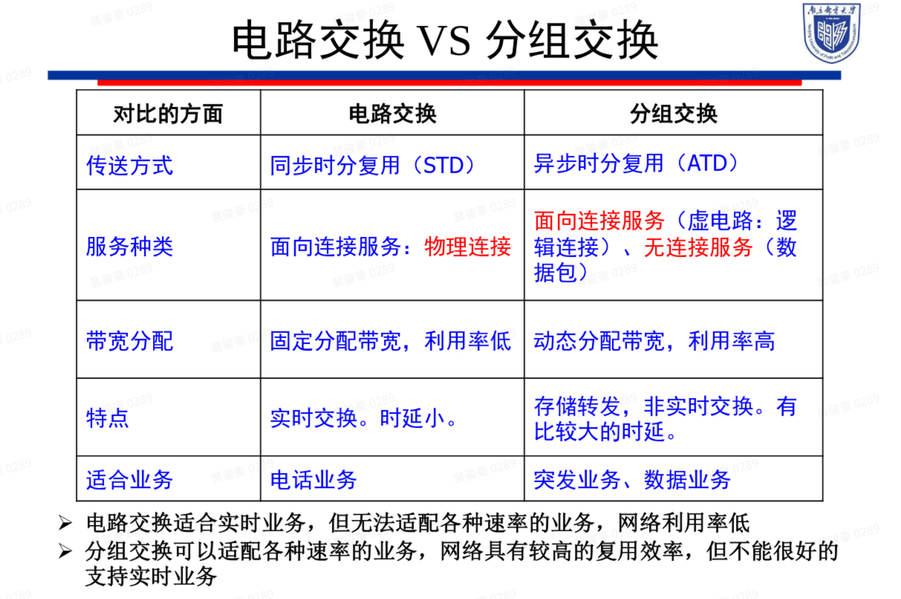

## 第一章
### 理解并掌握传统电话网的垂直分层结构，业务网、支撑网、传送网的概念及其具体网络。
通信网在垂直方向上被分为三个层次：**应用层、业务网、基础传送网**，他们分别完成不同的功能。

**应用层**表示各种信息的应用，它涉及到各种业务，如话音、视频、数据、多媒体等并支持各种业务应
用的通信终端技术。

**基础传送网**负责信息的传输，可以被分为物理层和通道层。
**业务网**负责为用户提供所需的业务。提供业务的网络包括：PSTN（Public Switched Telephone
Network，传统电话网）、ISDN（Integrated Services Digital Network）、PSPDN（Packet
Switched Public Data Network）、IP网等。
### 理解并掌握分组交换和电路交换的概念及特点。

### 掌握分组交换的两种实现方式及特点。
#### 虚电路方式
- **面向连接的服务**
包括三个阶段：
**虚电路的建立，数据传输，虚电路的释放**，通信终端在开始通信之前，必须通过网络在通信的源和目的终端之间建立连接；然后才能够进入信息传输阶段，发送和接收分组，且该通信的所有分组沿着已建立好的连接按序被传送到目的终端；当通信结束时，需要拆除该连接。
- **逻辑连接**

####  数据报方式
- **无连接的服务**
交换节点将每个分组独立地进行处理（每个分组均含有终点地址信息）；当分组到达节点后，节点根据分组中包含的终点地址为每一个分组独立寻找路由； 因此同一用户的不同分组可能沿着不同的路径到达终点；在网络的终点需要重新排队，组合成原来的用户数据信息。
* 每个分组根据目的地址独立选路
#### 4.TCP/IP协议模型各层功能。
* **应用层** $\approx$ OSI的会话层、表示层和应用层（OSI的上三层）
* **传输层** $\approx$ OSI的传输层
* **网络层** $\approx$ OSI的网络层
* **网络接口层** $\approx$ OSI的物理层和数据链路层（下两层）

## 第二章
### 掌握电信交换节点的四大基本技术。
**互连技术、接口技术、信令技术、控制技术**
### T 接线器的工作原理（两种方式会填写控制存储器，话音存储器内容）。T接线器和S接线器的功能。
#### T接线器
* 读出控制方式
1. 输入对应的几号时隙就写入几号单元中（先写SM->读编码）
2. 填CM的单元地址号：对应输出时隙号
3. CM单元中的内容为：输出的内容在输入时的时隙号（数字）
* 写入控制方式
1. 先写SM，输出对应的几号时隙就写入几号单元中
2. 填CM的单元地址为输入的时隙号
3. 填CM的单元内容位输入的内容在输出时对应时序号
#### S接线器
* 输出控制方式
1. 找出出线信号所在的那一列
2. 找出时隙信号对应的那一行
3. 填入入线信号的值
* 输入控制
1. 先找入线号所在那一列
2. 再找时隙号对应的那一行
3. 填入出线号的值

### 理解并掌握Banyan网络的基本特性。

### GSM系统中主要功能实体的作用。
1. **移动交换中心/MSC（核心服务器）**：完成呼叫接续、过区切换控制、无线信道管理等功能，同时是陆地固定网的接口设备。从HLR、VLR和AC处获取处理用户位置登记和呼叫所需的所有数据并且根据最新获取的信息请求更新数据库的部分数据。提供电信业务、承载业务、补充业务
2. **移动台/MS(用户终端)**:移动网的用户终端设备
3. **基站/BS**：负责射频信号的发送和接收以及MSC的接入在某些系统中负责信道分配，蜂窝小区管理
4. **HLR**：存储在该地开户的所有移动用户的用户数据、位置信息、路由选择信息以及移动用户的计费信息
5. **VLR**：存储本地区的所有访问用户的相关数据
6. **AC（鉴权中心）**：存储移动用户合法性检验的专用数据和算法。存储鉴权信息和加密密钥
7. **EIR（设备表示登记器）**：记录移动台设备号及七使用合法性等信息；存储移动设备的国际移动设备识别码（IMEI），通过核查三种表格（白名单、灰名单、黑名单）使得网络具有防止无权用户接入、监视故障设备的运行和保障网络运行安全的功能
8. **网络操作维护中心（OMC）**：用于网络管理和维护 
### GSM系统中的几类号码， IMSI, MSDN ,MSRN，IMEI （弄清楚区别，何时使用）
**IMSI（International Mobile Subscriber Identity）**：​
* 定义：国际移动用户识别码，是用于在移动通信网络中唯一识别移动用户的代码。 这个代码由
一串数字组成，通常不超过15位，且仅包含0~9的数字。 每个SIM卡都有一个与之对应的IMSI
码，这个码在SIM卡制造时被移动运营商分配，并永久保存在SIM卡中。​
* 使用场景：用于用户身份验证和位置管理。
##### MSDN（Mobile Station Directory Number）：​
* 定义：移动用户的电话号码。
* 使用场景：用于呼叫和消息传递。
##### MSRN（Mobile Station Roaming Number）：​
* 定义：在漫游时分配给移动用户的临时号码。
* 使用场景：用于漫游呼叫的路由。
##### IMEI（International Mobile Equipment Identity）：​
* 定义：国际移动设备身份码，唯一标识一个移动设备。
* 使用场景：用于设备识别、防盗等。
##### TMSI(Temporary Mobile Subscriber Identity)
* 是为了加强系统的保密性而在VLR内分配的临时用户识别，在某一VLR区域内与IMSI唯一对应。
### IP地址定义及相关概念：主机地址、网络地址、网络能容纳的主机数、掩码。

### 掌握CIDR地址块划分的方法及对应的子网掩码、网络地址（根据主机数量从大到小划分原则），掌握CIDR地址块的表示方法，网络前缀与子网掩码以及能容纳的主机数的对应关系。
### 理解IP数据报首部重要字段的含义。
### 网络互连设备（集线器、交换机、路由器）转发数据的基本原理；三种设备都存在的网络中，数据转发过程中源/目的IP地址、源/目的MAC地址的变化（IP地址实现全局范围内寻址、MAC地址实现局部范围内寻址）。

### 掌握路由表的基本构成；路由种类（直接转发路由、特定主机路由、特定网络路由、默认路由）；能够由网络拓扑及路由器各接口的地址推导出路由表基本表项
### MPLS网络中的基本概念，LSP形成过程（包括FEC的概念和中英文全称及FIB、LIB、LFIB等的概念和作用）及数据转发流程
### 掌握MPLS网络中FIB、LIB、LFIB的基本表项的内容，能看懂并解释MPLS基本配置实验中查看这些表的命令结果，由拓扑结构中某一个路由器的路由表和LIB的显示结果，能够推出LFIB中针对某一个目的地地址的表项
### 以太网的二层交换机的自学习和转发过程（收到数据包、源地址、接口号学习到地址表中，再根据目的MAC地址转发）；理解并掌握以太网二层交换机中转发表的形成过程