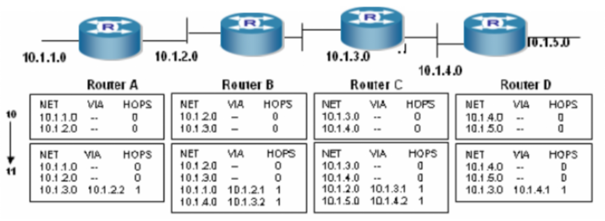
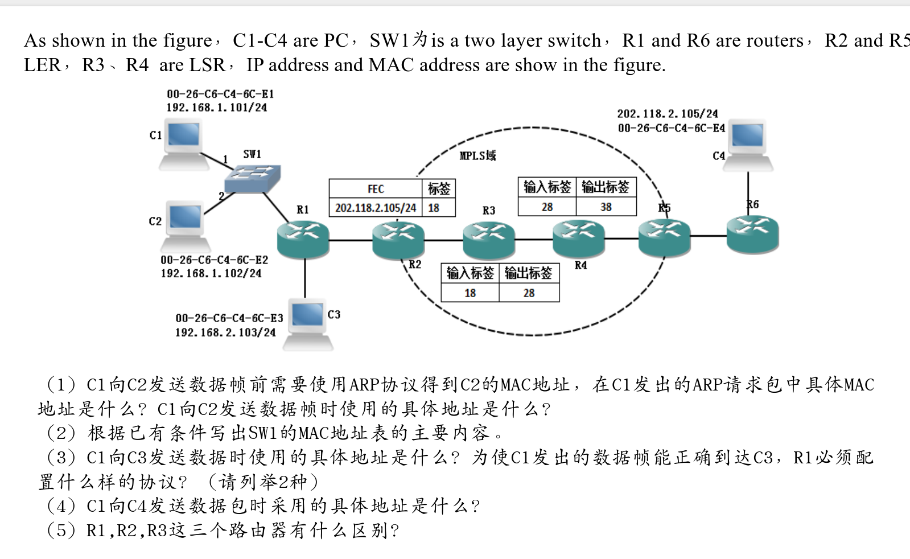

**1. 交换式以太网与共享式以太网在网络结构、信息传送方式、地址构成上有何异同?**
交换式以太网与共享式以太网都遵循相同的IEEE 802.3标准，使用相同的以太网帧格式和MAC地址结构。它们的核心区别在于信息转发方式和由此带来的网络结构差异。

在网络结构上，共享式以太网以集线器为核心设备。集线器将所有端口连接在一起，形成一个共享的总线，因此所有设备同处一个冲突域和广播域，整个网络共享同一段带宽。交换式以太网则以交换机为核心。交换机的每个端口都是一个独立的冲突域，网络总带宽等于各端口带宽之和，性能远高于共享式。

在信息传送方式上，这是两者最根本的区别。共享式以太网采用广播式传送。当一台主机发送数据时，集线器会简单地将信号复制并广播到所有其他端口，由接收方根据MAC地址判断是否接收。这种方式极易产生数据冲突，导致效率低下。交换式以太网采用基于MAC地址的存储转发交换。交换机通过自学习建立MAC地址与端口的映射表。当数据帧进入时，交换机只查询地址表，并将帧精准地转发到目标端口，不会广播到其他无关端口。这实现了并行通信，避免了冲突，极大地提升了网络效率和安全性。

在地址构成上，两者没有区别。它们都使用全球唯一的48位MAC地址作为数据链路层的硬件标识，帧格式完全一致。其根本差异在于网络设备如何处理这些地址：集线器完全不识别MAC地址，而交换机则依赖MAC地址表进行智能转发。

**2.描述冲突域和广播域的差别**
冲突域关注的是物理层和数据链路层的“冲突”问题。它指的是网络中一个特定的范围，在这个范围内，任何两个或多个设备同时发送数据就会产生信号冲突，导致数据损坏和重传。冲突域的范围由能隔离冲突的设备决定。例如，中继器和集线器会扩大冲突域，它们的所有端口都在同一个冲突域内。而交换机、网桥和路由器能够隔离冲突域，交换机的每一个端口就是一个独立的冲突域。因此，减少冲突域可以显著提升网络效率。

广播域关注的是网络层的“广播通信”范围。它指的是网络中一个广播帧（目的MAC地址为全F）所能传递到的全部设备所构成的区域。广播帧会被该域内的所有设备接收和处理。广播域的范围由能隔离广播的设备决定。集线器和交换机（在未划分VLAN的情况下）的所有端口都处于同一个广播域，它们会传播广播帧。只有路由器或三层交换机可以隔离广播域，因为它们在网络层工作，默认不转发广播包。因此，划分广播域可以控制广播流量、提高安全性和网络性能。

**3. 有10个站连接到以太网上。试计算以下二种情况下每一个站所能得到的带宽。
    (1) 10个站都连接到一个10 Mb/s以太网集线器；
    (2) 10个站都连接到一个10 Mb/s以太网交换机**

(1) 10个站连接到一个10 Mb/s以太网集线器

- 集线器为**共享式介质**，所有端口共享总带宽。
- 在理想平均情况下，每个站所能得到的带宽为：

  \[
  \text{每个站带宽} = \frac{10 \text{ Mb/s}}{10} = 1 \text{ Mb/s}
  \]

（2）
- 交换机为**独占式链路**，每个端口独享端口速率。
- 每个站与交换机端口之间的链路带宽为 **10 Mb/s**。
- 因此，每个站所能得到的最大带宽为：

  \[
  \text{每个站带宽} = 10 \text{ Mb/s}
  \]

**4.下面哪项不是导致LAN拥塞的原因？
A.广播域内的主机太多                                   B.为建立连接的网络中添加交换机
C.广播风暴                                                       D.带宽太低**
答案： B 
**5 如果一台以太网交换机链接了3台计算机，且没有配置VLAN，请问该交换机创建了多少个冲突域和广播域？
A.3个广播域和1个冲突域                                B.3个广播域和3个冲突域 
C.1个广播域和3个冲突域                                D.1个广播域和个冲突域**
答案：C
**6、有一台计算机安装了一块10/100M自适应网络接口卡，当该计算机通过UTP电缆跟下列设备对接时，分别工作在那种双工模式？对接的设备为HUB，LAN交换机。（ ）
A、全双工，全双工      B、半双工，全双工
C、全双工，半双工     D、半双工，半双工**

答案：B

**名词解释**
**(1)FEC**
它是一种在通信系统中用于控制和纠正数据传输错误的技术。其核心思想是：发送方在原始数据中添加冗余的纠错编码，接收方利用这些冗余信息，在不要求重新发送的情况下，自动检测并纠正传输过程中发生的部分错误。
LSP 是 标签交换路径（Label Switched Path）的英文缩写。
**（2）LSP**
LSP 是 标签交换路径（Label Switched Path）的英文缩写。
它是 MPLS（多协议标签交换）网络中的核心概念，指的是一条在数据转发层面，基于标签进行交换的、从入口到出口的单向路径。
**(3) VLAN**
VLAN 是 虚拟局域网（Virtual Local Area Network）的英文缩写。
它是一种在物理网络基础上，通过逻辑划分方式，将连接在同一台或多台网络设备上的用户和资源，划分为多个互不直接通信的广播域的技术。
**（4） LDP**
LDP 是 标签分发协议（Label Distribution Protocol）的英文缩写。
它是 MPLS（多协议标签交换）网络中一种主要的信令协议，其核心功能是在相邻的LSR（标签交换路由器）之间动态地建立标签映射关系，从而自动创建和维护LSP（标签交换路径）。

**8. 设某路由器建立了如下路由表（这三列分别是目的网络、子网掩码和下一跳路由器，若直接交付则最后一列表示应当从哪一个接口转发出去）：
128.96.39.0       255.255.255.128     接口0
128.96.39.128     255.255.255.128     接口1
128.96.40.0       255.255.255.128       R2
192.4.153.0       255.255.255.192       R3                         R4
现共收到5个分组，其目的站IP地址分别为：
(1) 128.96.39.1
(2) 128.96.40.122
(3) 128.96.40.151
(4) 192.4.153.17
(5) 192.4.153.90
试分别计算其下一跳。（请给出计算过程，不能只写答案！）**
路由表（目的网络/掩码 → 下一跳）

    128.96.39.0/25 → 接口0

    128.96.39.128/25 → 接口1

    128.96.40.0/25 → R2

    192.4.153.0/26 → R3

    0.0.0.0/0 → R4（默认）

匹配计算
(1) 128.96.39.1

    与表1：128.96.39.1 & 255.255.255.128 = 128.96.39.0（匹配）

    与表2：128.96.39.1 & 255.255.255.128 = 128.96.39.0 ≠ 128.96.39.128（不匹配）
    → 最长匹配为表1，下一跳：接口0

(2) 128.96.40.122

    与表3：128.96.40.122 & 255.255.255.128 = 128.96.40.0（匹配）
    → 下一跳：R2

(3) 128.96.40.151

    与表3：128.96.40.151 & 255.255.255.128 = 128.96.40.128 ≠ 128.96.40.0（不匹配）

    无其他匹配 → 走默认
    → 下一跳：R4

(4) 192.4.153.17

    与表4：192.4.153.17 & 255.255.255.192 = 192.4.153.0（匹配）
    → 下一跳：R3

(5) 192.4.153.90

    与表4：192.4.153.90 & 255.255.255.192 = 192.4.153.64 ≠ 192.4.153.0（不匹配）

    无其他匹配 → 走默认
    → 下一跳：R4

**9. LDP在建立LSP时，主要需要哪些网络协议？转发的信息存放在哪里？这个表包含哪些内容？**
IP 协议：作为底层承载协议，用于传输 LDP 消息。

IGP（如 OSPF、IS-IS）：提供路由信息，LDP 依据 IGP 路由表为前缀分配标签，确保 LSP 路径与最短路径一致。

TCP：用于 LDP 会话建立与可靠的标签映射信息交换（端口 646）。

UDP：用于 LDP 邻居发现（Hello 报文，端口 646）。

LDP 协议本身：负责定义标签分发、映射和管理的信令流程。

转发的信息存放在 LSR（标签交换路由器） 的 LFIB（标签转发信息库） 中。该表是实际转发时使用的标签转发表，由 LIB（标签信息库）中的最优条目生成。

LFIB 表包含的主要内容：

入标签：本地接收到的数据包的标签值。

出接口：转发数据包的物理或逻辑接口。

出标签：转发时替换的新标签（或为 POP 操作）。

下一跳地址：下游 LSR 的 IP 地址。

操作类型：包括 SWAP（标签交换）、POP（弹出标签）、PUSH（压入标签）等。

通过该表，LSR 能够根据入标签快速决定转发行为，实现 MPLS 数据平面的高效交换。

**10.下列对VLAN技术的理解正确的是：( ) (多项选择题） 
A.同一VLAN中的用户设备必须在物理位置上很接近，否则在交换机上没有办法实现
B.VLAN是一个逻辑上属于同一个广播域的设备组
C.VLAN之间需要通讯时，必须通过网络层的功能才可以实现
D.理论上可以基于端口、流量和IP地址等信息划分VLAN**
答案：BCD
**11. A router has just received the following new IP addresses: 57.6.96.0/21, 57.6.104.0/21, 57.6.112.0/21, and 57.6.120.0/21. If all of them use the same outgoing line, can they be aggregated? If so, to what? If not, why not?**
answer:Yes, they can be aggregated to 57.6.96.0/19.

**12 . 在t0至t1时间后处于RIP路由协议环境中的各路由器的路由表变化如下，若再经过一个更新周期的时间，Router A的路由表中会变化成什么样子？**

| NET        | VIA       | HOPS |
|------------|-----------|------|
| 10.1.1.0   | --        | 0    |
| 10.1.2.0   | --        | 0    |
| 10.1.3.0   | 10.1.2.2  | 1    |
| 10.1.4.0   | 10.1.2.2  | 2    |

 **13 For the given topology of the network, use Dijkstra’s shortest path algorithm to compute the shortest path from A to all network nodes. Give a shortest path tree and node A’s routing table.**
### 节点A的路由表
| 目的节点 | 下一跳节点 | 最短距离 |
|----------|------------|----------|
| A        | -          | 0        |
| D        | D          | 1        |
| E        | E          | 2        |
| F        | D          | 3        |
| C        | F          | 5        |
| B        | B          | 5        |

#### (1) ARP请求包与数据帧地址
- **ARP请求包的MAC地址**：
  源MAC：C1的`00-26-C6-C4-6C-E1`；
  目的MAC：广播地址`FF-FF-FF-FF-FF-FF`。
- **C1→C2数据帧的地址**：
  源MAC：`00-26-C6-C4-6C-E1`，目的MAC：`00-26-C6-C4-6C-E2`；
  源IP：`192.168.1.101`，目的IP：`192.168.1.102`。

#### (2) SW1的MAC地址表
| 端口 | MAC地址               |
|------|-----------------------|
| 1    | 00-26-C6-C4-6C-E1     |
| 2    | 00-26-C6-C4-6C-E2     |
| （连接R1的端口） | R1对应端口的MAC地址 |

#### (3) C1→C3的地址与R1需配置的协议
- **数据地址**：
  源MAC：`00-26-C6-C4-6C-E1`，目的MAC：R1对应端口的MAC地址；
  源IP：`192.168.1.101`，目的IP：`192.168.2.103`。
- **R1需配置的协议**：
  1. IP路由协议（如RIP、OSPF）；
  2. 接口IP地址配置协议（IPv4）。

#### (4) C1→C4的地址
- 源MAC：`00-26-C6-C4-6C-E1`，目的MAC：R1对应端口的MAC地址；
- 源IP：`192.168.1.101`，目的IP：`202.118.2.105`；
- MPLS标签：R2会为该数据封装标签`18`，后续LSR（R3、R4）按标签表替换标签。

#### (5) R1、R2、R3的区别
- **R1**：普通路由器，仅实现IP路由转发，无MPLS功能；
- **R2**：LER（标签边缘路由器），是MPLS域的入口，负责为IP包分配标签（封装标签）；
- **R3**：LSR（标签交换路由器），位于MPLS域内部，仅根据标签进行数据转发（标签交换）。