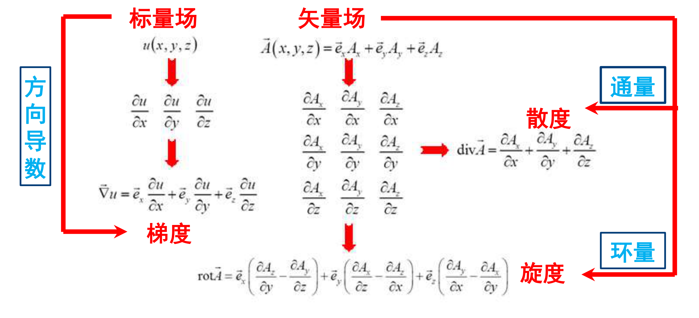

### 1.0前置知识（高数知识）
#### 方向导数
* 定义：设l是xoy平面上以原点为起点的射线
$$
\frac{\partial f}{\partial l}|_{x_0,y_0,z_0} = \lim_{l \to 0} \frac{\Delta z_l}{l} = f_x'（x_0,y_0,z_0）cos\alpha+f_y'(x_0,y_0,z_0)cos\beta+f_z'(x_0,y_0,z_0)cos\gamma
$$ 
其中，$cos\alpha,cos\beta,cos\gamma$ 分别为l与x,y,z轴夹角的余弦值
#### 第一类曲线积分

### 1.1 矢量的代数运算
这一节属于高中知识，故掠过
### 1.2场的微分运算
**两个重要的算子**
* 哈密顿算子($\vec \nabla$)
$$
\vec \nabla = \vec{e_x}\frac{\partial}{\partial x}+\vec{e_y}\frac{\partial}{\partial y}+\vec{e_z}\frac{\partial}{\partial z}
$$
* 拉普拉斯算子($\vec \nabla^2$)
标量场的拉普拉斯运算
$$\vec \nabla^2 u = {\vec \nabla} \cdot {\vec \nabla}u = \frac{\partial^2 u}{\partial x^2}+\frac{\partial^2 u}{\partial y^2}+\frac{\partial^2 u}{\partial z^2}$$
矢量场的拉普拉斯运算
$$
\vec \nabla^2 \vec A = {\vec \nabla}  ({\vec \nabla}\cdot A)-\vec \nabla \times (\vec \nabla \times \vec A ) \\ = \vec {e_x} \nabla^2A_x +\vec {e_y} \nabla^2A_y+\vec {e_x} \nabla^2A_x$$

#### 常见的微分运算

* 通量
定义:矢量场穿过曲面的通量线的总数，可表示为矢量沿该曲面的面积分
$$
\Phi = \int_S \vec A \cdot d \vec S
$$
矢量场的通量是一个标量，大小和正负取决于矢量场的分布以及曲面的正法线方向
* 环量
定义：矢量场沿闭合曲线的线积分
$$
\Gamma = \oint_l \vec A \cdot d \vec l
$$
矢量场的环量是一个标量，用来描述一个矢量场的漩涡特性
梯度：$gradu$ = $\vec \nabla u$
散度：$div \vec A = \vec \nabla \cdot  A  $
旋度：$rot \vec A=\vec \nabla \times \vec A$
**梯度、散度、旋度的对照**
    | 名称         | 梯度         |散度       |旋度  |
    | ----------- | ----------- |-----------|-----|
    | 表示符号      |$gradf$|$div\vec A$|$rot \vec A$|
    | 定义对象 | 标量场      | 矢量场   |矢量场       |
    | 计算结果 | 矢量场      | 矢量场   |  矢量场     |
    | 定义    | 方向导数最大 | 通量的密度| 环量密度最大 |
    | 物理意义 | $gradf$垂直于等值面    | $divA>0$有源，$divA=0$无源,$divA<0$有沟|$rot \vec A$不为0为有旋场，反之为无旋场|
    |相关的恒等式| $\vec \nabla \times\vec \nabla f = 0$|$\vec \nabla \cdot\vec \nabla \times \vec A = 0$|$\vec \nabla \times \vec \nabla \times \vec A = \vec \nabla(\vec \nabla \cdot \vec A)-\nabla^2 \vec A$|
**无源场和有源场**
无源场：矢量场的散度处处为0（不存在通量源），无源场必为有旋场
有源场：矢量场的散度不是处处为0,即存在通量源，在有源区，矢量的散度不为0,在无源区，矢量的散度仍然可以为0
**无旋场和有旋场**
与无源场和有源场类似
**重要恒等式**
$\vec \nabla \times\vec \nabla f = 0$：无旋场可以表示为某个标量函数的梯度
**eg**:$\vec \nabla \times \vec E = 0 \iff \vec E = -  \vec \nabla \Phi$
$\vec \nabla \cdot\vec \nabla \times \vec A = 0$：无源场可以表示为某一矢量函数的梯度
 

