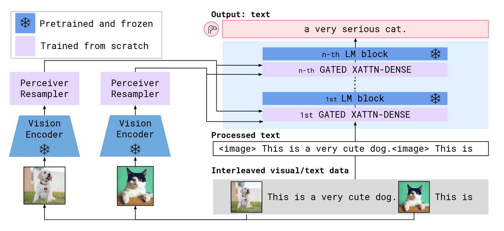
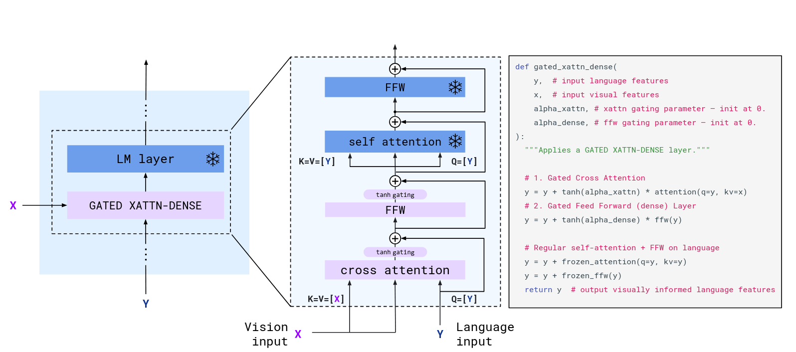

### 作者信息
* **作者**：Anas Awadalla(University of Washington)， Irena Gao(Stanford University).(同时也是通讯作者)
### 研究背景、目的方法和结论
#### 背景
当前的开源的模型（如BLIP-2）只支持单图片信息输入并且使用的是像coco这种清洗过的数据集,而deepmind支持文本图像交叉处理的模型Flamingo闭源。
#### 目的
填补当前可以处理图像文本交叉序列的开源模型的空白，所以开源了一系列对应的模型和代码
#### 方法
* **视觉编码器**：CLIP的VIT
* **文本模型**：冻结的MPT-1B/7B或RedPajama-3B（含instruction-tuned变体）
* **跨模态对齐**：可训练的Perceiver重采样器 + 交叉注意力模块
* **训练数据**：LAION-2B  and Multimodal C4 （二者都是庞大且优质的图像-文本对数据）

**结果**：开源了一系列参数规模从3B到9B的模型参数和代码，并且达到了闭源模型Flamingo的百分之八十以上的性能
### 好在哪
使用的组件和数据集均来自于开源社区，且代码开源，并且开源了一系列各种参数的模型，为VLM的学术研究作出了比较大的贡献
### 思考和补充
#### 处理视频数据
该模型不能够处理视频信息，原始的flamingo论文提到的方法是
*For video inputs, frames are sampled at 1 FPS and encoded independently to obtain a 3D spatio-temporal grid of features to which learned temporal embeddings are added. Features are then flattened to 1D before being fed to the Perceiver Resampler.*
可以概括为以下几个步骤
1. 对于视频每秒钟抽取一帧
2. 将抽取到的帧数据送入图像编码器，每一帧图像都进行独立编码
3. 将所有编码后得到的张量拼接为一个张量
4. 对每一帧率独立编码后的张量加入时间嵌入（类似于transformer的位置编码），让模型学习序列信息
5. 对加入位置编码后的张量进行重采样，最后得到一个2D张量（与处理单一图像得到的张量形状一致）

 
