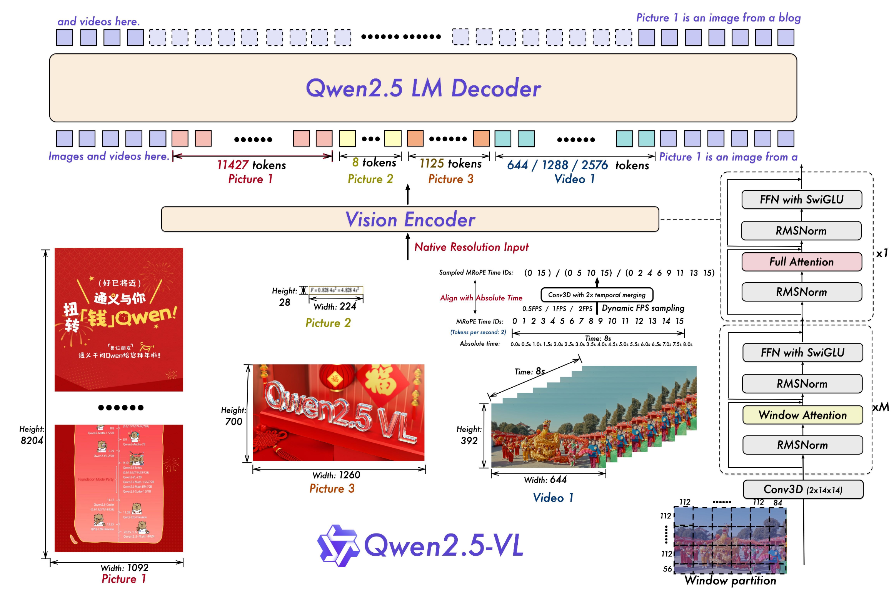

### 作者信息
阿里巴巴千问团队
### 研究背景、目的方法和结论
#### 背景
LVLM：(Large vision-language models)将大语言模型的成功从处理单一的文本信息迁移到了处理多模态信息的领域，但是当前的LVLM虽然能够处理多样的任务，但是仍然缺乏出色的能力。包括算力消耗、对图片信息的细致感知能力并且对于不同长度的序列信息能力不同。
#### 目的
提升LVLM的细颗粒（fine grained）感知能力（如图片中物品的位置信息等），提升大模型的多模态推理能力
#### 模型结构

* **大语言模型**：使用了Qwen2.5LLM的权重，但是把其的位置编码方式从一维换成了多维（Multimodal Rotary Position Embedding Aligned to Absolute Time）
* **视觉编码器**：使用重新设计的Vision Transformer,在其中综合了2D-RoPE位置编码和窗口注意力机制
* **给予MLP的视觉-语言信息提取构件**：将ViT输出的四个相邻的patch综合起来，通过mlp压缩之后再输入到LLM
#### 方法
##### 从头训练并设计的视觉编码器
* **窗口注意力机制**： 将图像划分为多个112\*112的窗口（对应8*8的窗口），计算注意力时每个patch只与同窗口内的其他patch计算注意力，仅有四层使用全局注意力，将传统的注意力机制$o(n^2)$ 的算法复杂度降低到接近 $o(n)$ 从而使模型可以直接处理原始的图片信息，从而具有更加细颗粒度的图像感知能力和提高对不同尺寸的图像的处理能力
* **归一化方法**： 使用采用RMSNorm归一化与SwiGLU激活函数，进一步提升了计算效率
##### 时空维度动态处理
* **时间**：引入动态分辨率采样，扩展分辨率到视频序列维度，从而支持长达数小时的视频理解
* **空间**：使用原生分辨率输入，使用绝对坐标标记图像信息空间的特征，从而使模型可以更好的学习图片的空间信息和提升模型处理不同尺寸图片的能力
#### 绝对时间对齐的位置编码的MRoPE（Multimodal Rotary Position Embedding ）
改进了Qwen2.0VL的方法，即对于时间维度按照帧数增加位置编码的ID（模型无法感知不同帧率的视频的区别），而是使用时间戳作为时间维度的位置编码ID
#### 结论
Qwen2.5VL 在多模态信息理解领域取得了巨大的进展，增强了视觉识别，物体定位，文档解析和长视频理解能力。窗口注意力机制在不牺牲分辨率和保真度的情况下减小了计算开销。满足了从高性能计算和边缘人工智能的需求。
