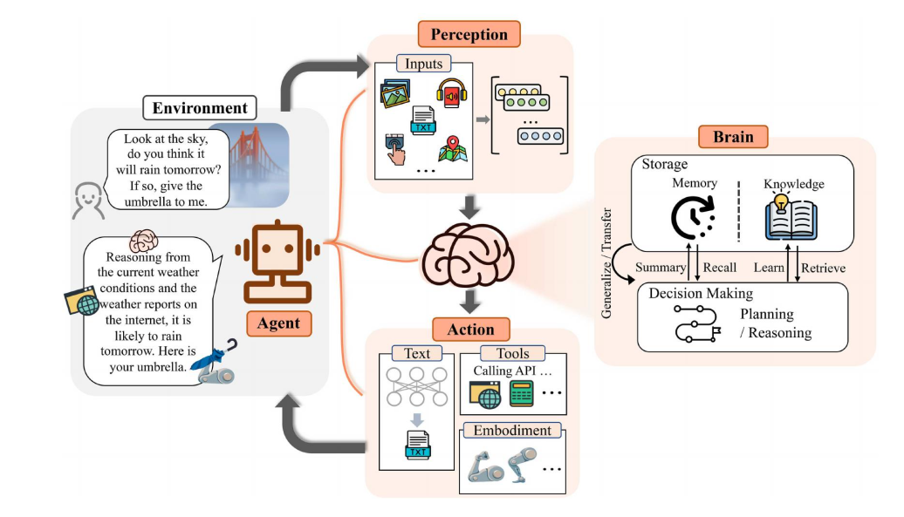

## 解决的问题

- 总结当前 `agent` 的技术框架、应用场景等
- 总结当前领域的一些潜在未来方向

---

## 智能体的发展历史

### 符号智能体（`symbolic agents`）
采用逻辑规则和符号表示来封装推理过程，典型代表是专家系统，但在处理不确定性和大规模现实问题方面面临局限性。

### 反应式智能体（`reactive agents`）
根据当下感知到的状态直接触发预设的行为规则（无规划、无记忆），缺点是缺乏高级决策和规划能力。

### 基于强化学习的智能体（`reinforcement based agents`）
强调智能体与环境交互进行学习，以获取最大累计奖励。深度学习兴起后，深度强化学习（`DRL`）应运而生，取得了 `AlphaGo` 之类的巨大成就。

### 具有迁移学习和元学习的智能体（`agents with transfer learning and meta learning`）
传统的强化学习模型训练成本高且泛化能力差：引入**迁移学习**来增强泛化性、降低训练成本；引入**元学习**来提升样本效率。但是当源任务和目标任务存在显著差异时，迁移学习的有效性可能达不到预期（负迁移）；元学习需要大量预训练和样本，同样难以建立通用的学习策略。

### 基于大语言模型的智能体（`LLM based agents`）
`LLM` 展现出强大的涌现能力，基于 `CoT` 等技术展现出与符号智能体相当的推理和规划能力，通过从反馈中学习和执行新动作获得类似反应式智能体的环境交互能力。并且 `LLM` 的预训练语料库巨大，展示了小样本和零样本泛化的能力。

---

## LLM 为什么适合作为 Agent 基础设施

### 自主性（Autonomy）
`Auto-GPT` 等应用展示了 `LLM` 在构建自主智能体方面的巨大潜力。

### 反应性（Reactivity）
通过多模态融合、具身技术、工具使用扩展 `LLM` 的行动空间。但 `LLM` 执行非文本模态的任务时，需要以文本生成想法或制定工具使用方案，这个中间文本响应会降低响应速度。

### 积极主动性（Pro-Activeness）
通过 “让我们逐步思考” 之类的指令提示，可以引发 `LLM` 的广义推理和规划能力，并且 `LLM` 已经展示出在目标重构、任务分解以及根据环境变化调整计划的涌现能力。

### 社交能力（Social Ability）
`LLM` 表现出强大的自然语言交互能力，能够以可解释的方式与其他模型或人类交互，并且可以扮演不同的角色，模拟现实世界的社会分工。

---

## 智能体的概念框架（Brain + Perception + Action）

论文提出了一个基于 `LLM` 智能体的一般概念框架，由**大脑、感知和行动**三部分组成。首先由感知模块感知外部环境变化，将多模态信息转换为智能体可理解的表示；然后由大脑模块进行思考与决策；最后行动模块执行动作。

---

### 大脑（Brain）

#### 知识（Knowledge）
`LLM` 在预训练阶段将大规模数据编码进参数中，这些知识可以分为常识知识和专业领域知识。

#### 记忆（Memory）
记忆存储了智能体过去的观察、思考和行动。但是记忆的累积会超出 `Transformer` 上下文窗口的处理能力，并增加检索和连接相关记忆的难度。因此有以下两种压缩记忆的方法：

- **记忆总结**：将历史互动总结为自然语言。
- **用向量或数据结构压缩记忆**：
    1. 将互动历史编码为稠密向量，存储到向量数据库（语义检索）。
    2. 把自然语言句子转化为结构化的三元组（主语-谓语-宾语），即知识图谱的形式。
    3. `LLM` 不直接操作记忆，而是生成 `SQL` 查询语句去查询记忆（如 `ChatDB`、`DB-GPT`）。

#### 推理与规划

**推理**
推理能力是一种涌现能力。思维链（`CoT`）等方法已被证明可以通过在输出答案前生成理由来激发推理能力。还可以通过**交互式训练**方法和**监督式微调（SFT）**方法来进一步提高 `LLM` 的推理能力。

**规划**
1. 计划制定阶段：将总任务分解为多个子任务。
2. 计划反思阶段：对计划的优缺点进行反思和评估。

#### 迁移性和泛化性（`Transferability and Generalization`）
- **未见任务泛化**（`zero-shot`）：经过指令调优的 `LLM` 无需任务特定微调即可处理不熟悉的任务。
- **上下文学习**（`few-shot`）：在 prompt 中拼接少量示例，无需更新模型参数即可提升性能。

---

### 感知（Perception）

#### 文本输入（`Text Input`）
理解文本输入是 `LLM` 最基本的能力，但用户输入除了显式内容外还有信念、欲望和意图等隐式内容，这仍是挑战。目前一些研究采用指令调优和强化学习的方法来提升这项能力。

#### 视觉输入（`Visual Input`）
- **图像描述**（`Image Captioning`）：为图像生成文本描述，直接拼入 `LLM` prompt，可解释性强，但转换过程中会大量丢失图像原本的信息（低带宽）。
- **多模态融合**（`Modality Fusion`）：在 `Embedding` 层面将视觉编码器的输出与 `LLM` 对齐，例如 `BLIP-2` 使用 `Q-Former` 作为中间接口层，`LLaVA` 仅使用单个投影层。

#### 听觉输入（`Audio Input`）
- **工具调用**：`LLM` 作为控制中心，直接调用现有工具集/模型库来感知音频信息。
- **频谱图**：将音频转换为 2D 频谱图，用类似 `ViT` 的方法（`AST`）进行处理。

#### 其他输入
未来的 `LLM` 智能体还可接入 `GPS`、激光雷达等传感器，从而更全面地感知环境。

---

### 行动（Action）

#### 文本输出
基于 `Transformer` 的 `LLM` 语言能力表现优秀，因此基于 `LLM` 的智能体可以成为强大的语言生成器。

#### 工具使用
- **学习使用工具**：利用 `LLM` 的零样本/小样本学习能力，通过 prompt 示例获取有关工具的知识，也可以通过环境和人类的反馈学习。
- **扩展行动空间的工具**：智能体可在推理和规划阶段使用的外部资源，如 `Web` 应用程序、其他 `LM`、生成 `SQL` 语句、`Python` 解释器等。

#### 具身行动
人们期望智能体能够主动感知、理解物理环境并与之互动和决策，这些统称为具身行为。

- **基于 LLM 的智能体在具身行动方面的潜力**：
    - **成本效率**：`PaLM-E` 将机器人数据与通用视觉-语言模型数据联合训练，实现了显著的迁移能力。
    - **泛化性**：`Voyager` 引入技能库机制，使智能体具备终身学习能力。
- **基于 LLM 智能体的具身行为**：（待补充）

---

## 实践中的智能体

### 单智能体的通用能力

#### 面向任务的部署

**Web 场景**
- 针对 `HTML` 微调 `LLM`（`Mind2Web`）。
- 使用包含 `HTML` 以及截图的多模态语料库（`WebGum`）。
- 直接与移动设备的界面交互（`Auto-GUI`）。

**生活场景**
足够大的 `LLM` 可以在没有额外训练的情况下将高层任务分解，但智能体生成的动作往往缺乏对环境的动态感知。因此一些方法将周围空间状态作为输入纳入模型。

#### 面向创新的部署
目前 `LLM` 智能体在前沿科学等领域的潜力尚未完全实现，原因有：
- **科学固有的复杂性**：许多特定术语和结构很难用单一文本表示。
- **训练数据匮乏**：如果智能体拥有自主探索能力，将为人类带来有益创新。

#### 面向生命周期的部署
目标是构建能够在开放世界内持续探索的智能体。许多工作借助 `Minecraft` 作为开发和测试智能体能力的独特场所，例如 `Voyager` 引入技能库，使智能体在没有任何干预的情况下自主探索和适应环境。

---

### 多智能体的协同潜力

多智能体系统（`MAS`）旨在让智能体从与其他智能体的多轮反馈中获益，且多个智能体的专业化分工可以提高整个系统的效率和输出质量。

#### 互补性合作
- **无序合作**：每个智能体自由表达观点和意见，整个过程不受控制，缺乏特定顺序。典型代表：`ChatLLM`。
- **有序合作**：系统中的智能体遵循特定规则按顺序表达意见。但 `MetaGPT` 发现，没有规则约束时多智能体间的交互会放大微小的幻觉，引入交叉验证或外部反馈可以缓解这个问题。

#### 对抗性互动
将博弈引入系统可以让智能体通过动态交互迅速调整策略，但这种系统本质上仍依赖大语言模型，面临几个挑战：
1. 随着辩论延长，`LLM` 无法处理过长的上下文。
2. 计算开销大。
3. 多智能体系统可能收敛到错误的共识。

---

### 人与智能体间的互动

在人与智能体的互动中，人类提供指导或监管智能体的安全性、合法性和道德行为。人与智能体的交互可以分为以下两种模式：

#### 指导者-执行者（非对等交互）
智能体相应人类的指令，并且通过交替迭代完善行动，但这需要耗费大量的人力。所以我们可以授权智能体自主完成任务，并只在某些情况下提供反馈，反馈类型可以分为
* 定量反馈
主要包括二元分数和评级，以及相对分数
* 定性反馈
人类就如何修改智能体的输出提供建议，然后智能体采纳这些建议后改进输出。

#### 平等伙伴范式

人机交互的最终目标是实现人类与智能体之间高效和安全的交互，因此有大量研究深入智能体的共情能力，以及使智能体从人类水平的角度和人类完成合作任务。

### 智能体社会

感觉跟我的关系不大，略

### 讨论

#### 智能体和LLM之间的互惠互利

##### LLM研究->智能体研究

`LLM`为智能体提供了一个强大的基础，而且，`LLM`强大的泛化性使训练范式更加
精简，允许通过演示直接适应新任务

##### 智能体研究->LLM 研究

将`LLM`应用到智能体扩展了它的应用范围，并提供了进一步发展大语言模型的动力，如更强的认知能力和泛化能力，以及对安全性提出了更高的要求

#### 实用的开发工具

##### 用于开发单智能体系统的工具

* `XAgent`
由调度器，规划器和执行器组成，可以自动解决各种任务
* `LangChain`
使开发者能够使用一系列模块化的组建来创建由`LLM`驱动的应用程序，这些工具直接调用`LLM API`，而不是从头开始训练智能体
* `AgentGym`
为不同的环境提供统一的`API`接口，支持基于`LLM`的智能体训练

##### 用于开发多智能体系统的工具

* `AgentVerse`
一个多智能体框架，可以模拟人类群体解决问题的过程，并且可以动态调整团队成员，已可以在`Minecraft`中实现智能体间的复杂交互

* `AutoGen`
一种灵活的多智能体开发工具，通过人类和工具的集成，促进多个智能体之间的通信和协作

* `ChatEval`
一种多智能体辩论框架，用于评估生成文本的质量

* `Swarm`
利用智能体（`agent`）和移交（`handoff`）的抽象，实现轻量级且可控的智能体协调和执行

#### 基于LLM的智能体的评估

对智能体的测试主要包括
* 有效性
* 社交性
* 价值观

#### 基于LLM智能体的潜在风险

##### 对抗鲁棒性

为了防止对抗性攻击以及数据集投毒等攻击方法对`LLM`的影响，目前的解决办法有诸如对抗训练，对抗数据增强，对抗样本检测等方法，但是在不影响模型有效性的情况下保证其效用依旧是一个严峻的挑战

##### 可信度

训练集中的数据偏差会渗透到神经网络中，导致智能体输出与人类意图不一致。
构建诚实值得信赖的智能体是一个迫切的需求目前的解决方法包括
* 引导模型在推理阶段展示思维过程并解释
* 整合外部知识库或数据库

##### 其他潜在风险
* 滥用
* 失业
* 对人类福祉的威胁

#### 增加智能体的数量

##### 扩展方法

* 静态扩展
设计者预先设置代理数量，角色和属性，运行环境和目标，问题在于当任务变得复杂时，这种静态方法会受到限制。

* 动态调整

由代理自主将任务委托给其他代理，设计者近定义初始框架，从而使整个系统更加自主和自组织。

##### 潜在挑战

* 计算负担增加
* 通信难度增加
* 协调代理的难度增加

#### 未解决的问题

* 虚拟仿真到物理环境
虚拟世界与真实物理世界之间存在显著差距，为了无缝融入现实世界，智能体需要理解和推断有隐含含义的模糊指令，还需要具备灵活学习和应用新技能的能力。此时，`LLM`有限的上下文也带来了重大挑战，且不像模拟世界，真实物理世界中的犯错会造成真实且不可逆转的损害。

* 智能体的集体智慧
集体智慧源于个体的多样性和协作与竞争，利用智能体社会中的通信和进化，或许可以模拟生物社会观察到的进化，进行社会学实验。

* 基于`LLM`的代理即服务
用户构建提示词，用`API`使用云端模型，而不需要拥有本地的数据中心，从而可以提供灵活性的按需服务，但是同时也带来了鲁棒性，可信度和恶意使用的相关问题

