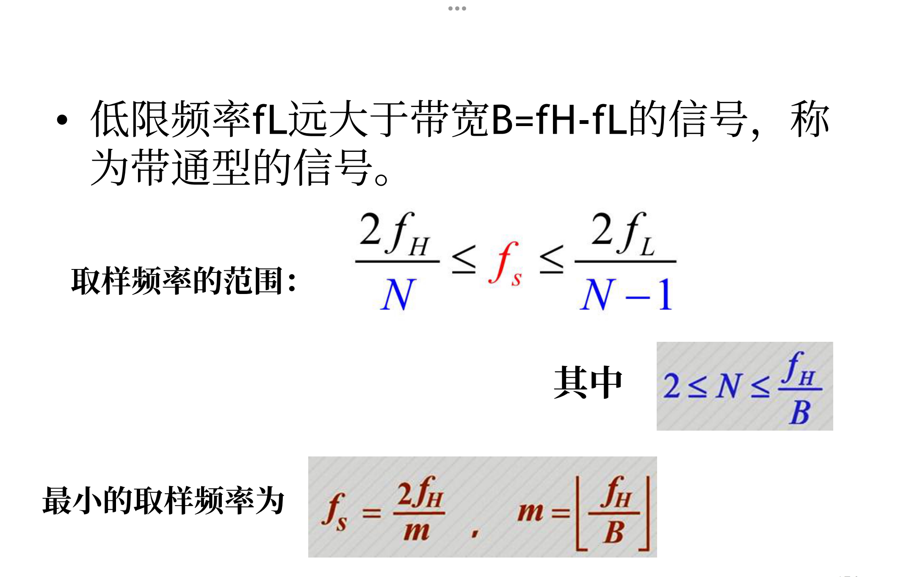
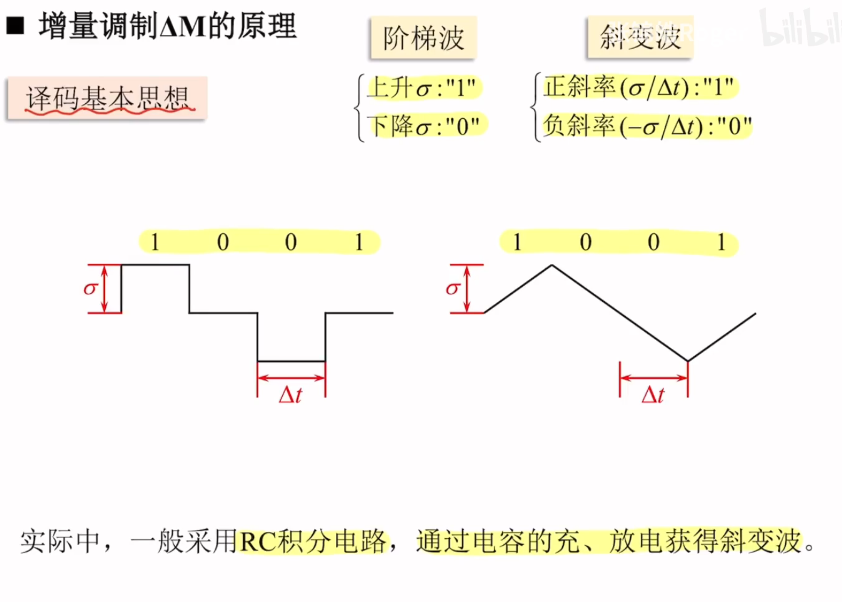
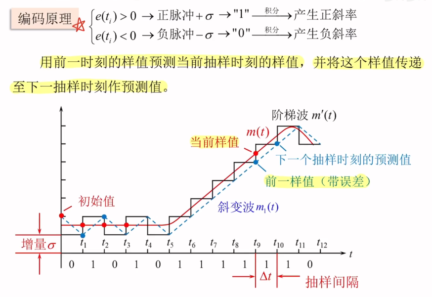
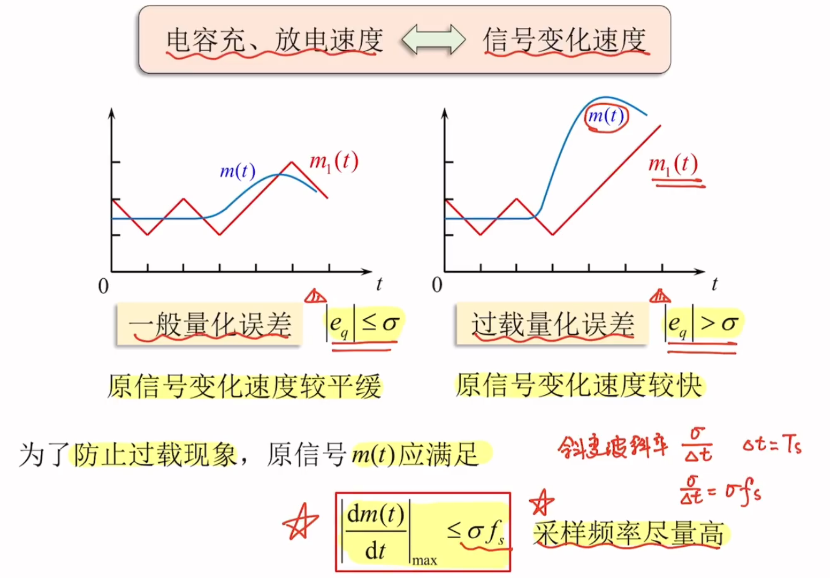

### 抽样定理
#### 低通抽样定理
一个频带限制在 $(0,f_H)$ 内的低通信号 $m(t)$,如果以 $f_s \geq 2f_H$ 的速率进行均匀抽样，则抽样序列可以无失真地恢复 $m(t)$
* 奈奎斯特抽样速率：$f_s = 2f_H$
* 奈奎斯特抽样间隔：$T_s = \frac{1}{2f_H}$
#### 带通抽样定理

### A律13折线编码
#### 编码方式
* $a_1$（极性）
若脉冲抽样值大于0则为1,反之为0
* $a_2a_3a_4$(段落码)
将2048划分为 $[0,16],[16,32],[32,]...,[1024,2048]$ 八个区间，用0到7代表，$a_2 a_3 a_4$ 为区间的二进制值
* $a_5 a_6 a_7 a_8$ （段内码）
将所在区间按照均匀间隔分为16个区间，用0到15代替，$a_5 a_6 a_7 a_8$为所在区间的二进制值，所在区间的下限即为对应的编码值
#### 量化误差
所在区间的下限即为所对应的编码值 $I_c$，其与实际值的差取绝对值即为 量化误差
#### 11位线性码
* 编码方式
将编码值 $|I_c|$ 变成11位二进制数即11位线性码
* 编码误差
编码值 $I = I_c + \frac{B}{2}$,其中B是段内码所在区间的长度，其与真实值的差的绝对值即为编码误差
### 增量调制 $\Delta M$
* 原理：对预测误差进行1位编码

* 变化波形图

* $\Delta M$ 的过载特性

