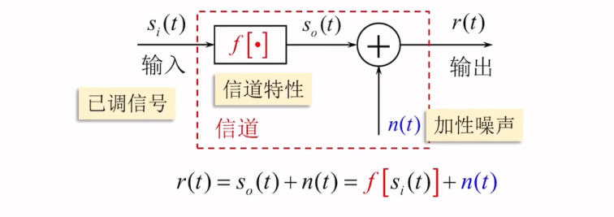
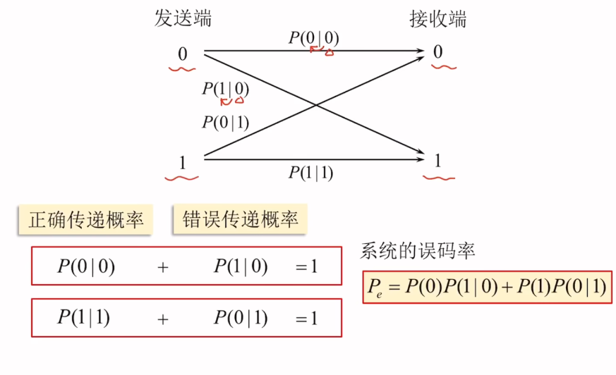
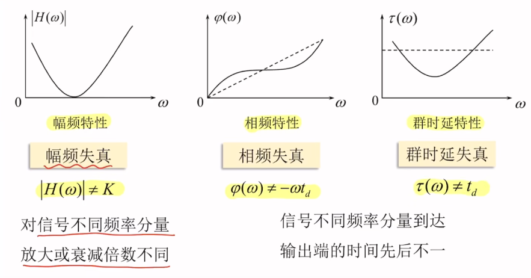
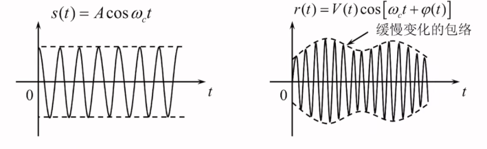
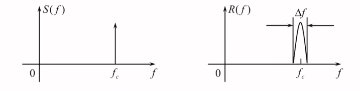
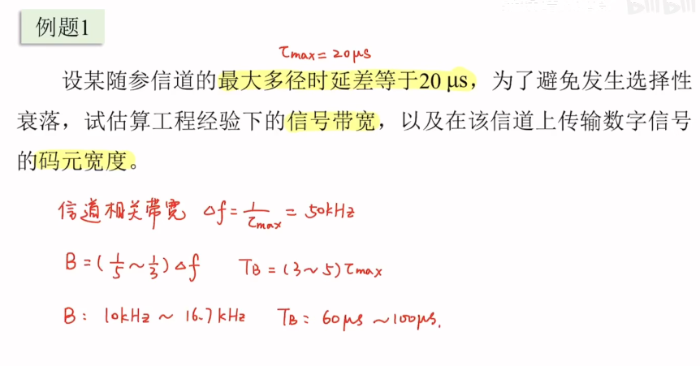
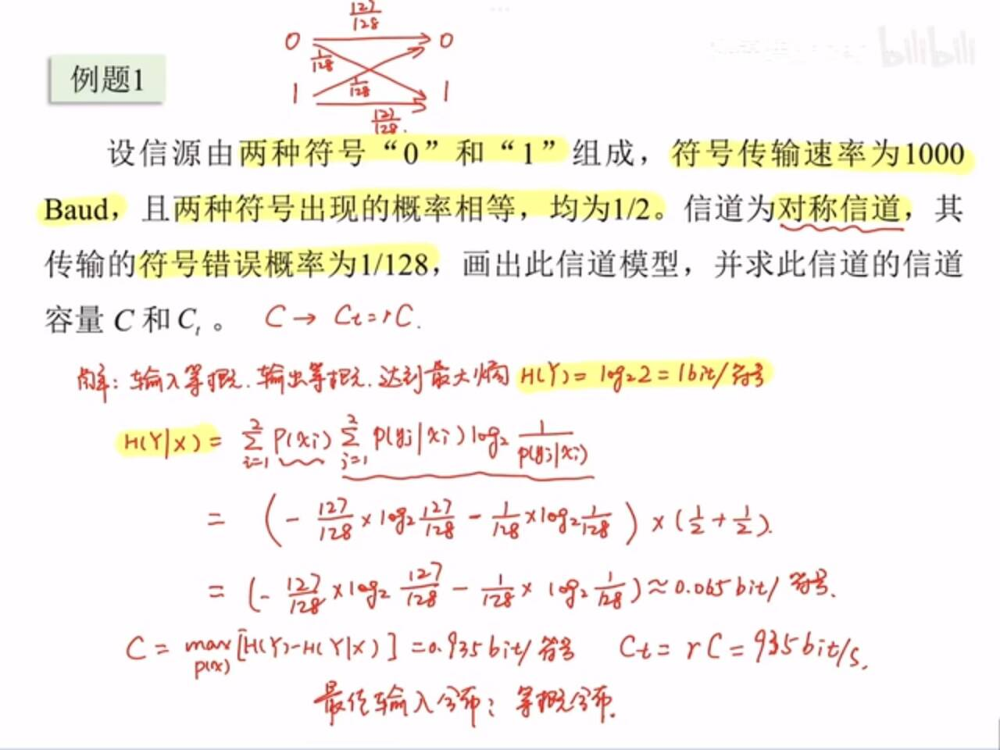

### 信道定义与数学模型
#### 调制信号的特点
* 有一对/多对输入/输出端
* 大多数满足线性叠加原理（为线性网络）
* 对信号有固定或时变的延迟（对相位）和损耗（对幅度）
* 无信号输入时仍然可能有输出，此时输出噪声
#### 数学模型

* 恒参信道：对应的信道特性为线性时不变滤波器
其中，$f[\cdot] = c(t)$,$s_o(t) = s_i(t)*c(t)$,由傅里叶变换特性可知：$S_o(\omega) = S_i(\omega)\cdot C(\omega)$,$C(\omega)$ 称为乘性干扰，与输入信号共存共失
**特例：加性高斯噪声信道**：传输函数 $C(\omega)$ 为常数，且信号在频带内为常数
* 随参信道：对应的信道特性为线性时变滤波器
其中 $f[\cdot] = c(t,\tau)$,乘性干扰为 $C(\omega,\tau)$
#### 编码信道的数学模型
用转移概率 $P(y|x)$ 描述编码信道。以二进制信道为例：

### 恒参信道的特性
#### 理想恒参信道的特性
理想无失真传输信道，可等效为一个线性时不变网络。
理想恒参信道满足无失真传输条件：输入输出波形结构一致，知识幅度和时间不同
* 无失真传输函数的频域条件
$$
H(\omega) = Ke^{-j \omega t_d}
$$
1. $|H(\omega)|=K$:对信号不同频率分量放大或衰减倍数相同(无幅度失真)
2. $\phi(\omega) = -\omega t_d,\tau(\omega) = -\frac{d\phi(\omega)}{d\omega} = t_d$:信号不同频率分量到达输出端的时间先后一致（无相位失真）

以上失真均不产生新的频率分量，因此均为线性失真
### 随参信道的特性
**1.存在时变的衰减和时延**
**2.存在多径传播现象**
#### 多径传播的影响
* 多径传播的数学模型
发送正弦波
$$
s(t) = Acos\omega_c(t)
$$
经过n条独立路径传播后
$$
\begin{align}
r(t) &= \sum_{i = 1}^{n}a_i(t)cos[\omega_c(t-\tau_i(t))]\\
&=V(t)cos[\omega_c t+\phi(t)]
\end{align}
$$
可以看作一个窄带随机过程
#### 多径传播的影响
* 瑞利衰落：单频正弦波变为包络，相位受调制的窄带信号(包络快衰落)

* 频率弥散：单频正弦波单一谱线变成了窄带频谱

* 对宽带信号的影响（频率选择性衰落）
假设两条路径的相对时延差为 $\tau$,且具相同的幅度衰减K
时域
$$
s_o(t) = Ks_i(t)+Ks_i(t-\tau)
$$
频域上
$$
S_o(\omega) = KS_i(\omega)+KS_i(\omega)e^{-j\omega \tau} \\ H(\omega) = \frac{S_o(\omega)}{S_i(\omega)} = (1+e^{-j\omega \tau}) = 2Kcos{\frac{\omega \tau}{2}}e^{-j\frac{\omega \tau}{2}}
$$
幅频特性 $|H(\omega)| = 2K|cos\frac{\omega \tau}{2}|$

幅频特性曲线的零点的频率间隔为信道**相关带宽**：$\Delta f = \frac{1}{\tau}$,为了避免选择性衰落，应该使信号带宽满足 $B_s<\Delta f$
工程上一般选取 $B_s =\frac{1}{3} 到\frac{1}{5}\Delta f $ ,码元宽度$T_B$ 属于 3到5 $\tau$
**推广到宽带信号**：
$$
\Delta f = \frac{1}{\tau_{max}}
$$
其中 $\tau_{max}$ 为最大的路径时延差
限制传输速率可以有效改善多径效应，但实际中有高速传输要求。
解决方法：OFDM技术

### 噪声与带宽
* 热噪声
1. 来自一切电阻性元器件中电子的热运动
2. 功率谱均匀分布在$0-10^{12}$Hz范围内可视为白噪声
3. 其电压瞬时值可视为服从高斯分布，且均值为0
所以可以将热噪声视为零均值的高斯白噪声
* 信道噪声
典型的信道加性噪声的代表是起伏噪声（热噪声等），它是0均值的高斯白噪声
\[
\begin{cases}
f_n(\nu) = \dfrac{1}{\sqrt{2\pi\sigma_n}} \exp\left[ -\dfrac{\nu^2}{2\sigma_n^2} \right] \\
P_n(f) = \dfrac{n_0}{2} \quad \text{(W/Hz)} \quad 
\end{cases}
\]

* 等效噪声带宽

$$
\begin{align*}
B_n = \frac{\int_0^{+\infty} P_n(f) df}{P_n(f_0)} = \frac{\int_{-\infty}^{+\infty} P_n(f) df}{2P_n(f_0)}
\end{align*}
$$
含义：通过带宽为 $B_n$ 的矩形滤波器的噪声功率等于实际接受滤波器的噪声功率
### 信道容量
**定义** ：信道容量是指信道所能承载的最大信息速率
平均互信息
信源符号集 $X=\{x_1,x_2,...,x_n\}$ 接收符号集 $Y = \{y_1,y_2,...,y_m\}$
* 互信息定义
$$
I(x_i; y_j) = I(x_i) - I(x_i | y_j) = \log_2 \frac{1}{P(x_i)} - \log_2 \frac{1}{P(x_i | y_j)}
$$

$I(x_i) = \log \frac{1}{p(x_i)}$ 发送前接收端对 $x_i$ 的不确定度

$I(x_i | y_j) = \log \frac{1}{p(x_i | y_j)}$ 收到 $y_j$ 后接收端对 $x_i$ 的不确定度

互信息代表着收端收到 $y_j$ 对发端 $x_i$ 不确定度的减小量。
$$
\begin{align*}
\underline{I(X;Y)} &= E[I(x_i;y_j)] = E[I(x_i)-I(x_i|y_j)] = E[I(x_i)]-E[I(x_i|y_j)] \\
&= \sum_{i=1}^n P(x_i)\log_2 \frac{1}{P(x_i)} - \sum_{i=1}^n \sum_{j=1}^m P(x_i y_j)\log_2 \frac{1}{P(x_i|y_j)} \\
&= \sum_{i=1}^n P(x_i)\log_2 \frac{1}{P(x_i)} - \sum_{j=1}^m P(y_j)\sum_{i=1}^n P(x_i|y_j)\log_2 \frac{1}{P(x_i|y_j)} \\
&= H(X)-H(X|Y) \\
\underline{I(X;Y)} &= H(X)-H(X|Y) \quad \underline{I(X;Y)} = H(Y)-H(Y|X)
\end{align*}
$$
* **离散信道容量的定义**
在最佳输入分布下离散信道的平均互信息量达到最大值，称此最大值为信道容量
$$
\begin{cases}
C = max_{p(x)}[H(X)-H(X|Y)](单位：bit/符号)\\
C = max_{p(x)}{r[H(X)-H(X|Y)]}(单位：bit/s)
\end{cases}
$$
对于第二个公式，r为信道的符号传输速率，单位是符号/s
* **离散二进制对称信道的信道容量**
1. 输入等概的条件下，输出也等概
2. 输入等概时，转移概率等于后验概率
后验概率为：$P(x_i|y_j)(后验概率) = P(y_j|x_i)(转移概率)$
3. 条件熵$H(X|Y) = H(Y|X)$
4. 对称信道的条件熵与输入的分布无关，为定值
5. 因此达到信道容量的最佳输入分布为等概分布
