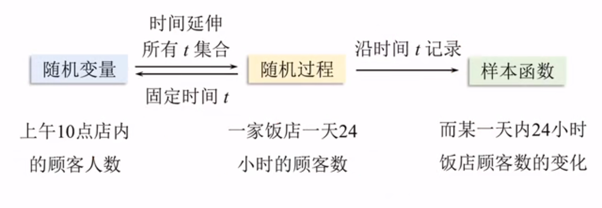
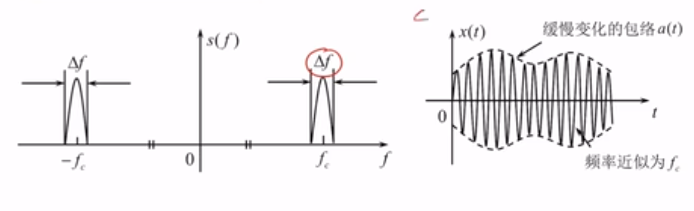
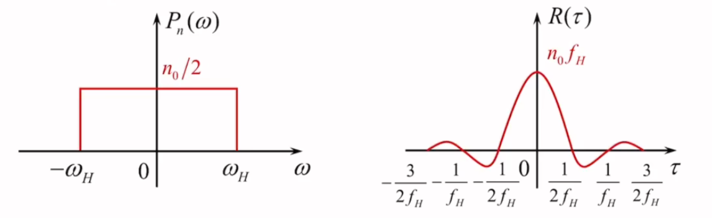
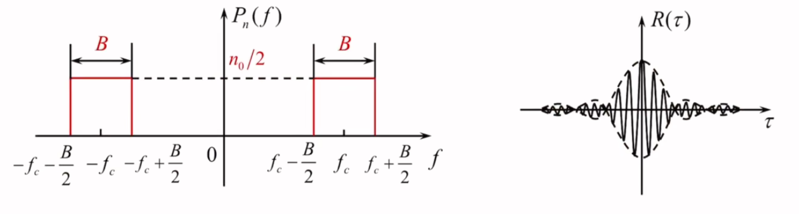

### 随机过程的基本概念
随机过程{$x(t)$}由一族时间函数$x_i(t)$，$i = 1,2,3，…$组成，每一个时间函数都是$x_i(t)$称为随机过程{$x_t$}的**样本函数**(一个实现)。
随机过程实际上是随机变量在时间上的“升维”

### 随机过程的统计特性
* 一维分布函数(相当于随机过程固定时间为$t_1$时的随机变量的分布函数)
$$
F_1(x_1,t_1) = P[\xi(t_1) \leq x_1]
$$
* 一维概率密度函数(同上)
$$
f_1(x_1,t_1)=\frac{\partial F_1(x_1,t_1)}{\partial x_1}
$$
* 数学期望（期望函数）
$$
a(t) = E(\xi(t))=\int_{-\infty}^{\infty}xf_1(x,t)dx
$$
随机过程的数学期望与时间t有关，表示n个样本函数的摆动中心
* 方差
$$
D[\xi(t)] = E{[\xi(t)-a(t)]^2}=E[\xi ^2(t)]-a^2_t
$$
随机过程的方差表示了随机过程在$t$时刻偏离数学期望的程度
* 自相关函数
$$
R(t_1,t_2)=E(\xi(t_1) \xi(t_2))
$$
自相关函数反映不同随机时刻取值的相关性
* 协方差函数
$$
B(t_1,t_2) = R(t_1,t_2)-E[Y(t_1)]E[Y(t_2)]
$$
****
### 平稳随机过程
#### 定义
平稳随机过程的统计特性不随时间的推移而变化，其一维分布与时间$t$无关，二维分布只与时间间隔$ \tau $有关
* 一维分布与t无关
$$
f_1(x,t) = f_1(x,t+h) = f_1(x)
$$
* 二维分布只和时间间隔$\tau$有关
$$
f_2(x_1,x_2;t_1,t_2)=f_2(x_1,x_2;t_1+h,t_2+h)=f_2(x_1,x_2;t_2-t_1)
$$

#### 数字特征（重要）
* 均值
$$
E[\xi(t)] = \int_{-\infty}^{\infty}xf_1(x)dx=a
$$
与t无关，样本函数围绕同一水平线起伏
* 方差
$$
D[\xi(t)] = \int_{-\infty}^{\infty}(x-a)^2f_1(x)dx=E[\xi^2(t)]-a^2=\sigma^2
$$
与时间无关，为常数
* 自相关函数
$$
R(t,t+\tau)=E(\xi(t)+\xi(t+\tau))=R(\tau)
$$
自相关只与时间间隔$\tau$相关，与时间起点无关

#### 狭义平稳和广义平稳
* 狭义平稳(严平稳)
随机过程的各维概率密度函数都不随时间推移而变化
* 广义平稳随机过程(宽平稳)
一个二阶矩随机过程（方差为有界值），均值为常数，自相关函数仅仅是时间间隔的函数，称这样的过程为广义平稳随机过程或者宽平稳随机过程

#### 平稳随机过程的各态历经性
 $\xi(t)$的所有实现$x(t)$时间均值和时间相关函数分别为

 $$
 \begin{cases}
 \overline {a} = \overline{x(t)}=\lim_{T \to \infty}\frac{1}{T}  \int_{-T/2}^{T/2}x(t)dt \\ \overline{R(\tau)}=\overline{x(t)}* \overline{ x(t+\tau)} = \lim_{T \to \infty}\frac{1}{T}  \int_{-T/2}^{T/2}x(t)x(t+\tau)dt
 \end{cases}
 $$

 如果所及过程依概率1满足 $\overline{a} = a,\overline{R(\tau)}=R(\tau)$,则称该平稳过程具有各态历经性
 * 含义：随机过程中任意实现都经历了随机过程的所有可能状态
 #### 平稳随机过程自相关函数的性质
 * $R(0) = E[\xi^2(t)]=S$ 物理意义：随机过程的平均功率
 * $R(\infty)=E^2[\xi(t)]=a^2$ 物理意义：随机过程的直流功率
 * $R(0)-R(\infty)=E[\xi^2(t)]-a^2=\sigma^2$ 物理意义：随机过程的交流功率
 * 自相关函数为偶函数
 * $|R(\tau)|\leq R(0)$,即与自身时刻相关性最大

 #### 平稳随机过程的功率谱密度
 平稳随机过程的功率谱密度和自相关函数互为傅里叶变换对
 * 性质
 1. 功率谱密度具有非负性
 2. 功率谱密度是偶函数
 3. 单边，双边功率谱密度互换：$P_{\xi 单边}(f)= \begin{cases}2P_{\xi 双边}(f) \quad f \geq 0 \\ 0 \quad f <0 \end{cases}$
****

### 高斯随机过程
* 定义
若随机过程的任意n维分布都是正态分布，则称它为高斯随机过程。
* 一维高斯过程的概率密度函数
$$
f_1(x) = \frac{1}{\sqrt{2 \pi}\sigma}exp[-\frac{(x-a)^2}{2 \sigma^2}]
$$
其中,a为随机过程的均值，$\sigma$ 为随机过程的方差
* 高斯随机过程的n维分布完全由n个随机变量$x_1,x_2,x…x_n$的数学期望，方差以及两两变量之间的归一化协方差函数决定；
* 广义平稳的高斯过程也狭义平稳
* 对高斯变量来说，不相关和独立等价
* 高斯过程经过线性变换后仍为高斯过程，但数字特征发生改变
* 若干个高斯过程的代数和仍为高斯过程，但数字特征发生改变

### 随机过程通过线性系统
**只考虑平稳随机过程通过线性时不变系统时的情形**
类似于确知信号 v_i(t)通过线性时不变系统 $H( \omega)$ 
$$
v_0(t) = v_i(t)*h(t)
$$
平稳随机过程 $\xi_i(t)$ 通过线性时不变系统有
$$
\xi_o(t) = \xi_i(t)*h(t)
$$
**性质**
* 数学期望
$$
E[\xi(t)] = a \to E(\xi_0(t)) = a \cdot H(0)
$$
物理意义：输出过程的数学期望为常数，即输入直流分量（输入期望）与系统支流增益H(0)的乘积
* 自相关函数
$$
R_i(t,t+ \tau) = R_i(\tau) \to R_O(t,t+ \tau) = R_O(\tau)
$$
输入平稳随机过程，则输出过程自相关函数只与时间间隔有关 
**结论：平稳随机过程通过线性系统，输出也是平稳随机过程**

* 功率谱密度
$$
P_o(\omega) = P_i(\omega)|H(\omega)|^2
$$
物理意义：输出过程的功率谱为输入过程功率谱 $H(\omega)$ 与系统功率增益 $|H(\omega)|^2$ 的乘积
* 高斯随机过程通过线性系统
线性系统输入高斯过程，则输出也为高斯过程，但数字特征会发生改变
****
### 窄带随机过程
**定义**
窄带系统：通带宽度<< $f_c$,且中心频率$f_c$远离零频率的系统
窄带过程：随机过程通过以$f_c$为中心频率的窄带系统的输出过程

**窄带随机过程的数学表示**
* 幅度-相位表达式
$$
\xi(t)=a_{\xi}(t)cos[\omega_c t+\phi(t)]
$$
其中 $a_\xi(t)$ 称为随机包络，$\phi_\xi(t)$ 称为随机相位
* 同相分量-正交分量表达式 
$$
\begin{align}
\xi(t) &=  a_\xi(t)cos[\omega_c t+\phi_\xi(t)] 
\\ &= a_\xi(t)cos\phi_\xi(t)cos\omega_c t-a_\xi(t)sin\phi_\xi(t)sin\omega_c(t) 
\\ &=\xi_c(t)cos\omega_c t-\xi_s(t)sin \omega_c t
\end{align} $$
其中 $a_\xi(t)cos\phi_\xi(t)cos\omega_c  (t)$ 为同相分量，$a_\xi(t)sin\phi_\xi(t)sin\omega_c(t)$ 为正交分量

**同相分量和正交分量的统计特性**
* $\xi_c(t)$ 和 $\xi_s(t)$的数学期望均为0。
* $\xi_c(t)$和 $\xi_s(t)$ 的相关函数均只与时间间隔有关故必然平稳
* $\xi_c(t)$ 和 $\xi_s(t)$ 的自相关函数相同
* $\xi_c(t)$和 $\xi_s(t)$ 的方差相同
* $\xi_c(t)$ 和 $\xi_s(t)$ 为不相关、统计独立的高斯变量

**随机包络和随机相位的统计特性**
* 随机包络服从瑞利分布
$$
f(a_\xi)= \frac{a_\xi}{\sigma_\xi ^2}exp(-\frac{a_\xi ^2}{2\sigma_\xi ^2}) ,a \geq 0
$$
* 随机相位服从均匀分布
$$
f(\phi_\xi)=\frac{1}{2 \pi},0 \leq \phi_\xi \leq 2\pi
$$
* 随机相位和随机包络统计独立
****
### 正弦波加窄带高斯噪声
**信号模型**
$$
r(t) = Acos(\omega_ct+ \theta)+n(t)
$$
其中 $\theta$ 为随机相位 ，$n(t)$ 为均值为0,方差为 $\sigma^2$ 的窄带高斯噪声
* 同相分量-正交分量表达式
$$
\begin{align}
r(t) &= Acos(\omega_c(t))+n_c(t)cos\omega_ct-n_ssin\omega_ct \\ &=[Acos\theta+n_c(t)]cos\omega_c(t)-[Asin\theta+n_s(t)]sin\omega_ct \\
&=z_c(t)cos\omega_c t -z_s(t)sin \omega_ct
\end{align}
$$
其中$z_c(t)$为同相分量，$z_s(t)$为正交分量
*  幅度-相位表达式（参考上方窄带高斯噪声，此处略）
### 高斯白噪声和带限白噪声
**定义**
功率谱密度均匀分布在整个频率范围内的随机过程称为白噪声
* 功率谱密度
$$
P_n(\omega) = \frac{n_0}{2},-\infty<\omega<\infty
$$

$\frac{n_0}{2}$ :双边噪声功率谱密度

$$
P_n(\omega) = n_0,0<\omega<\infty
$$
$n_0$ :单边噪声功率谱密度

* 自相关函数
$$
R(\tau) = \frac{n_0}{2} \delta(\tau)
$$
物理意义：白噪声在任意两个不同的时刻上取值互补相关只有时间间隔 $\tau$为0时才相关
**低通白噪声**
* 功率谱密度
$$
P_n(\omega) = 
\begin{cases}
\frac{n_0}{2} ,|\omega| \leq \omega_H \\
0,|\omega|>\omega_H \\
\end{cases}
$$
* 自相关函数
$$
R_\tau = n_0f_H \frac{sin\omega_H \tau}{\omega_H \tau}
$$

由上图可知，对低通白噪声按照抽样定理抽样时，各抽样值为互不相关的随机变量
* 平均功率
$$
S = R(0) = n_0f_H 
$$
**带通白噪声**
 * 功率谱密度
 $$
 P_n(f) = 
 \begin{cases}
 \frac {n_0}{2},f_c-\frac{B}{2} \leq |f| \leq f_c+\frac{B}{2}\\
 0 ,otherwise
 \end{cases}
 $$
 * 自相关函数
 $$
 R(\tau) = n_0BSa(\pi B \tau)cos2\pi f_c \tau
 $$
 
 * 平均功率
 $$
 S = R(0) = n_0 B
 $$