## 线性调制
### 调幅制AM
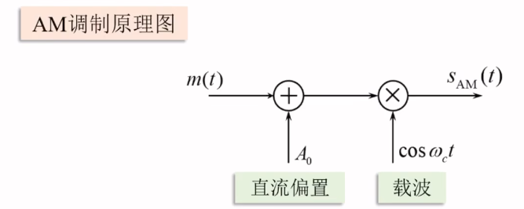
由图可知，$S_{AM}(t) = [A_0+m(t)]cos \omega_c t$
#### AM调制必须满足的条件
* m(t)均值为0
* 直流偏置必须满足 $A_0 \geq |m(t)_{max}|$ 目的：防止过调幅
**AM调幅系数**：$a = \frac{|m(t)|_{max}}{A_0},a \leq 1$

#### AM信号的时域，频域表达式
* 时域表达式
$s_{AM}(t) = [A_0+m(t)]cos \omega_c t = A_0 cos \omega_c t（载波项） + m(t)cos \omega_c t（边带项）$
* 频域表达式
$S_{AM}(\omega) = \pi A_0[\delta(\omega+\omega_c)+\delta(\omega-\omega_c)]（载波项）+\frac{1}{2}[M(\omega +\omega_c)+M(\omega -\omega_c)]（边带项）$
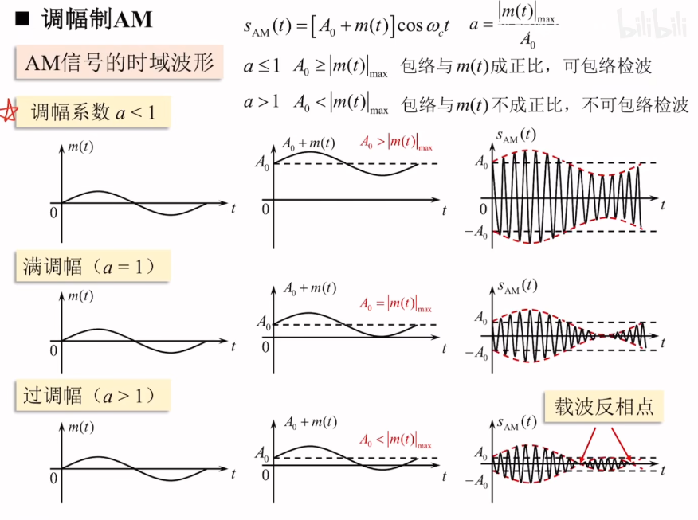
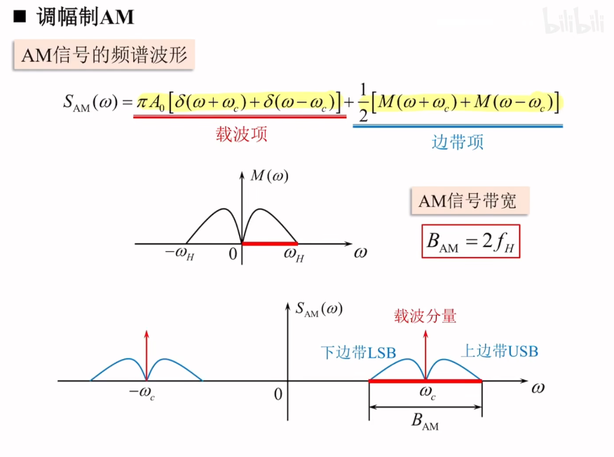
线性调制：频谱为线性搬移，没有产生频率的畸变
#### AM信号的调制效率
$P_{AM} = \frac{A_0^2}{2}+\frac{\overline{m^2(t)}}{2} = P_c（载波频率）+P_s（边带频率）$
$\eta_{AM} = \frac{P_s}{P_{AM}} = \frac{\overline{m^2(t)}}{A_0^2 + \overline{m^2(t)}}$
由于 $m(t)_{max} \leq A_0$,故 $\eta_{AM} \leq 50\%$
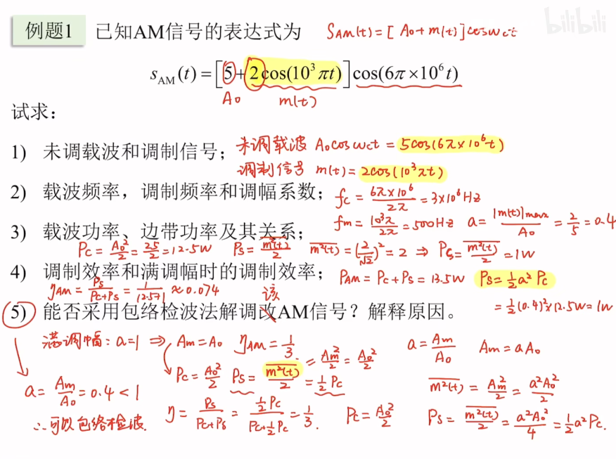
#### 双边带调制DSB
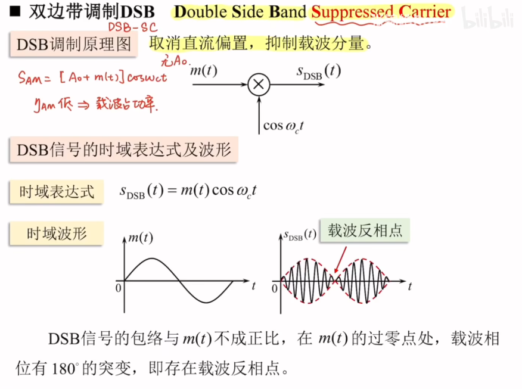
#### DSB信号和AM信号的对比
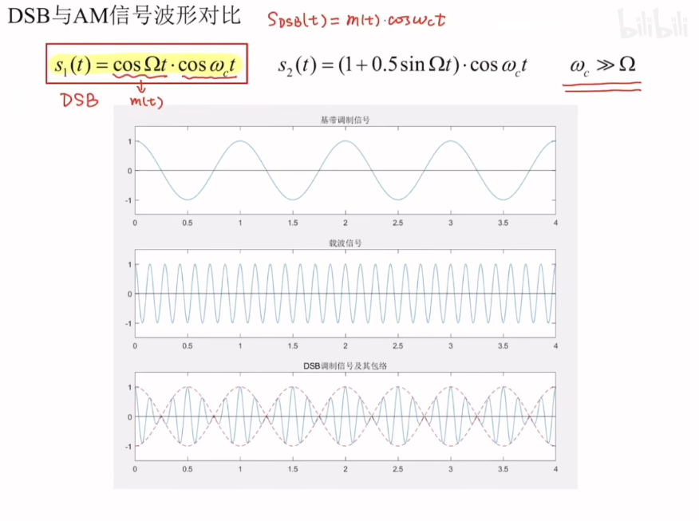
从中可以看出，在调制信号0点附近存在相位翻转
#### DSB信号的频域表达式及频谱
* 频域表达式：$S_{DSB}(\omega) = \frac{1}{2}[M(\omega+\omega_c)+M(\omega - \omega_c)]$
* 频域波形
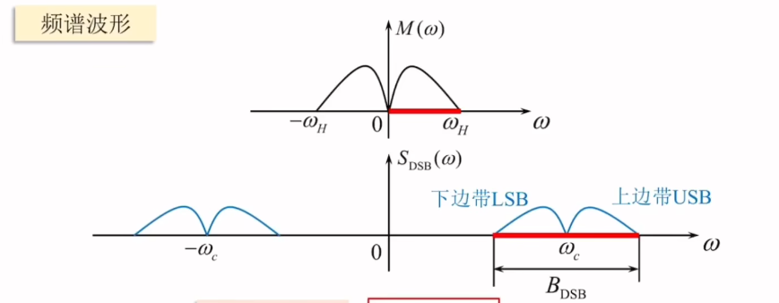
* 信号带宽：$B_{DSB} = 2f_H$
* 调制效率
$P_{DSB} = \frac{\overline{m^2(t)}}{2}$
$\eta_{DSB} = 100\%$
DSB调制效率高，但是不能用包络检波法，解调方法复杂 
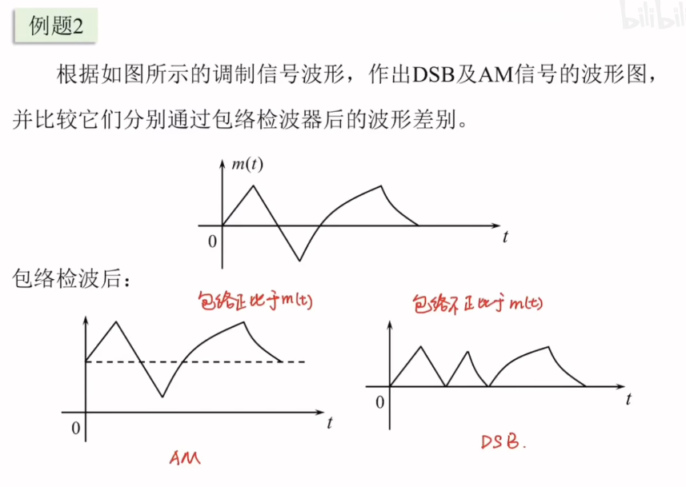
#### 单边带调制SSB
DSB上下边带对称，信息相同，只需要传输其中一个
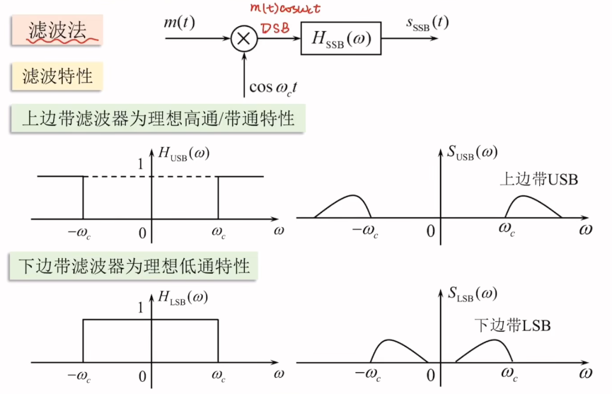
信号带宽：$B_{SSB} = f_H$
难点：要求边带滤波器在载频$\omega_c$处有陡峭的截止特性，由于理想滤波器物理不可实现，因此要求m(t)在$\omega = 0$处近似等于0
**数学原理** ：调制信号为单频正弦波 $m(t) = A_mcos \omega_m t$
**DSB 信号表达式**  
\[
S_{\text{DSB}}(t) = A_m \cos \omega_m t \cdot \cos \omega_c t = \frac{1}{2} A_m \cos (\omega_c + \omega_m) t + \frac{1}{2} A_m \cos (\omega_c - \omega_m) t
\]

**上边带 USB**  
\[
S_{\text{USB}}(t) = \frac{1}{2} A_m \cos (\omega_c + \omega_m) t = \frac{1}{2} A_m \cos \omega_m t \cdot \cos \omega_c t - \frac{1}{2} A_m \sin \omega_m t \cdot \sin \omega_c t
\]

**下边带 LSB**  
\[
S_{\text{LSB}}(t) = \frac{1}{2} A_m \cos (\omega_c - \omega_m) t = \frac{1}{2} A_m \cos \omega_m t \cdot \cos \omega_c t + \frac{1}{2} A_m \sin \omega_m t \cdot \sin \omega_c t
\]

**Hilbert 变换（相移 \(\pi / 2\)）**  
\[
A_m \cos \omega_m t \xrightarrow{\text{Hilbert变换}} A_m \cos \left( \omega_m t - \frac{\pi}{2} \right) = A_m \sin \omega_m t
\]

### 待补完

## 角度调制
### 角度调制基本概念
$$
s_m(t) = Acos[\omega_c(t)+\phi(t)]
$$
* 瞬时相位：$\omega_ct+\phi_t$,瞬时相位偏移：$\phi(t)$
* 瞬时角频率：$\omega_c+\frac{d\phi(t)}{dt}$,瞬时角频偏：$\frac{d\phi(t)}{dt}$
* 调相信号PM：$\phi(t) = K_pm(t),s_{PM}(t) = Acos[\omega_ct+K_pm(t)]$,即有瞬时相位偏移和调制信号成正比，$K_p$是相移常数
* 调频信号FM：$\frac{d\phi(t)}{dt} = K_fm(t),S_{FM}(t) = Acos[\omega_c(t)+K_f \int m(\tau)d\tau]$
顺时角频偏和调制信号成正比，$K_f$为频偏常数
* 调频指数与最大频偏
对于 $S_{FM}(t) = Acos[\omega_c(t)+K_f \int m(\tau)d\tau]$,假设 $m(t) = A_mcos\omega_mt$,$\frac{d\phi(t)}{dt} = K_f A_m cos\omega_m t$,
**最大角频偏**：$$\Delta \omega = K_f A_m$$
$\phi(t) = K_fA_m \int cos\omega_m \tau d\tau = \frac{K_fA_m}{\omega_m}sin\omega_m t$
**调频指数**：
$$
m_f = \frac{K_fA_m}{\omega_m} = \frac{\Delta \omega}{\omega_m} = \frac{\Delta f}{f_m}
$$
### 窄带调频（NBFM）
* 定义：FM信号的最大瞬时相位偏移满足 $|K_f| << \frac{\pi}{6}(0.5)$，则为窄带调频
时域表达式：
$$
s_{NBFM}(t) \approx Acos\omega_c(t)-[AK_f \int m(\tau)d\tau] \cdot sin\omega_c t
$$
频域：
$$
S_{NBFM}(\omega) = \pi A[\delta(\omega + \omega_c + \delta(\omega -\omega_c))]+\frac{AK_f}{2}[\frac{M(\omega-\omega_c)}{\omega-\omega_c}-f\frac{M(\omega+\omega_c)}{\omega+\omega_c}]
$$
从中可见，边带项 $\frac{AK_f}{2}[\frac{M(\omega-\omega_c)}{\omega-\omega_c}-f\frac{M(\omega+\omega_c)}{\omega+\omega_c}]$ 产生了新的频率分量，引起了频谱失真，为非线性制，其**信号带宽为$B = 2f_H$**
NBFM信号的最大频偏小，占据带宽小，抗干扰性强于AM
### 宽带调频（WBFM）
* 定义：最大瞬时相位不满足$|K_f| << \frac{\pi}{6}(0.5)$
* 时域表达式：
$$
s_{FM}(t) = Acos(\omega_c t+ m_f sin \omega_m t) = A \sum_{- \infty}^{\infty}J_n(m_f)cos(\omega_c +n \omega_m)t
$$
* 频域表达式：
$$
S_{FM} = \pi A \sum_{-\infty}^{\infty}J_n(m_f)[\delta(\omega+\omega_c+n\omega_m)+\delta(\omega-\omega_c-n\omega_m)]
$$
其中 $J_n(m_f)$为第一类n阶贝赛尔函数
* **卡森公式**
$B_{FM} = 2(m_f+1)f_{max}$,$f_m = \frac{\Delta f}{f_{max}}$
* FM信号的功率分配
 $$
 P_{FM} = \frac{A^2}{2} = P_C
 $$
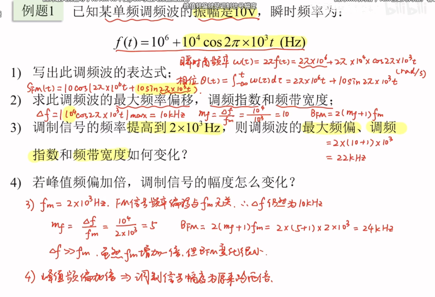
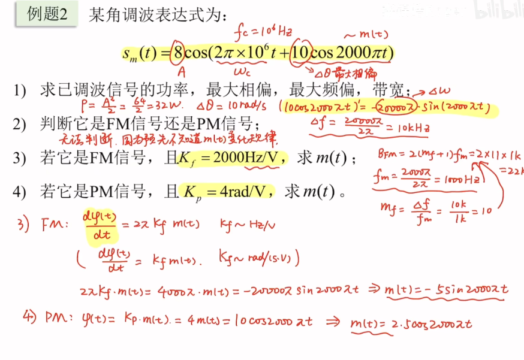
## 模拟调制系统的抗噪声性能

### 分析模型和性能指标
* 分析模型
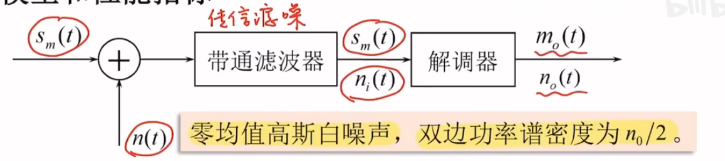
其中带通滤波器的中心频率为 $f_0$,带宽为B
$n(t)$为均值高斯白噪声，双边功率谱密度为 $\frac{n_0}{2}$,经过带通滤波器后的噪声为窄带高斯噪声
* 性能指标
调制制度增益：
$$
G = \frac{\frac{S_O}{N_O}}{\frac{S_i}{N_i}} = \frac{\frac{\overline{s_o^2()t}}{\overline{n_o^2(t)}}}{\frac{\overline{s_m^2(t)}}{\overline{n_i^2(t)}}}
$$
它反映了解调过程对信噪比的改善程度

调制器输出信噪比：
$$
\frac{S_o}{N_o} = \frac{\overline{m_o^2(t)}}{n_o^2(t)}
$$

