## 数字基带系统与基带信号波形
### 数字基带系统的电脉冲表示
$$
s(t) = \sum_{-\infty}^{\infty}a_ng(t-nT_B)
$$
其中，$a_n$为第n个码元的电平取值（通常取+1或者-1），$g(t)$为脉冲波形，$T_B$为码元持续时间
### 数字基带信号的波形及其特点
#### 单极性不归零波形
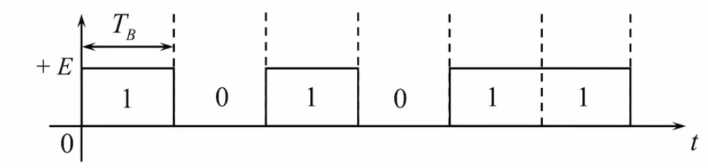
特点：极性单一含有直流分量，在长连0或长连1串时无同步信息。
#### 双极性不归零波形

特点：当0、1等概率分布出现时无直流分量，在长连0或长连1串时无同步信息。
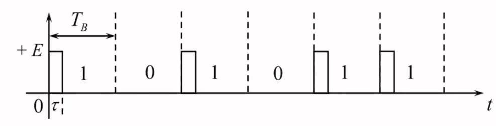
#### 单极性归零波形
特点：极性单一含有直流分量，高电平小于一个码元持续时间在长连0或长连1串时无同步信息。
#### 双极性归零波形
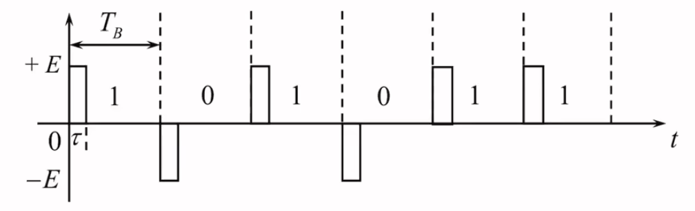
特点：当0、1等概率分布出现时无直流分量，相邻脉冲之间以零电平间隔，有利于同步信息的提取
#### 差分波形
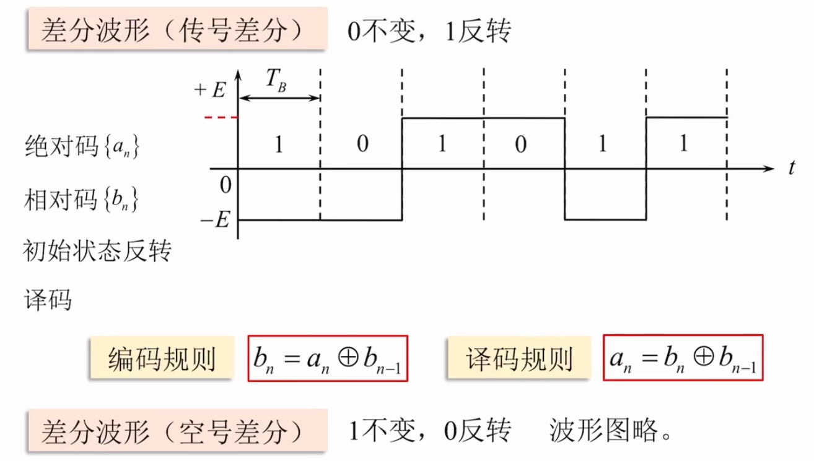
特点：当0、1等概率分布出现时无直流分量，相邻脉冲之间以零电平间隔，有利于同步信息的提取
特点：利用相邻码元的电平变化来表示代码可消除初始状态的影响或者在同步系统中引起的相位模糊
#### 多电平波形
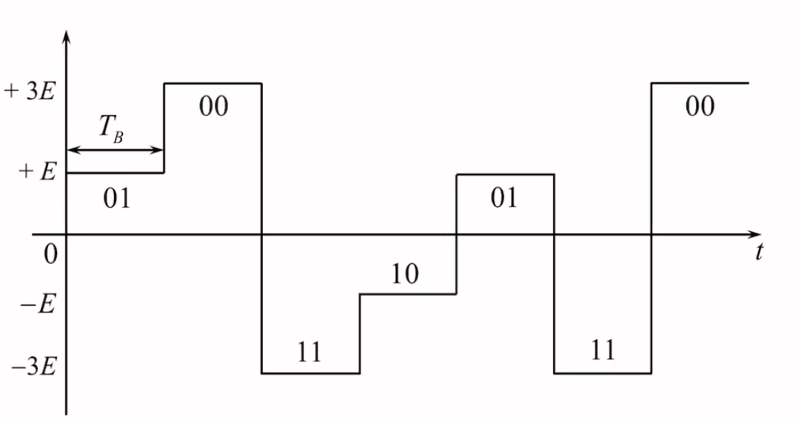
特点：一个电平对应多位二进制代码频带利用率高
### 数字基带系统求解功率谱
数字基带信号功率谱的一般表达式为
$$
P_s(f) = \frac{\sigma^2}{T_s}|G_T(f)|^2+\frac{\mu_a^2}{T_s^2}\sum_{m=-\infty}^{\infty}|G_T(\frac{m}{T_s})|^2 \delta(f-\frac{m}{T_s})
$$
其中 $a_n$为发送信号的数字序列，$G_T(f)$为成形滤波器 

### 基带传输的常用码型（线路编码）
#### 传输码（线路码）的选择原则
* **功率谱**：无直流分量，限制信号带宽，减小功率谱中的高低频分量
* **定时**：应该包含与定时分量相关的离散谱，便于接收端从信号中提取定时信息（同步）
* **透明性**：码型变换应该具有透明性，即与信源输出符号的统计特性无关
* **性能监测**，线路码最好具有内在的检错能力，便于接收端进行误码检测
* **传输可靠性**：给定传输条件，线路码应使系统的差错概率尽可能地小
* **设备复杂度**：线路编译码设备尽可能简单
#### AMI码
* **编码规则**
“1”（传号）交替变换为“+1”和“-1”，“0”（空号）保持不变
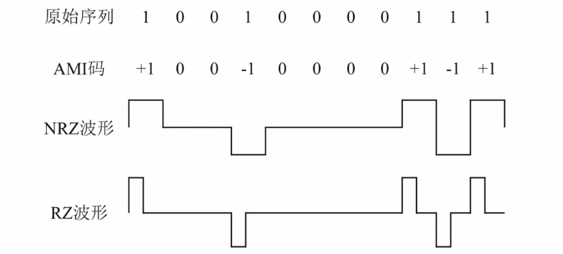
(NRZ:非归零，RZ：归零)
##### 码型特点
1. 改变信号的功率谱密度，无直流，高，低频分量少
2. 编、译码电路简单
3. 通过观察极性是否交替即可判断有无误码
4. 缺点：出现长连0时不利于提取定时信息
#### HDB3码（三阶高密度双极性码）
##### 编码规则
1. 连0个数不超过3,按照AMI规则编码
2. 若出现4个连0,用“000V”代替“0000”，V称为破坏脉冲，破坏符号V的极性和前一个非0符号极性相同，且V码之间极性交替
3. 若两个想令V码之间有偶数个非0码，此时后一个V码与前一个非0符号极性相反，需要用“B00V”取代后一个“000V”，B称为调节脉冲，极性与前一个非零符号极性相反，且后面的符号V开始极性交替变化（**V码需要当成非零码处理**）
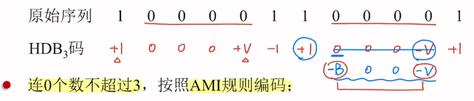
* V码的作用：将连0数减少至不超过3个
* B码的作用：保证V码极性交替，消除直流
* V码和B码在序列中视为非0码
* 可能出现的四种取代节：000+V，000-V，+B00+V，-B00-V

##### 译码方法
1. 找破坏位置，即出现 $\pm$1000$\pm$1,以及   $\pm$100$\pm$1 的位置
2. 若出现 $\pm$ 1000 $\pm$1,则将后四位全部译为0；若出现 $\pm$100$\pm$1,则将四位全部译为0
3. 其余的非0脉冲全部译为“1”，0脉冲译为“0”
4. 其余的非0脉冲译为“1”，0脉冲译为“0”。
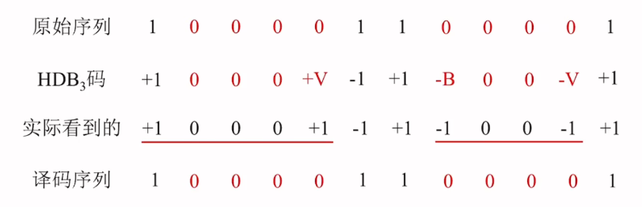
##### 码型特点
* 改变信号功率谱密度，无直流，高、低频分量少
* 编码复杂，译码简单
* 有一定的检错，纠错能力
* 连0码不超过3个有利于提取定时信息
#### 数字双相码
##### 编码规则
“0”编为“01”，“1”编为“10”
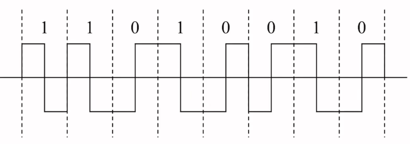
##### 码型特点
1. 改变信号；功率谱密度，无直流，高、低频分量少
2. 易提取定时信息
3. 编码简单
4. 连码不超过两个，可以用于检错
5. 缺点：带宽加倍
#### CMI码（传号反转码）
##### 编码规则
“1”编为“11”和“00”交替出现，“0”编为“01”，“10”为禁用码组
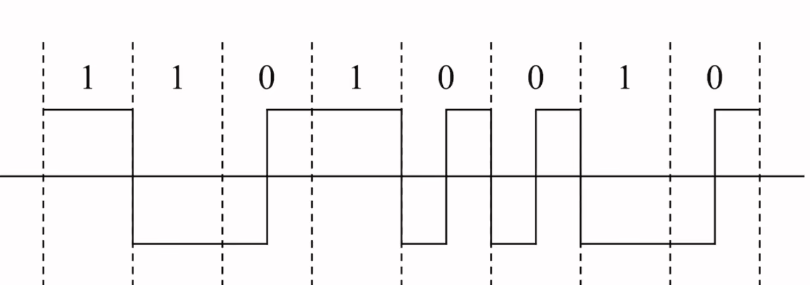
##### 码型特点
1. 信号功率谱密度无直流
2. 跳变频繁，易提取定时信息
3. 编码简单
4. 连码不超过三个可以宏观检错
5. 缺点：带宽加倍
#### nBmB码
将原来的n位二进制码，编码为m位二进制码，由于m>n,因此会出现冗余，从中选择一部分有利码组作为可用码组，其余为禁用码组。常选m = n+1,如3B4B码，5B6B码等
#### nBmT码
将原先的n位二进制码编码为m位三元码
例如：在相同的数据率下，4B3T的信息容量大于1B1T码，可提高频带利用率
## 码间干扰
### 码间干扰的数学表示
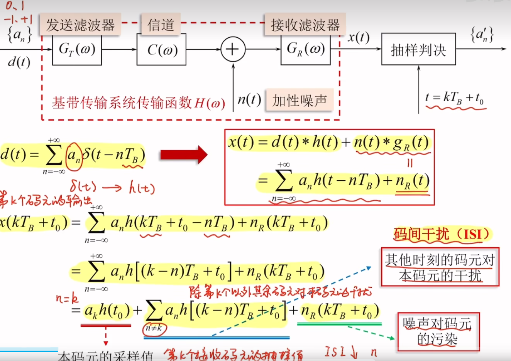
#### 无码间干扰的时域条件
码间干扰可以表示为(假设$t_0$ = 0)
$$
\sum_{n \neq k} a_nh[(k-n)T_B] = 0 \rightarrow m = k-n =0
$$
无码间干扰时域表达式：
$$
h(mT_B)\begin{cases}
1,m = 0\\
0,m为其他整数
\end{cases}
$$
直观理解：基带系统单位冲激响应 $h(t)$在其他码元抽样时刻 $mT_B$为0,在本码元抽样时刻（$m = 0$）有值
### 无码间干扰的频域条件：奈奎斯特第一准则
表达式
$$
\sum_i H(\omega +\frac{2\pi i}{T_B}) = T_B,|\omega| \leq \frac{\pi}{T_B}
$$
物理意义：
若一个实际的基带传输特性可以等效于一个理想低通滤波器，则以 $R_B =\frac{1}{T_B}$ 传输时，无码间干扰
当基带系统满足理想低通特性时，最高频带利用率 $\eta_{max} = \frac{R_B}{B} = 2$，奈奎斯特速率 $R_B = \frac{1}{T_B} = 2f_N(Baud)$,奈奎斯特带宽$B = \frac{1}{T_B}$
### 余弦滚降特性
在奈奎斯特带宽的频率$f_N$ 处按照奇对称条件进行“圆滑滚降”
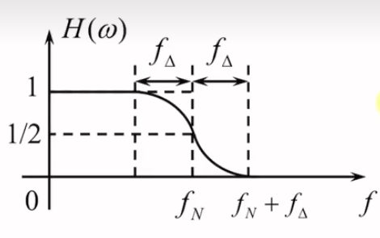
* 滚降系数： $\alpha = \frac{f_\Delta}{f_N}$
* 系统带宽：$B = f_N+f_{\Delta} = (1+\alpha)f_N$
* 频带利用率：$\eta = \frac{R_B}{B} = \frac{2}{1+\alpha}(Baud/Hz)$,$\eta_b = \frac{2}{1+\alpha}log_2M(bps/Hz)$

### 解题思路总结
1. 通过传输函数确定奈奎斯特带宽$f_N$
2. 根据奈奎斯特带宽$f_N$确定最大传输速率，即奈奎斯特速率$R_{Bmax} = 2f_N$
3. 若实际数据率满足 $R_B = \frac{R_{Bmax}}{n},则无ISI$
4. 频带利用率 $\eta = \frac{R_B}{B},\eta_{max} = \frac{R_{Bmax}}{B}$
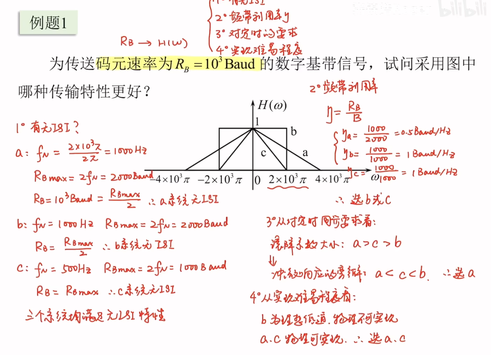
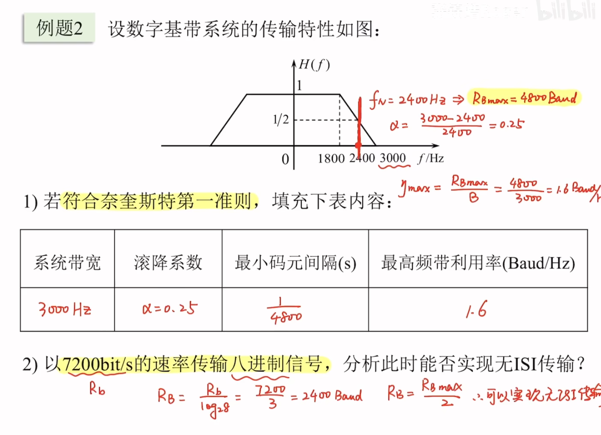
## 眼图
**概念**：在示波器余晖作用下多个码元扫描波形会在窗口内重叠显现，呈现出来的图像像一只眼睛，故称为“眼图”
**观察方法**
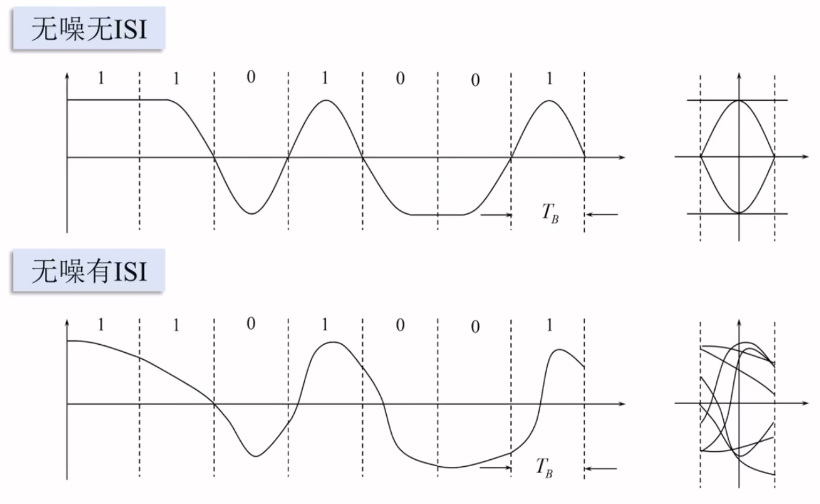
眼图眼睛张开的大小反映了码间干扰的强弱。“眼睛”张得越大，越端正，ISI越小。
眼图“眼睛”迹线清晰与否反映了噪声的大校，眼睛越清晰噪声越小
**眼图模型**
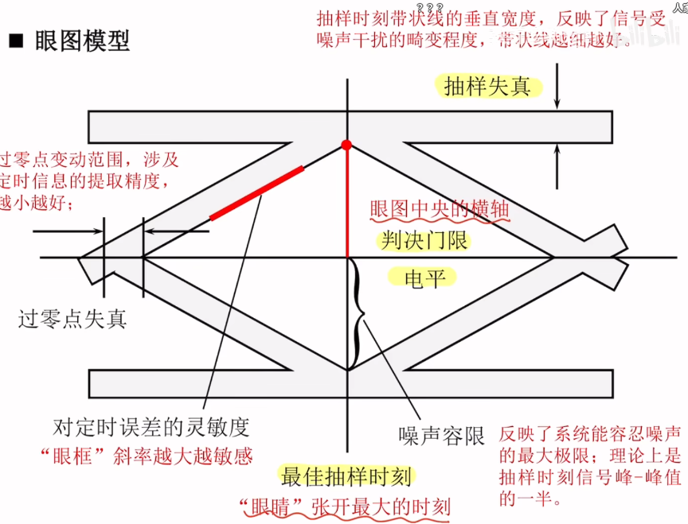
## 消除码间干扰
抽样判决值（以双极性基带系统为例）
$$
r = \begin{cases}
A+n_R,当发送“1”码时\\ -A+n_R,当发送“0”码时
\end{cases}
$$
系统总误码率
$$
\begin{align}
P_e &= P(0)P(1|0)+P(1)P(0|1) \\&=P(0)\int _{V_d}^\infty f_0(r)dr+P(1) \int_{-\infty}^{V_d}f_1(r)dr
\end{align}
$$
对于双极性系统，在等概条件下最佳判决门限电平为0；对于单极性系统最佳判决门限电压在等概条件下为 $\frac{A}{2}$
## 匹配滤波器
### 推导
输入信号 $r(t) = s(t)+n_i(t)$ 经过匹配滤波器 $H(f)$ 输出 $y(t) = s_o(t)+n_o(t)$,则有输出信号的瞬时功率：
$$
S_O(t) = |s_o(t_0)|^2 = |\int_{-\infty}^{\infty}H(f)S(f)e^{j2\pi ft_0}|^2
$$
输出噪声的功率大小：
$$
N_o = -\int_{-\infty}^{\infty}|H(f)|^2 \frac{n_0}{2}df
$$
则信噪比：$r_0 = \frac{S_O}{N_O} \leq \frac{2E}{n_0}$
其中E为发送信号 $s(t)$ 的能量，$E = \int_{-\infty}^{\infty}|S(f)|^2df = \int_{-\infty}^{\infty}s^2(t)dt$
且当 $H(f) = S^*(f)e^{-j2\pi ft_0}$,即 $h(t) = s(t_0-t)$ 时等号成立
### $t_0$的选取
匹配滤波器 $h(t)$ 实质上是对信号 $s(t)$的镜像并平移

由于因果系统要求 $t_0 \geq T_B$,则输出最大信噪比必须在输入信号结束之后，为了尽早判决，常取 $t_0 = T_B$,此时匹配滤波器的冲激响应为：
$$
h(t) = s(T_B-t)
$$
此时输出信号 $s_o(t) = R(t-t_0)$,$R(t)为s(t)$的自相关函数，因此匹配滤波器等同于相关器，在抽样时刻
## 基于匹配滤波器的最佳接收机
### 接收电压的统计特性
接受波形可以表示为 $r(t) = n(t)+s_i(t)$,出现发送码元 $s_i(t)$ 时，$r(t)$ 的统计特性完全由 $n(t)$ 决定，接收电压 $r(t)$ 的联合概率密度函数为：
$$
f_i(r) = \frac{1}{(\sqrt{2}\sigma_n)^k}exp\{{-\frac{1}{n_0}} \int_{0}^{T_B}[r(t)-s_i(t)]^2dt \}
$$
似然函数表示发送信号 $s_i(t)$ 确定时，接收到的观察值和原发送信号的相似程度。
### 最大似然准则
当似然函数满足 $\frac{f_0(r_0)}{f_1(r_0) }= \frac{P(1)}{P(0)}$,总体误码率最小，此时称 $r_0$ 为最佳判决门限，这样的判决准则称为似然比准则
当输入等概时，当 $f_0(r)<f_1(r)$ 时，判为1,反之则判为0，这样的判决准则为最大似然准则
## 最佳接收机
由似然比准则推导出，当
$$
\frac{n_0}{2}lnP(0)+\int_{0}^{T_B}r(t)s_0(t)dt>\frac{n_0}{2}lnP(1)+\int_{0}^{T_B}r(t)s_1(t)dt
$$
时，判为0,反之判为1，称 $\frac{n_0}{2}lnP(0)$ 为 $U_0$,$\frac{n_0}{2}lnP(1)$ 为 $U_1$
可以得出接收机的框图为

相当于比较 $r(t)$ 与 $s_0(t)与s_1(t)$的相关性，判为相关性大的对应信号
匹配滤波器形式的最佳接收机

假设 $s_0(t)$ 和 $s_1(t)$ 先验等概，噪声单边功率谱密度 $n_0$ 给定，系统误码率只和 $\int_{0}^\infty {[s_0(t)-s_1(t)]^2}dt$ ,即两个信号的差的能量有关
此时的误码率 $P_e = \frac{1}{2} erfc(\sqrt{\frac{E_b(1-\rho)}{2n_0}})$,此时 $E_0 = E_1 = E_b$,$\rho = \frac{\int_{0}^{T_s}s_0(t)s_1(t)dt}{\sqrt{E_0 E_1}}$,表示信号的相关性，$\rho = -1时的信号形式是最佳的，比如双极性基带信号和2PSK带通数字调制信号 
## 最佳基带系统
### 理想情况下的最佳基带传输系统
发送、接收滤波器传递函数必须满足
$$
G_T(\omega) = G_R(\omega) = H^{\frac{1}{2}}(\omega)
$$

$P_{e单} = \frac{1}{2} erfc(\frac{1}{2\sqrt{2}}\sqrt{\frac{A^2}{\sigma_n^2}})$ ,$P_{e双} = \frac{1}{2} erfc(\frac{1}{\sqrt{2}}\sqrt{\frac{A^2}{\sigma_n^2}})$ 抽样瞬间的最大信噪比为 $r_{MF} = \frac{2E}{n_0}$,带入其中可得 $P_{e单} = \frac{1}{2} erfc(\sqrt{\frac{E_b}{2n_0}})$ ,$P_{e双} = \frac{1}{2} erfc(\sqrt{\frac{E_b}{n_0}})$

### 非理想情况下的基带传输系统
非理想信道下，信道特性 $C(\omega) \neq 1$,在接收端同样采用匹配滤波器，此时 $G_{R}^(\omega) = G_{T}^*(\omega) \cdot C^*(\omega)$,同时在接收滤波器后方接均衡器，$G_E(\omega) = \frac{1}{|C(\omega)|^2}$