### 2ASK
#### 原理
用二进制数字基带信号控制正弦载波的幅度，码值0发送0,码值1发送 $cos \omega_c t$
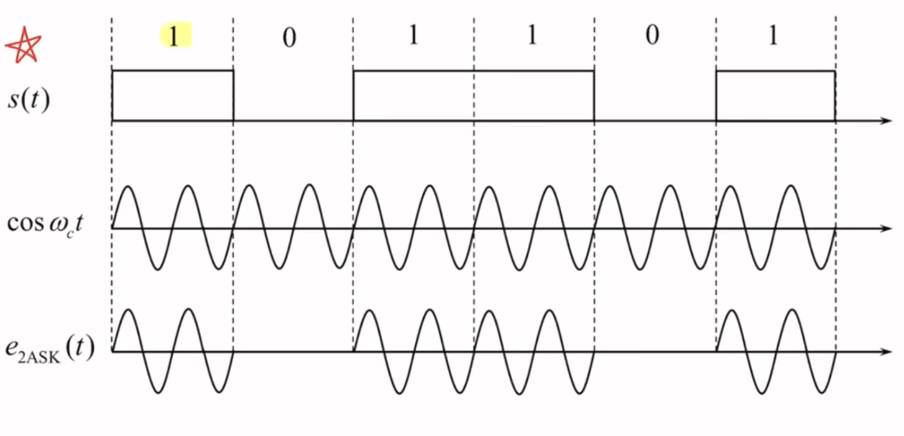
#### 调制方法
通过单极性归零信号与 $cos \omega_c t$ 相乘得到
#### 解调方法
* 包络检波法
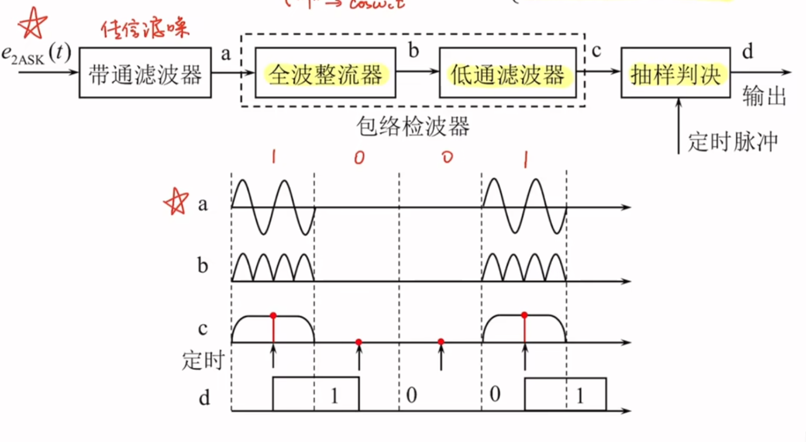
* 相干解调法（同步检波法）
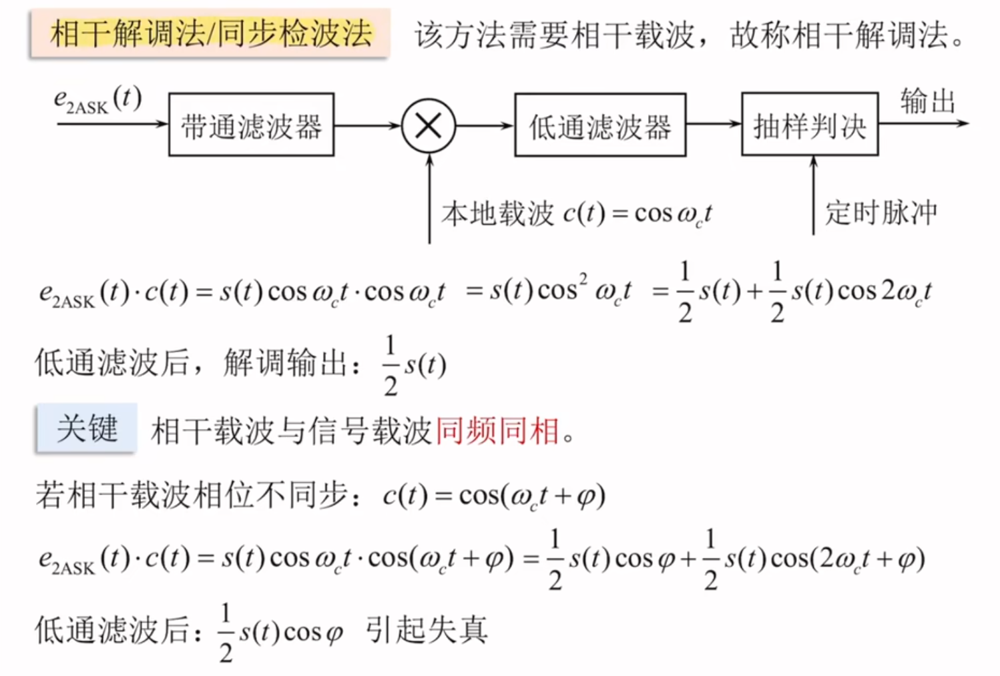
#### 功率谱密度
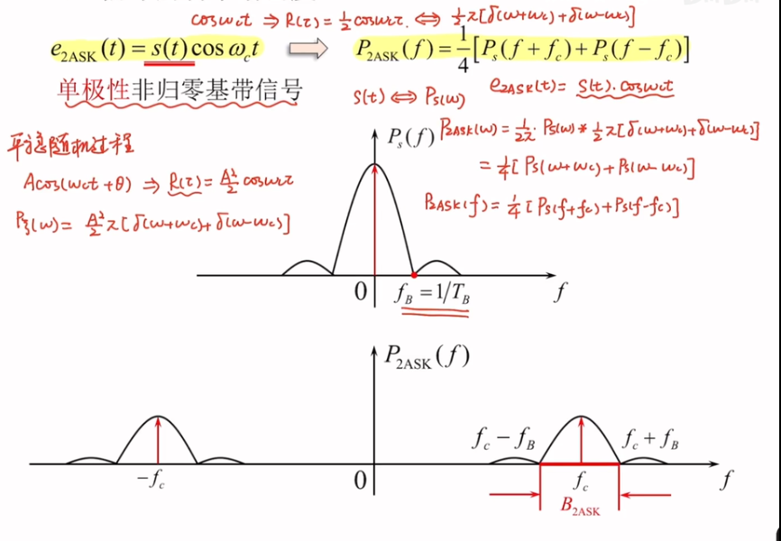
$$
B_{2ASK} = 2f_B = \frac{2}{T_B} = 2R_B
$$
此时的频谱含有载波分量

### 2FSK
#### 原理
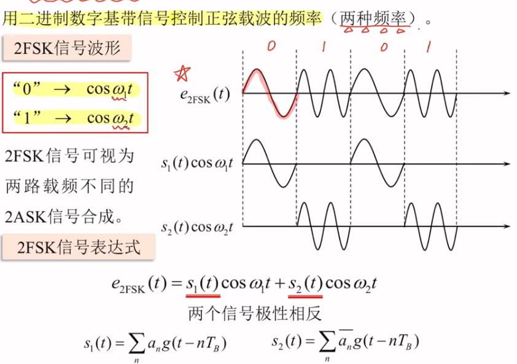
#### 调制方法
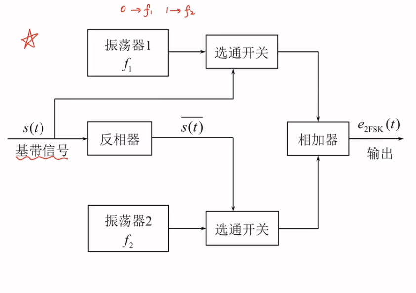
#### 解调方法
* 包络检波法
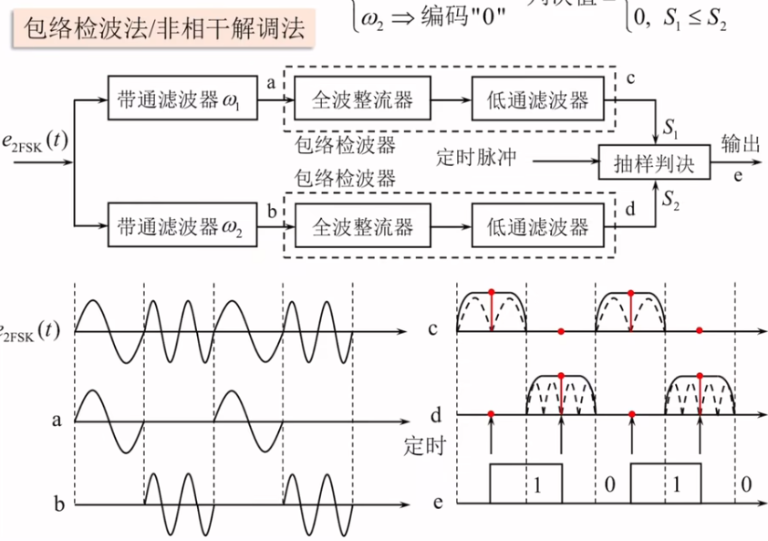
* 相干解调法
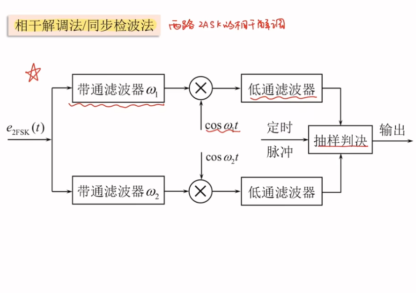
#### 功率谱密度
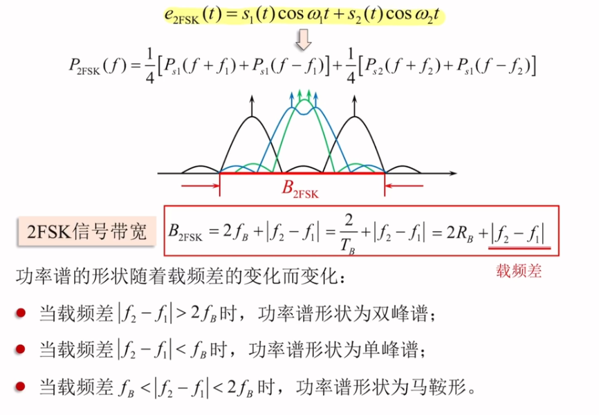

### 2PSK
#### 原理
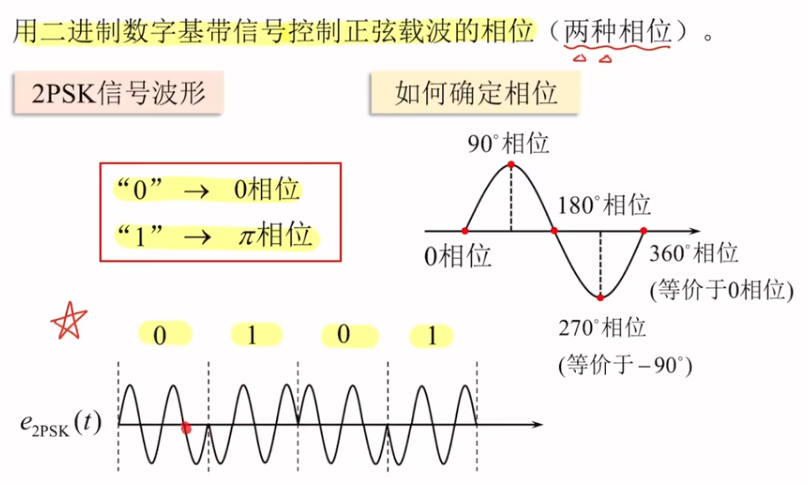

#### 解调方法
由于幅度恒定，所以只能使用相干解调法
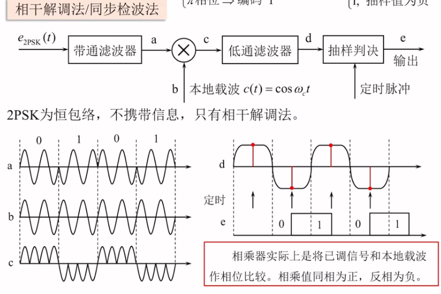

#### 2PSK调制存在的问题(倒$\pi$)

#### 功率谱密度
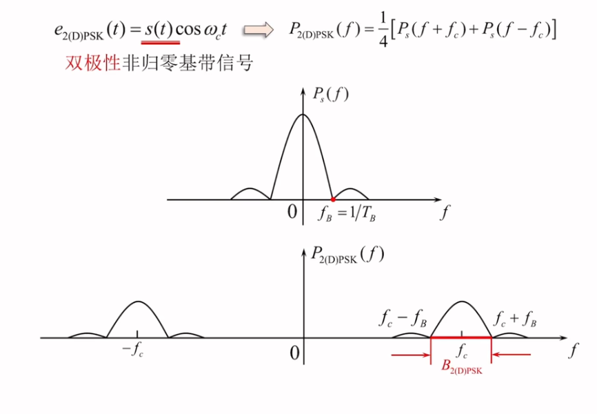

### 2DPSK
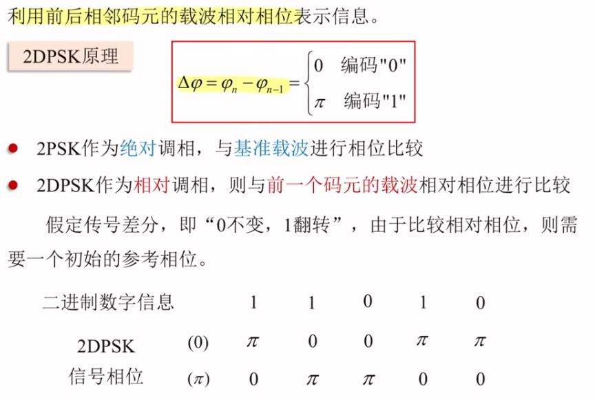
#### 解调方法
* 相干解调+码反变换
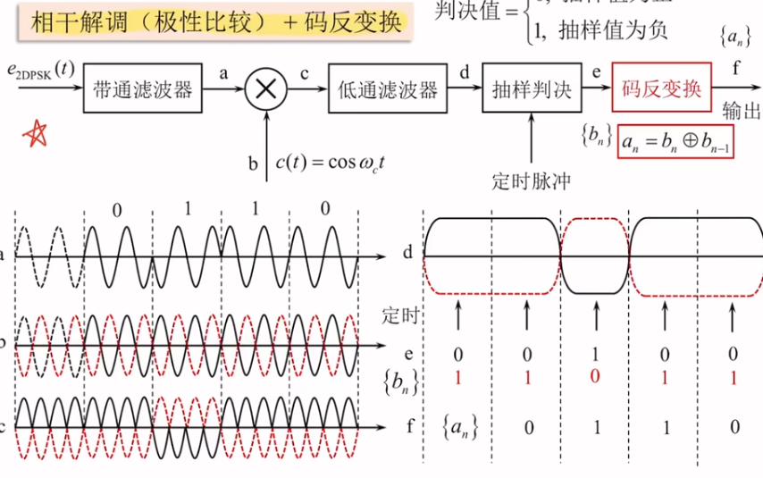
* 差分相干解调（相位）
#### 功率谱密度（同2PSK）

### 二进制数字调制系统的抗噪声性能
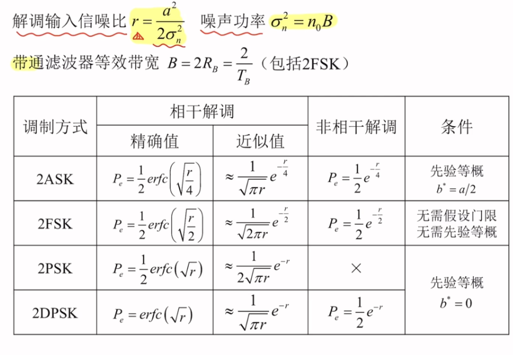
