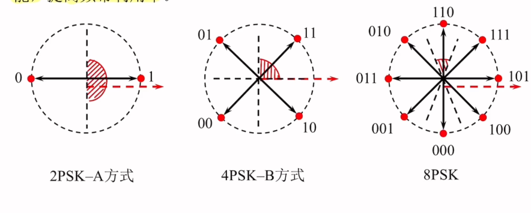
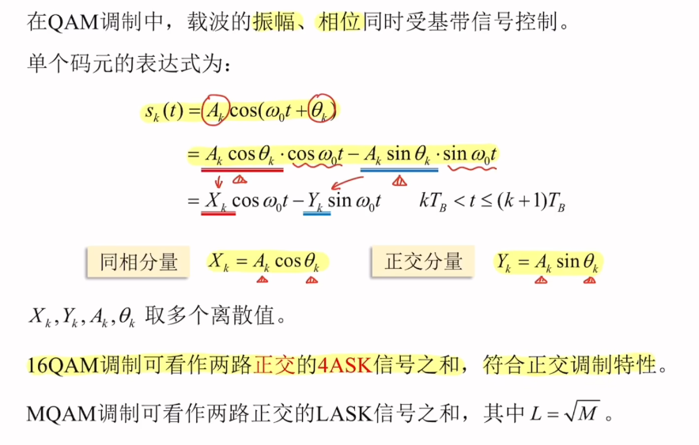
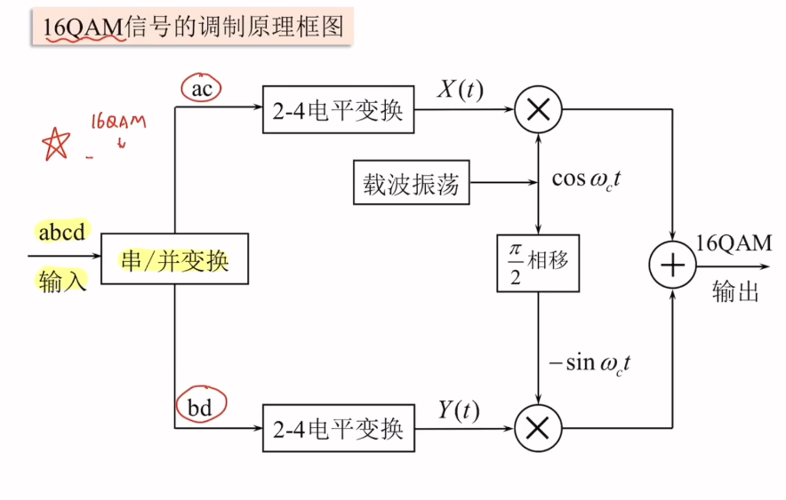
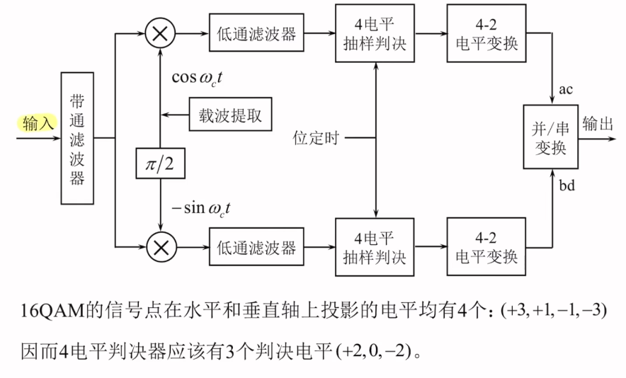
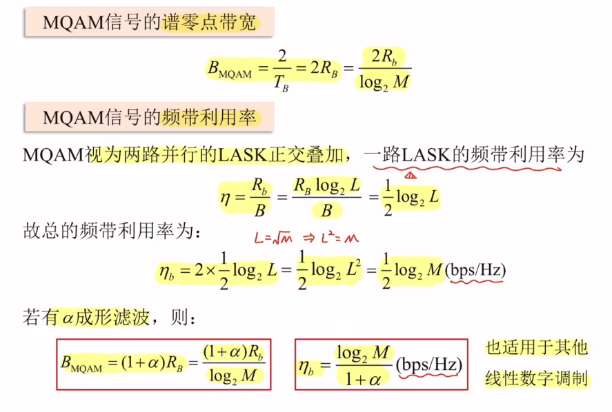
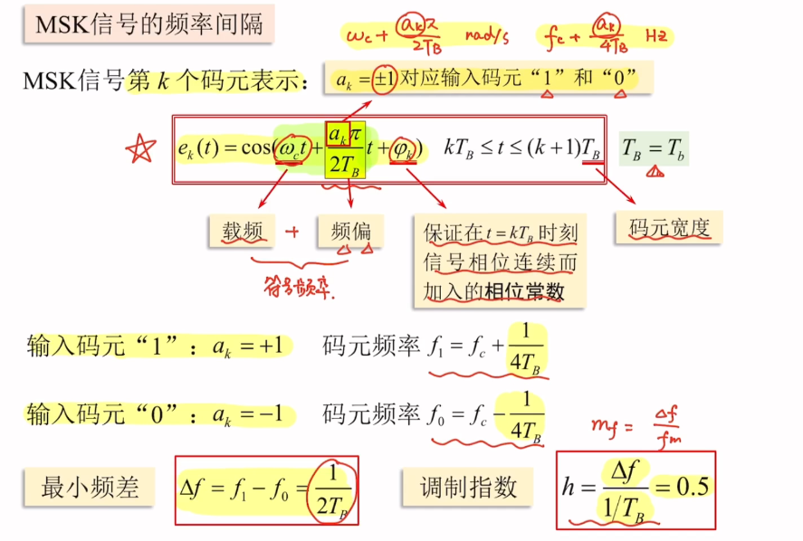
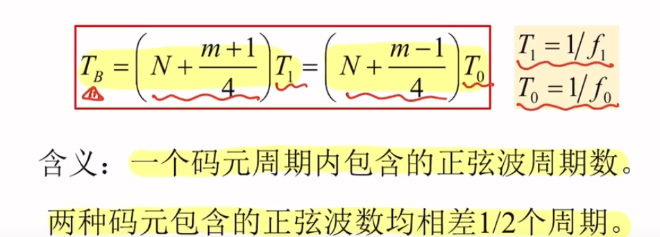
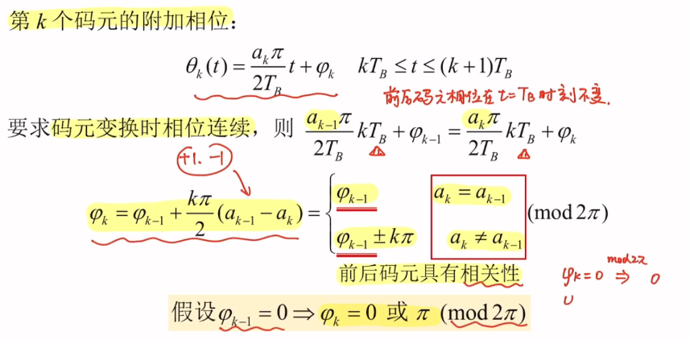
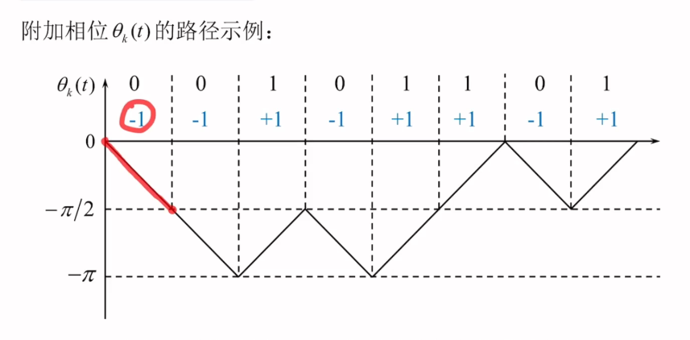

### 正交振幅调制（QAM）
* 需求背景：多进制相位调制中（MPSK），提高进制数M可以提高频带利用率，但同时减小了噪声容限

* 设计思想：不增大圆周半径（增加功率），但重新安排星座点的位置
#### 16QAM原理

#### 16QAM调制

#### 16QAM解调

#### 16QAM功率谱

#### 最小频移键控（MSK）
* 传统2FSK有相位不连续，占用频带宽，功率谱旁瓣衰减慢等缺点，根本原因是信号相位不连续
* 解决途径：采用相位连续变化的调制方式，MSK就是一种包络恒定，相位连续，频差最小并且严格正交的2FSK信号
#### 最小频率间隔
* 相干接收：$(f_1-f_0)_{min} = \frac{1}{2T_B}$,非相干接收：$(f_1-f_0)_{min} = \frac{1}{T_B}$

其中 $N$为整数，$m = 0,1,2,3$

#### MSK的相位路径

#### 正交频分复用（OFDM）
* 需求背景：希望码长大于最大时延差的同时期望高速传输
#### 优点
* 抗多径传播和频率选择性衰落
* 提高频谱利用率
#### 缺点
* 对频率偏移和相位噪声比较敏感
* 信号的峰值功率和平均功率的比值大，会降低功放功率