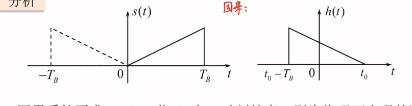
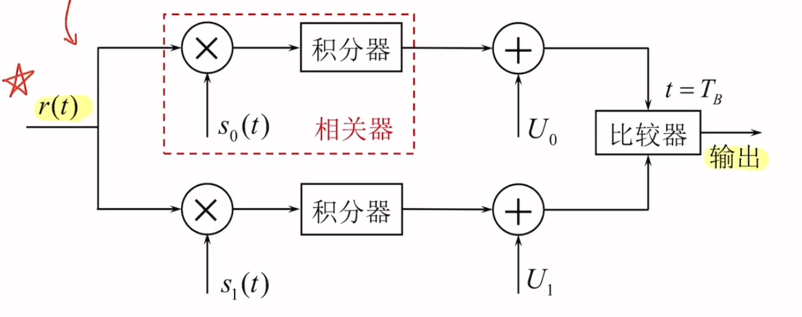
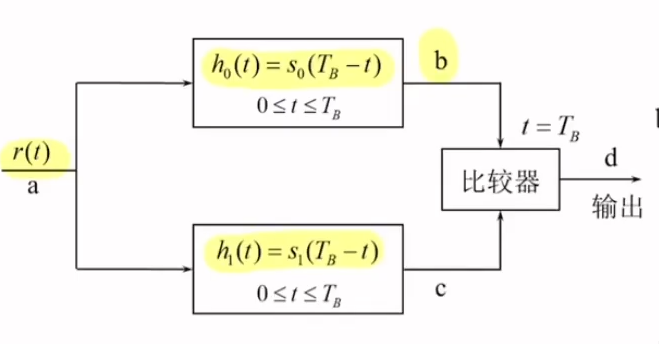

## 消除码间干扰
抽样判决值（以双极性基带系统为例）
$$
r = \begin{cases}
A+n_R,当发送“1”码时\\ -A+n_R,当发送“0”码时
\end{cases}
$$
系统总误码率
$$
\begin{align}
P_e &= P(0)P(1|0)+P(1)P(0|1) \\&=P(0)\int _{V_d}^\infty f_0(r)dr+P(1) \int_{-\infty}^{V_d}f_1(r)dr
\end{align}
$$
对于双极性系统，在等概条件下最佳判决门限电平为0；对于单极性系统最佳判决门限电压在等概条件下为 $\frac{A}{2}$
## 匹配滤波器
### 推导
输入信号 $r(t) = s(t)+n_i(t)$ 经过匹配滤波器 $H(f)$ 输出 $y(t) = s_o(t)+n_o(t)$,则有输出信号的瞬时功率：
$$
S_O(t) = |s_o(t_0)|^2 = |\int_{-\infty}^{\infty}H(f)S(f)e^{j2\pi ft_0}|^2
$$
输出噪声的功率大小：
$$
N_o = -\int_{-\infty}^{\infty}|H(f)|^2 \frac{n_0}{2}df
$$
则信噪比：$r_0 = \frac{S_O}{N_O} \leq \frac{2E}{n_0}$
其中E为发送信号 $s(t)$ 的能量，$E = \int_{-\infty}^{\infty}|S(f)|^2df = \int_{-\infty}^{\infty}s^2(t)dt$
且当 $H(f) = S^*(f)e^{-j2\pi ft_0}$,即 $h(t) = s(t_0-t)$ 时等号成立
### $t_0$的选取
匹配滤波器 $h(t)$ 实质上是对信号 $s(t)$的镜像并平移

由于因果系统要求 $t_0 \geq T_B$,则输出最大信噪比必须在输入信号结束之后，为了尽早判决，常取 $t_0 = T_B$,此时匹配滤波器的冲激响应为：
$$
h(t) = s(T_B-t)
$$
此时输出信号 $s_o(t) = R(t-t_0)$,$R(t)为s(t)$的自相关函数，因此匹配滤波器等同于相关器，在抽样时刻信噪比最大，为 $r = \frac{2E}{n_0}$,其中 $E$为峰值信号幅度，$n_0$ 为单边功率谱密度
## 基于匹配滤波器的最佳接收机
### 接收电压的统计特性
接受波形可以表示为 $r(t) = n(t)+s_i(t)$,出现发送码元 $s_i(t)$ 时，$r(t)$ 的统计特性完全由 $n(t)$ 决定，接收电压 $r(t)$ 的联合概率密度函数为：
$$
f_i(r) = \frac{1}{(\sqrt{2}\sigma_n)^k}exp\{{-\frac{1}{n_0}} \int_{0}^{T_B}[r(t)-s_i(t)]^2dt \}
$$
似然函数表示发送信号 $s_i(t)$ 确定时，接收到的观察值和原发送信号的相似程度。
### 最大似然准则
当似然函数满足 $\frac{f_0(r_0)}{f_1(r_0) }= \frac{P(1)}{P(0)}$,总体误码率最小，此时称 $r_0$ 为最佳判决门限，这样的判决准则称为似然比准则
当输入等概时，当 $f_0(r)<f_1(r)$ 时，判为1,反之则判为0，这样的判决准则为最大似然准则
## 基于相关器的最佳接收机
由似然比准则推导出，当
$$
\frac{n_0}{2}lnP(0)+\int_{0}^{T_B}r(t)s_0(t)dt>\frac{n_0}{2}lnP(1)+\int_{0}^{T_B}r(t)s_1(t)dt
$$
时，判为0,反之判为1，称 $\frac{n_0}{2}lnP(0)$ 为 $U_0$,$\frac{n_0}{2}lnP(1)$ 为 $U_1$
可以得出接收机的框图为

相当于比较 $r(t)$ 与 $s_0(t)与s_1(t)$的相关性，判为相关性大的对应信号
匹配滤波器形式的最佳接收机

假设 $s_0(t)$ 和 $s_1(t)$ 先验等概，噪声单边功率谱密度 $n_0$ 给定，系统误码率只和 $\int_{0}^\infty {[s_0(t)-s_1(t)]^2}dt$ ,即两个信号的差的能量有关
此时的误码率 $P_e = \frac{1}{2} erfc(\sqrt{\frac{E_b(1-\rho)}{2n_0}})$,此时 $E_0 = E_1 = E_b$,$\rho = \frac{\int_{0}^{T_s}s_0(t)s_1(t)dt}{\sqrt{E_0 E_1}}$(假设等能),表示信号的相关性，$\rho = -1$时的信号形式是最佳的，比如双极性基带信号和2PSK带通数字调制信号 
## 最佳基带系统
### 理想情况下的最佳基带传输系统
发送、接收滤波器传递函数必须满足
$$
G_T(\omega) = G_R(\omega) = H^{\frac{1}{2}}(\omega)
$$

$P_{e单} = \frac{1}{2} erfc(\frac{1}{2\sqrt{2}}\sqrt{\frac{A^2}{\sigma_n^2}})$ ,$P_{e双} = \frac{1}{2} erfc(\frac{1}{\sqrt{2}}\sqrt{\frac{A^2}{\sigma_n^2}})$ 抽样瞬间的最大信噪比为 $r_{MF} = \frac{2E}{n_0}$,带入其中可得 $P_{e单} = \frac{1}{2} erfc(\sqrt{\frac{E_b}{2n_0}})$ ,$P_{e双} = \frac{1}{2} erfc(\sqrt{\frac{E_b}{n_0}})$

### 非理想情况下的基带传输系统
非理想信道下，信道特性 $C(\omega) \neq 1$,在接收端同样采用匹配滤波器，此时 $G_{R}^(\omega) = G_{T}^*(\omega) \cdot C^*(\omega)$,同时在接收滤波器后方接均衡器，$G_E(\omega) = \frac{1}{|C(\omega)|^2}$

