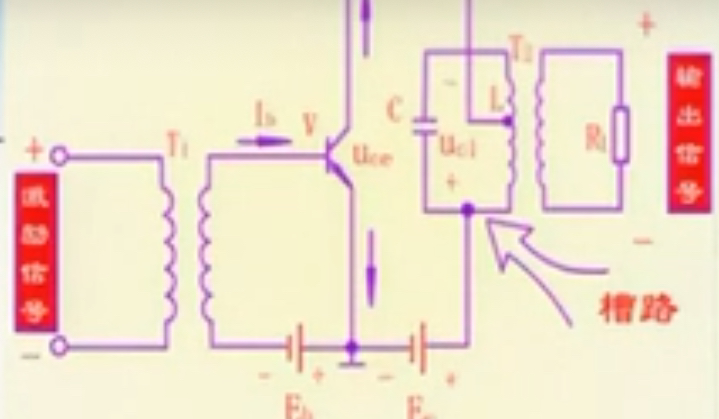
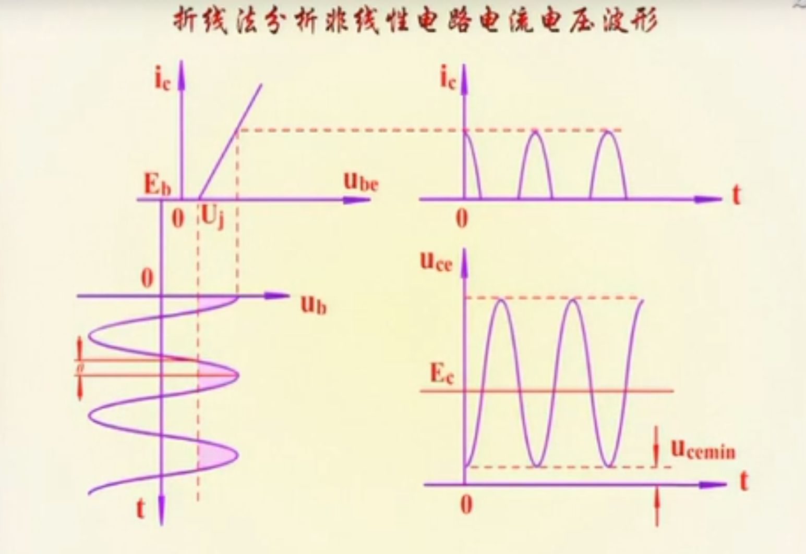
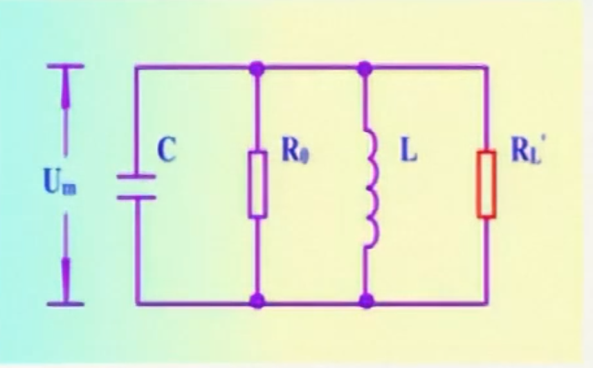
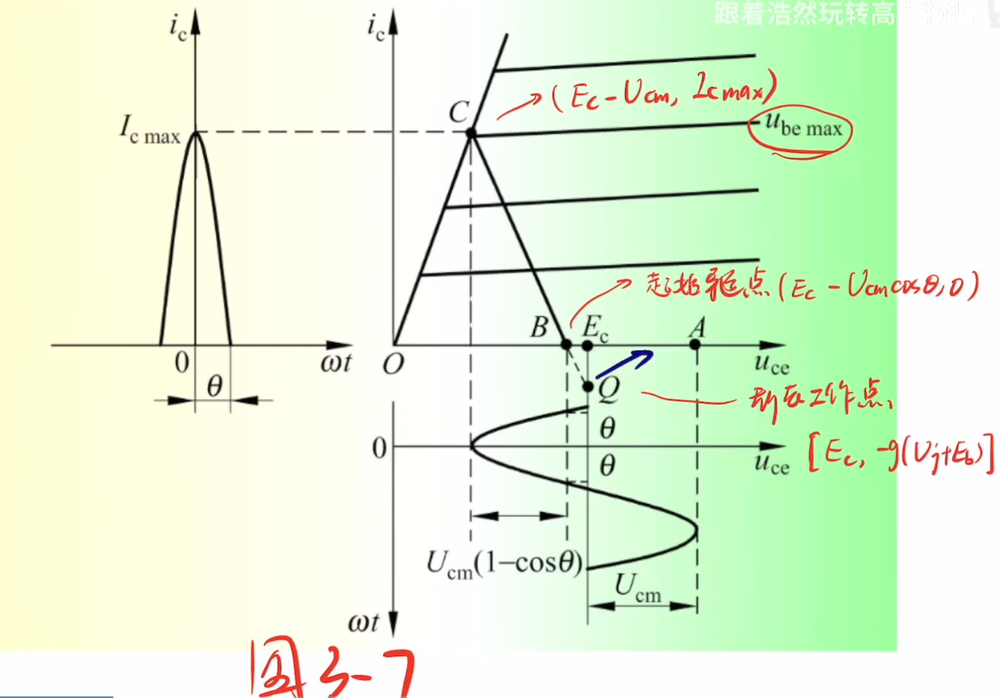
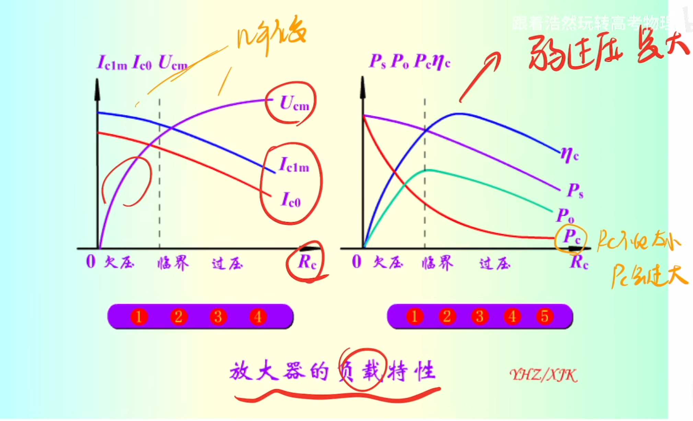
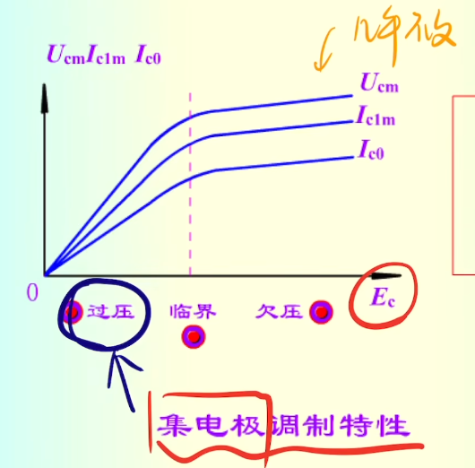
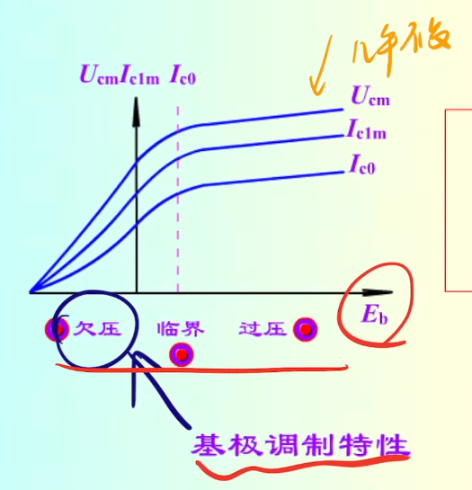
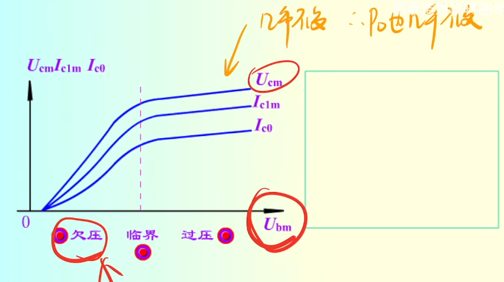

## 功率放大器的工作原理

设 $u_b = u_{bm}cos \omega t$,则 $u_{be} = -E_b+U_{bm}cos\omega t$,在导通范围内有 $i_c = g(u_{be}-U_j) = g(-E_b+U_{bm}cos \omega t-U_j)$
导通角：当 $\omega t =  \theta $ 时，$i_c = 0$,可以得到：
$$
cos \theta = \frac{U_j+E_b}{U_{bm}}
$$
当 $\omega t = 0$ 时，$i_c$ 取最大值
$$
i_{cmax} = gU_{bm}(1-cos \theta)
$$
$i_c$ 的傅里叶级数展开为
$$
i_c = I_{c0}+\sum_{1}^\infty I_{cnm}coss \omega t
$$
其中，直流分量 $I_{c0} = \frac{1}{2 \pi} \int_{-\pi}^\pi i_c d\omega t = I_{cmax} \frac{sin \theta-\theta cos \theta}{\pi (1-cos \theta)} = \alpha_0 I_{cmax}$
基波分量幅值为 $I_{c1m} = I_{cmax} \frac{\theta -sin \theta cos \theta}{\pi(1-cos\theta)} = \alpha_1 I_{cmax}$
 
 ## 功率放大器的功率和效率
### 集电极效率
电源供给功率 $P_S$ 和交流输出功率 $P_O$ 可以分别表示为
$$
\begin{align}
&P_S = E_C I_{c0} \\ &P_O = \frac{1}{2} U_{cm}I_{c1m}
\end{align}
$$
集点极效率 $\eta_c$ 为
$$
\eta_c = \frac{P_O}{P_S} = \frac{P_S -P_C}{P_S}=\frac{1}{2} \frac{\alpha_1}{\alpha_0} \frac{U_{cm}}{E_c}
$$
* $P_S$:直流电源提供的功率
* $P_O$:集电极输出的功率
* $P_C$:晶体管损耗功率 
其中 $\frac{U_{cm}}{E_c}$ 为电压利用系数
### 槽路效率

$$
\eta_T = \frac{P_L}{P_O} = \frac{P_O-P_T}{P_O}
= \frac{Q_0-Q_L}{Q_0}$$
* $P_L$:负载的功率,$P_L = \frac{U_m^2}{2 R_L'}$
* $P_O$:输入到槽路的总功率,$P_O = \frac{U_m^2}{2 (R_L'//R_0)}$
* $P_T$:槽路损耗功率,$P_T = \frac{U_m^2}{2 R_0}$
### 最佳负载
$$
R_C = R_{CP} = \frac{U_{cm}^2}{2P_O} = \frac{(E_C-U_{ces})^2}{2P_O}
$$
## 调谐功率放大器的工作状态分析
### 动态特性曲线
当放大器工作于谐振状态时，外部特性方程为
$$
\begin{align}
&u_{be} = -E_b +U_{bm}cos \omega t \\ &u_{ce} = E_c -U_{cm}cos \omega t
\end{align}
$$
二式联立得到：
$$
u_{be} = -E_b +U_{bm} \frac{E_c-u_{ce}}{U_{cm}}
$$
在转移特性的放大区，内部特性方程
$$
i_c = g(u_{be}-U_j)
$$

动态特性应该同时满足内部特性和外部特性方程，联立得到
$$
i_c = g(-E_b -U_j +U_{bm}\frac{E_c-U_{ce}}{U_{cm}})
$$
取 $E_c = U_{ce}$(静态工作点)，$i_c = 0$ (初始导通点)

### 调谐功率放大器的三种工作状态及判别方法
#### 定义
* 欠压：若晶体管在所有导通时刻都处于放大状态，则称放大器工作在欠压状态
* 临界：若刚刚进入饱和区的边缘，称放大器工作在临界状态
* 过压：若晶体管工作时有部分时间进入饱和区，则称放大器工作在过压状态

#### 判别方法：
$u_{cemin} = E_c -U_{cm}$,若 $u_{cemin}>U_{ces}$(欠压)，$u_{cemin}=U_{ces}$（临界）$u_{cemin}<U_{ces}$（过压）,$U_{ces}$是三极管的饱和压降
### 各种因素变化对性能指标的影响
#### $R_C$ 的变化对指标的影响

$$
\begin{align}
&P_o = \frac{1}{2} I_{clm} U_{cm} = \frac{U_{cm}^2}{2R_c} = \frac{1}{2} I_{clm}^2 R_c\\
&P_s = E_c I_{co}\\
&P_c = P_s - P_o \\
&\eta_c = \frac{P_o}{P_s}
\end{align}
$$

### $E_C$ 改变（集电极调制特性）、$E_b改变$（基极调制特性）、$U_{bm}$变化（振幅特性）
#### 集电极调制特性

#### 基极调制特性

#### 振幅特性

