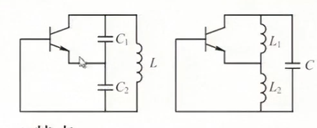
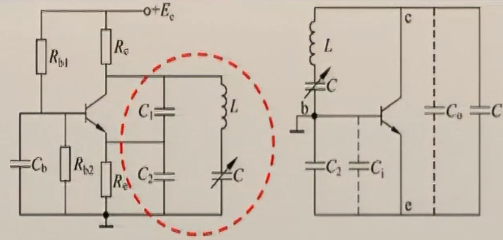
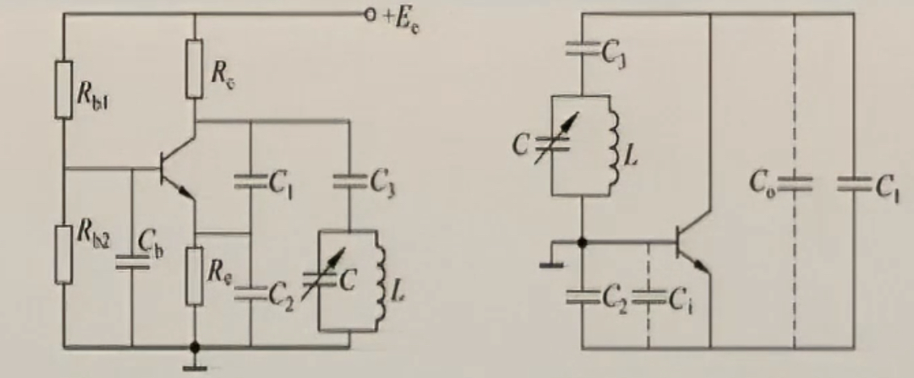
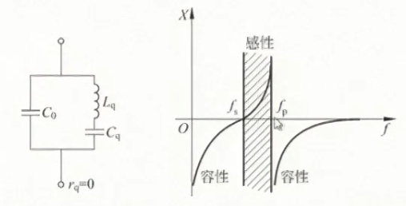

### 概述
#### 构成震荡器的条件
* $\dot{K} \cdot \dot{F} = 1$
其中 $\dot{K}$ 为放大器的放大系数，$\dot{F}$ 为反馈网络的反馈系数
由这个条件可以得到
$$
\begin{cases}
|K|\cdot|F| = 1(环路增益为1) \\ \phi_A +\phi_F = 2\pi n(正反馈条件) 
\end{cases}
$$
### 三点式振荡电路
#### 电路
LC回路引出三个端点分别同晶体管的三个电极相连，分电容式和电感式两种

**特点**：“射同基反”，即与发射极相连的元件性质相同，与集电极、基极相连的元件电抗性质相反
#### 常用指标的计算
电容式（左图）：
* 反馈系数
$$
F \approx \frac{u_i}{u_o} = \frac{\frac{1}{j \omega C_2}}{\frac{1}{j \omega C_1}} = \frac{C_1}{C_2}
$$
* 振荡频率
$$
f_0 \approx \frac{1}{2 \pi \sqrt{LC}}
$$

其中 $C = \frac{C_1 C_2}{C_1+C_2}$
* 电感式（右图）：
基本分析方法与电容式相同，唯一的不同是计算电感时，需要考虑互感 $L = L_1 +L_2+2M$ 
### 改进式电容三点震荡器
#### 克拉泼电路（串联改进型）
**电路特点**：在基本的电容式三点震荡器的电感部分串联一个电容减小了输入电容和输出电容对电路的影响，**不足之处**：当减小C来提高 $f_0$ 时，振荡幅度显著下降，当C减小到一定程度时，可能停振，限制了 $f_0$的提高；波段范围不宽，频率覆盖系数小

#### 西勒电路（并联改进型）
**电路特点**：除了采用容量较大的 $C_1,C_2$ 外，主要是把基本型的电容反馈线路集电极-基极之路改用LC并联回路再与$C_3$串联;波段内振幅比较稳定，且调谐范围比较宽

### 石英晶振电路
#### 晶振的等效电路

其中，$f_s$ 为串联谐振频率，$f_p$ 为并联谐振频率，石英振荡电路应该处于 $f_s \leq f < f_p$
#### 泛音晶振电路
**定义**：泛音是石英片振动的机械谐波，它与基频是奇数倍的关系，且和电气谐波不能同时并存，为了提高晶振电路的工作频率可使电路振荡频率工作在晶体的谐波（一般为三次到七次）频率上，这种晶体称为泛音晶体。