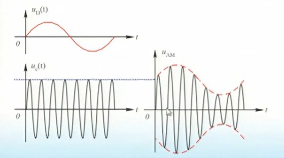

## 常见调制方法的分析
### 普通调幅波(AM)
#### 时域
设调制信号为单音音频信号 $u_{\Omega} = u_{\Omega_m}(t) = U_{\Omega_m}cos \Omega t$,载波信号为 $u_c(t) = U_{cm}cos \omega_c t$

调幅波的振幅可以表示为：
$$
\begin{align}
U_{AM}(t) &= U_{cm}+k_aU_{\Omega_m}cos\Omega 
\\& = U_{cm}(1+k_a \frac{U_{\Omega m}}{U_{cm}}cos \Omega t)\\ &= U_{cm}(1+m_a cos \Omega t)
\end{align}
$$
称 $m_a = \frac{k_a U_{\Omega_m}}{U_{cm}}$ 为调幅度，$m_a \leq 1$
#### 频谱
$$
u_{AM}(t) = U_{cm}(1+m_a cos \Omega t) 
$$
整理得到
$$
 U_{cm}cos \omega_c t+\frac{1}{2}m_aU_{cm}cos(\omega_c +\Omega)t +\frac{1}{2}m_aU_{cm}cos(\omega_c -\Omega)t
$$
**结论**：
* 调制过程是实现频线性搬移的过程
* 载频信号仍然保持调制前的频率和幅度，因此它没有反映调制信号信息，只有两个边带携带了调制信号的信息
* 调制信号的带宽 $B = 2F_s$
#### 功率谱
**载波功率**：
$$
P_c = \frac{1}{2} \frac{U_{cm}^2}{R_L}
$$
**边频功率**:
$$
P_1 = P_2 = \frac{1}{2}(\frac{m_a}{2}U_{cm})^2 = \frac{1}{4} m_a ^2 P_c
$$
**平均功率**：
$$
P = P_2 +P_1 +P_2 = (1+\frac{m_a^2}{2})P_c
$$

### 抑制载波双边带调幅(DSB)
为了克服普通调幅波效率低的缺点，提高设备的功率利用率，可以不发送载波，只发送边带信号
$$
\begin{align}
u_{DSB} &= AU_{\Omega m}cos \Omega t \cdot cos \omega_c t
\\ &= \frac{1}{2} AU_{\Omega m}U_{cm}[cos(\omega_c +\Omega)t+cos(\omega_c -\Omega)t]
\end{align}
$$

### 大信号峰值包络检波
* 工作原理 ：利用二极管的单向到典型和检波负载 $R_L C$ 的充放电作用
* 特点：快充慢放，$R_L C >> \frac{1}{f_c}$
* 检波效率：
$$
\eta_d = \frac{U_{\Omega_m}}{m_a U_{cm}} = a_2 R_2 U_{cm}
$$
其中，$U_{\Omega_m}$ 是检波后的波形最大值， $m_a U_cm$ 是 检波前波形的最大值
* 输入电阻 $R_{in}$
$$
R_{in} \approx \frac{1}{2 \eta_d} R_L(\eta _d 没给默认为1)
$$
#### 对角线失真
* 失真原因：放电太慢，以致解调波跟不上调幅波包络的变化
* 分析：当包络下降的速度小于电容的放电速度时，可以避免对角线失真，有
$$
m_a \Omega sin \Omega t_A \leq \frac{1}{RC}(1+m_a cos \Omega t_A)
$$
进一步整理，得到：
$$
m_a < \frac{1}{\sqrt{1+(\Omega C R_L)^2}}
$$
或者：
$$
\Omega C R_L < \frac{\sqrt{1-m_a ^2}}{m_a}
$$
#### 割底失真
* 失真原因：$u_i(t)<E$,其中 $E$ 是输出端等效的电动势。
* 避免方法： 设 $\eta_d = 1$,则当 $m_a < \frac{\tilde{R_L}}{R_L}$，可以避免割底失真，$\tilde{R_L} = \frac{R_i}{R_L+R_i}$