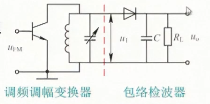
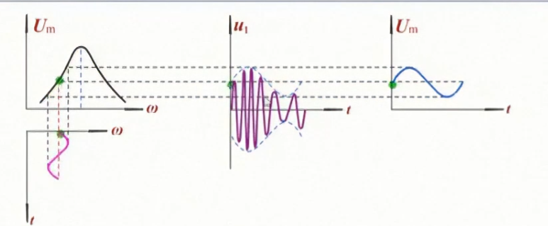
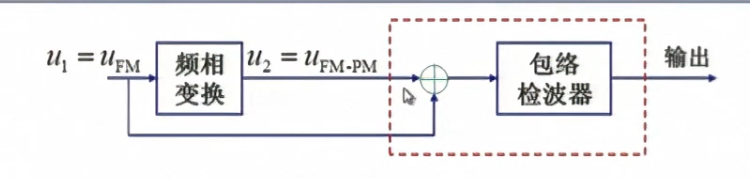

## 调角波的性质
### 调频以及其数学表达式
* 定义
$$
FM:\omega(t) = \omega_c (t) +K_f u_{\Omega}(t) = \omega_c +\Delta \omega(t)
$$
其中 $K_f$ 称为调频系数，由调频电路决定
* 瞬时相位
$$
\theta(t) = \int \omega(t)dt = \omega_c t+K_f \int u_\Omega(t)dt
$$
* 数学表达式
$$
u_{FM}(t) = U_m cos [\omega_c t +K_f \int u_{\Omega}(t)dt]
$$
* 最大频偏
$$
\Delta \omega_{max} = K_f |u_{\Omega(t)}|_{max}
$$
* 调频指数（最大相移）
$$
m_f = |\Delta \theta_{max}| = K_f |\int u_{\Omega}(t)dt|_{max}
$$
### 调相及其数学表达式
* 定义
$$
PM:\theta(t) = \omega_c t +K_p u_{\Omega}(t)
$$
其中 $K_p$ 为调相系数，取决于调相电路
* 瞬时频率
$$
\omega(t) = \frac{d \theta(t)}{dt} = \omega_c +K_p \frac{du_{\Omega}(t)}{dt}
$$
* 数学表达式
$$
U_m cos[\omega_c t +K_p u_{\Omega}(t)]
$$
* 最大频偏
$$
\Delta \omega = |\Delta \omega(t)|_{max} = K_p |\frac{du_{\Omega}(t)}{dt}|_{max}
$$
* 最大相移（调相指数）
$$
m_p = |\Delta \theta(t)|_{max} = K_p |u_{\Omega}(t)|_{max}
$$
### 调角波的频谱与有效频带宽度
在调制信号频率单一时：
$$
\begin{align}
u_{FM}(t) &= U_m cos[\omega_c t + m_f sin \Omega t] \\
& = U_m[cos \omega_c t \cdot cos(m_f sin \Omega t)-sin \omega_c t \cdot sin(m_f sin \Omega t)] 
\end{align}
$$
#### 窄带调频：$m_f << 1$
此时，有
$$
u_{FM}(t) = U_m cos \omega_c t -U_m sin \omega_c t \cdot m_f sin \Omega t
$$
此时频带宽度：$B = 2F$
#### 宽带调频：$m_f >>1$
此时，对表达式进行展开：
$$
u_{FM}(t) = U_m \sum_{n = -\infty}^{\infty}J_n(m_f)cos(\omega_c +n \Omega)t
$$
其中 $J_n()$ 为贝塞尔函数
##### 特点
* 调频信号的频谱不是调制信号的线性搬移，而是由载频和无数频率分量组成
* 各分量的幅度由相应的贝塞尔函数值决定，当 $m_f$ 为某些特定值时，可使载频或某些边频幅度为0；
* 各分量之间间隔为 $\Omega$
* 频谱理论上无限宽，但是实际上取 $B = 2(m_f +1)F = 2(\Delta f +F) \approx 2 \Delta f$,由于 $B$ 近似和 $F$ 无关所以称为恒定带宽调制

#### 角度调制的功率
调角波的平均功率为
$$
P_{av} = \frac{1}{2} \frac{U_m^2}{R_L}
$$
可以看出调制的过程是一个信号功率重新分配的过程
## 调频信号的产生
### 间接调频

间接调频的震荡器和调制器是分开的，因此可以获得较高的频率稳定度。但受线性调制的限制，相移，对大频偏都比较小通常不能满足要求，因此需要加倍频器，以扩展频偏
### 变容二极管调频 （to be completed when 复习提纲出来）

## 调频波的解调（鉴频）
### 斜率鉴频器

* 原理：实际上是一个以LC回路为负载的调谐放大器，但是**回路失谐**，并且利用不同回路对不同频率呈现不同阻抗的传输特性

### 相位鉴频器

工作原理：先将 $u_1$与 $u_2$ 相加，把两者的相位差的变化转换为合成信号的振幅变化，然后用包络检波器检测振幅的变化。要求两个信号有 **90度** 的固定相差。
### 比例鉴频器
