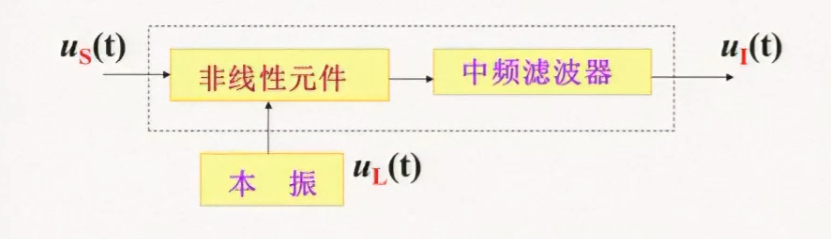
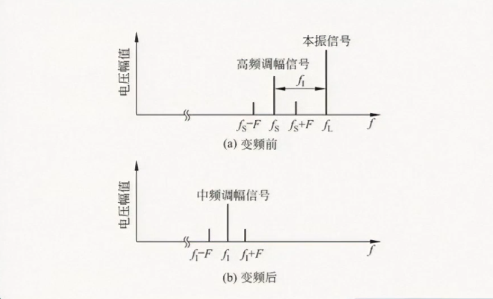

## 概述(To be completed)

### 变频前后的频谱图（以AM为例子）

其中，$f_I = f_L -f_S$,$f_S+F$分量变成 $f_L-(f_S + F) = f_I -F$,$f_S-F$分量变成 $f_L-(f_S - F) = f_I +F$
## 变频干扰及其抑制方法
### 组合频率干扰
#### 定义
流经变频管的电不仅含有直流分量、信号频率、本振频率成分还含有信号、本振频率以及它们的和、差频等组合频率分量
$$
 m f_L - nf_s \approx \pm f_I
$$
其中$n,m$是谐波的次数，当组合频率符合上述关系时，就可以产生组合频率干扰
#### 抑制方法
* 适当选择变频电路的工作点，防止本振电压过大
* 输入信号的电压幅值不能过大，防止谐波幅值过大
* 选择中频时应考虑组合频率的影响
### 副波道干扰
#### 定义
外来频率 $f_n$ 与本振频率满足
$$
 m f_L - nf_n \approx \pm f_I
$$
经过变形可以推导出
$$
f_n \approx \frac{1}{n} (m f_L \pm f_I)
$$
#### 中频干扰
* 起因：当 $m = 0,n = 1$ 时，$f_n = f_I$,此时如果接收机回路选择性不好,则该信号进入变频器，并被放大，从而产生干扰
#### 镜频干扰
起因：当 $m = n =1$ 时，$f_S$ 和 $f_n$ 分别等距地位于 $f_L$ 的两侧，则称此时的干扰为镜像干扰
#### 组合副波道干扰
* 起因：当 $m \geq 1,n>1$ 时，称干扰为组合副波道干扰，其中 $m+n$ 称为副波道干扰的阶数。通常阶数

**抑制方法**：提高变频器前面电路的选择性，增强对中频信号的抑制或者设置中频率陷波器
### 交调干扰和互调干扰
#### 交调干扰
电台信号和干扰信号同时作用于接收机的输入端产生的干扰，主要由器件转移特性的三次及以上高次项产生
#### 互调干扰
由两个或者多个干扰电压加到接收机高放极或变频极的输入端，由于晶体管的非线性作用相互混频
互调频率为
$$
\pm f_{n_1} \pm f_{n_2}
$$
互调次数为
$$
m+n
$$
且有频率关系
$$
f_s -f_{n_1} = f_{n_1}-f_{n_2}
$$
### 总结
* 干扰哨声是 $f_L$与 $f_S$ 组合形成的干扰
* 副波道干扰是 $f_n$ 与 $f_L$ 组合形成的干扰
* 交调干扰是 $f_s$ 与 $f_n$ 形成的干扰，与信号并存
* 互调干扰是多个干扰信号组合形成的干扰
