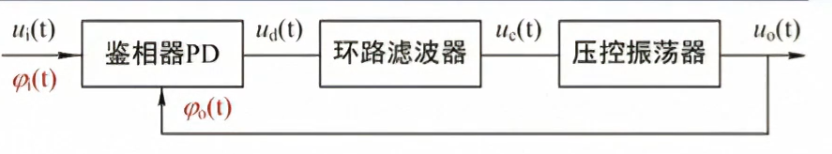

## 基本锁相环的构成

其中，鉴相器的输出 $u_d(t)$ 满足
$$
u_d(t) = K_d[\phi_i(t)-\phi_o(t)] = K_d \phi(t)
$$
压控震荡器的输出 $\omega(t)$ 满足
$$
\omega(t) = \omega_o + K_{\omega}u_c(t)
$$
式中，$\omega_o$ 为压控振荡器的中心频率,$u_c(t)$ 为控制电压
* 锁定：输入信号与输出信号的品率相等
* 捕捉：环路原来是失锁，缓慢调整到锁定，失锁到锁定的最大频差称为捕捉带或捕捉范围
* 跟踪：环路原先锁定，偏离锁定后重新调节维持锁定，能够保持跟踪的最大频差为跟踪带或跟踪范围
