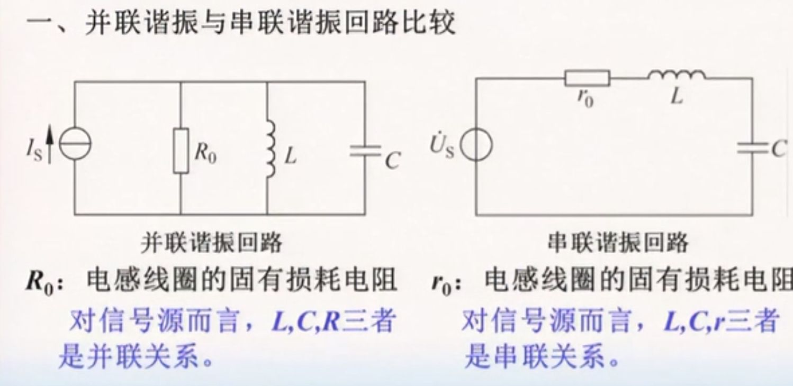
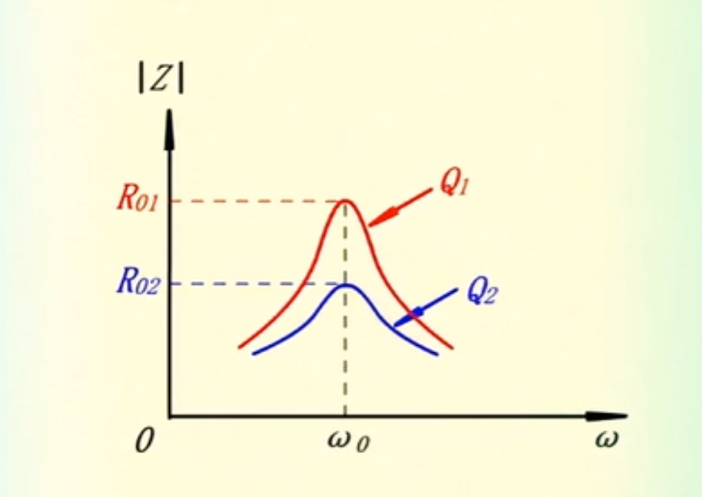
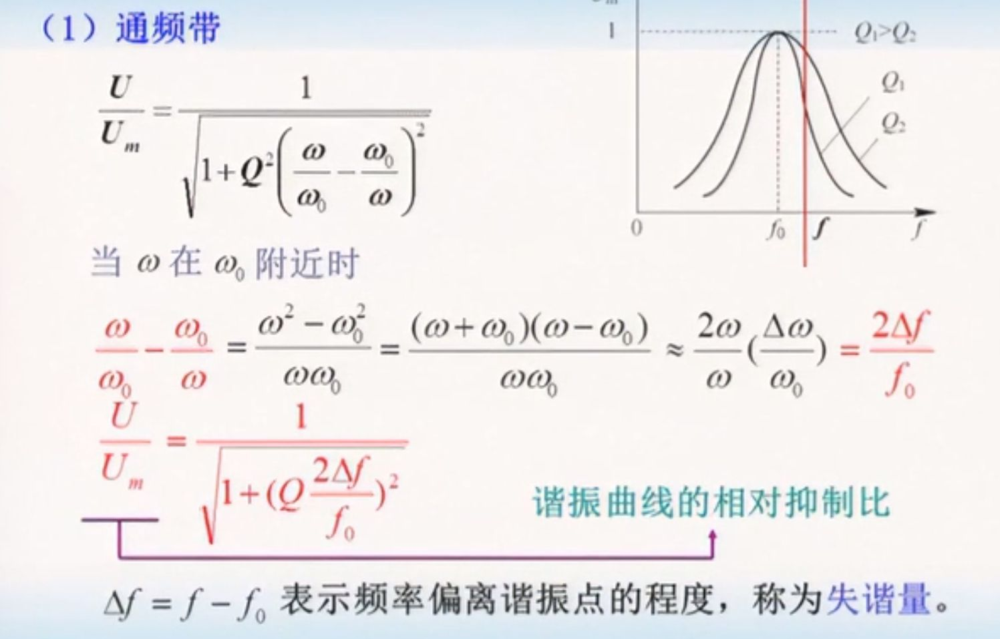
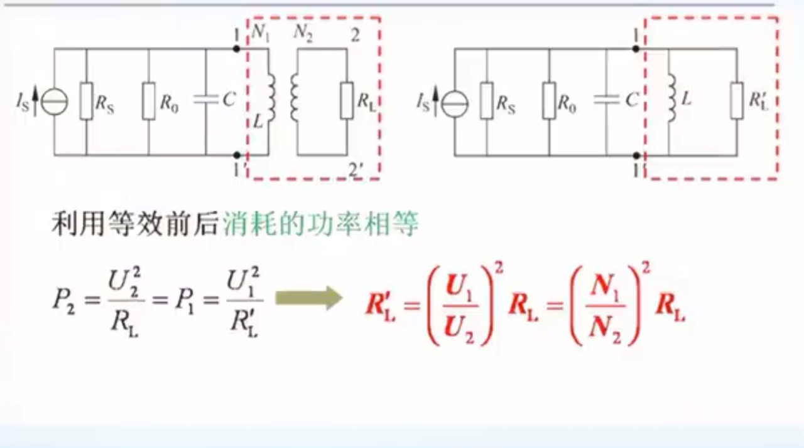
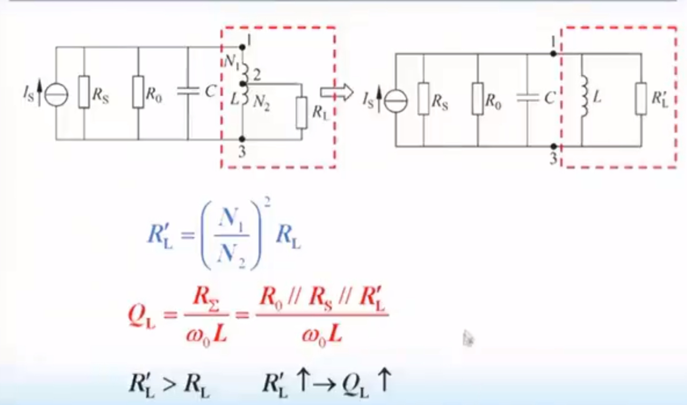
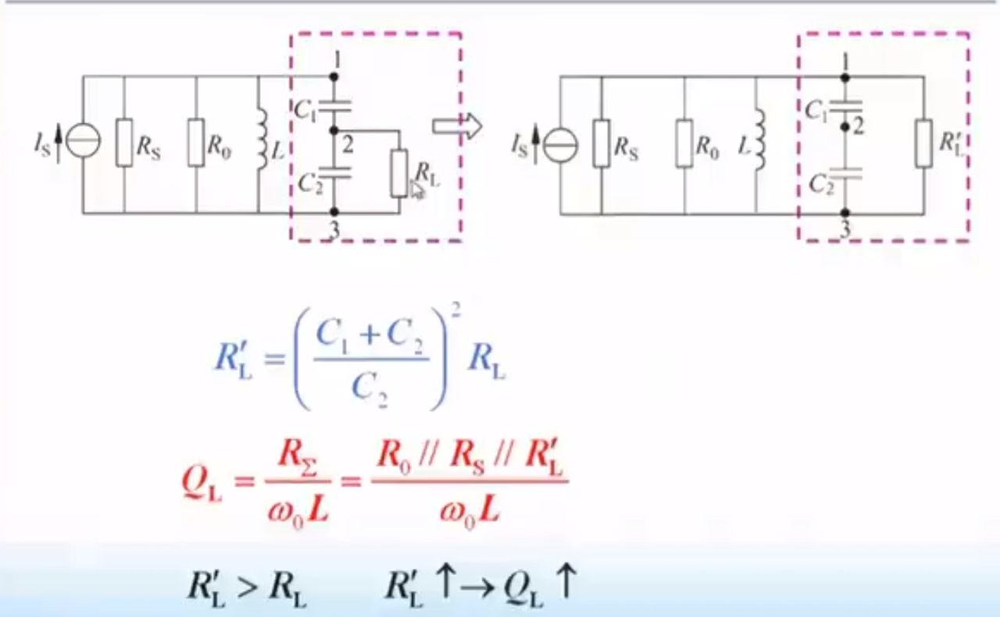
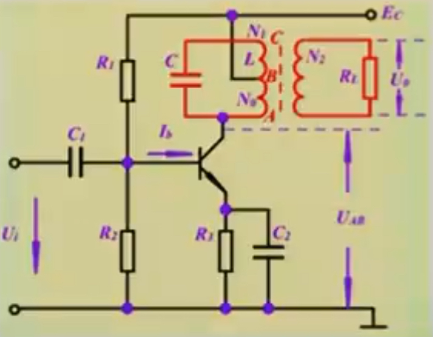
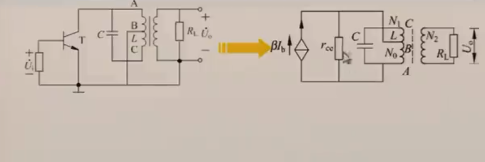
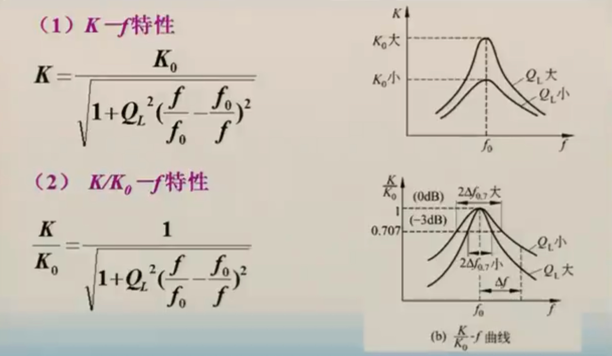

### LC谐振回路

* 谐振条件
当 $\omega L = \frac{1}{\omega C}$,有 $\omega = \omega_0 = \frac{1}{\sqrt{LC}}$或者 $f = f_0 = \frac{1}{2\pi \sqrt{LC}}$,当谐振时，电压电流同相
* 品质因数
$$
Q = \frac{谐振时L（或C）的无功功率}{谐振时r_0或R的有功功率}
$$
对于并联谐振电路（**重点**）（由电压相等条件推导）： $Q = \frac{R_0}{\omega_0 L} = R_0\omega_0 C$ 
对于串联谐振电路（由电流相等条件推导）： $Q = \frac{\omega_0 L}{R_0} =\frac{1}{R_0\omega_0 C}$ 

* 并联谐振电路的阻抗特性图
并联阻抗：$$
|Z| = \frac{1}{\sqrt\frac{1}{R_0^2}+(\omega C -\frac{1}{\omega L})^2} = \frac{R_0}{1+Q^2(\frac{\omega}{\omega_0}-\frac{\omega_0}{\omega})^2}
$$

* 谐振曲线分析

**通频带**:当$\frac{U}{U_m}$由1下降到0.707时，所确定的2$\Delta f$称为回路的通频带B
$$
B = \frac{f_0}{Q}
$$

* 选择性：对某一频率偏差$\Delta f$下的 $\frac{U}{U_m}$记作$\alpha$,$\alpha = 20lg \frac{U}{U_m}$分贝
* 矩形系数：$K_{0.1} = \frac{B_{0.7}}{B_{0.1}}$ 

### 负载和信号源内阻对谐振回路的影响
#### 对品质因数的影响
* 阻性负载
$$
Q_L = \frac{R_\Sigma}{\omega_0L} = \frac{R_0||R_s||R_L}{\omega_0 L}
$$

又 $B=\frac{f_0}{Q}$ ,则通频带上升，选择性下降

* 含有容性或者感性负载（一般为容性）
$$
\omega_0 = \frac{1}{\sqrt{LC_\Sigma}}
$$

#### 部分接入
* 互感变压器接入

可以通过增加$\frac{N_1}{N_2}$ 增加品质因数

* 电容抽头接入

### 单调谐放大器

* 放大系数K
$$
\begin{align}
K = \frac{U_o}{U_i} &= \frac{U_o}{U_{AB}}\\ &= \frac{N_2}{N_0} \cdot \frac{\beta I_b \cdot Z_{AB}}{I_b \cdot r_i} \\ &=\frac{\beta}{r_i}Z_{AC}(\frac{N_0}{N_1}) \frac{N_2}{N_0}
\end{align}
$$
当谐振时，回路满足$Z_{AC} = R_\Sigma = Q_L\omega_0 L$,则谐振时的电压放大倍数$$
K_0 = \frac{\beta}{r_i}Q_L \omega_0 L(\frac{N_0}{N_1})(\frac{N_2}{N_1})
$$
其中 $$
R_\Sigma = R_0 || (\frac{N_1}{N_2})^2 \cdot R_L||(\frac{N_1}{N_2})^2 r_{ce}
$$

* 选频特性

在谐振点附近，有
$$
\xi = Q_L \frac{2 \Delta f}{f_0}
$$
$$
\frac{K}{K_0} = \alpha = \frac{1}{\sqrt{1+\xi^2}}
$$
可见，|$\xi$| = 1处对应上下边界 