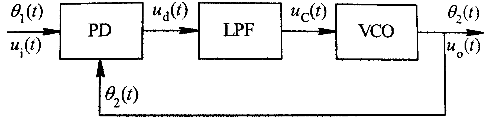
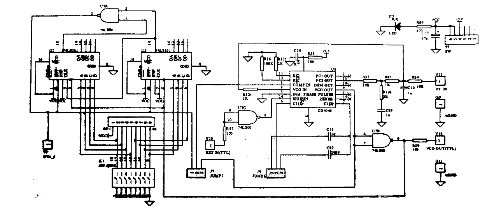

### 锁相环的内部构成
锁相环是一种以消除频率误差为目的的频率反馈控制电路，它的基本原理是：两个频率不同的信号其相位误差会连续增加（或减小），采用一种所谓“鉴相器”的电路将相位误差转换为误差电压，用误差电压去控制其中一个信号的频率改变使得两个信号的频率趋于一致。所以当电路达到平衡状态之后，虽然有剩余相位误差存在，但频率误差可以降低到零，从而实现无频差的频率跟踪。
锁相环由三部分组成，如图1所示。包含压控振荡器（VCO），鉴相器（PD）和环路低通滤波器（LPF）三个基本部件，三者组成一个闭合环路，输入信号为$u_i(t)$，输出信号为$u_o(t)$，反馈至输入端。下面逐一说明基本部件的作用。
#### 1.压控振荡器（VCO）
VCO是本系统的控制对象，被控参数是其振荡频率，控制信号为加在VCO上的频率控制电压，故称为压控振荡器。
#### 2.鉴相器（PD）
PD是一相位比较电路，用来检测输出信号 $u_0(t)$ 与输入信号$u_i(t)$之间的相位差 $θ_e(t)$，并把转化为电压 $u_d(t)$ 输出，$u_d(t)$称为误差电压。
#### 3.环路滤波器（LPF）
LPF为一低通滤波电路，其作用是滤除因PD的非线性而在ud(t)中产生的无用的组合频率分量及干扰，产生一个只反映$θ_e(t)$大小的控制信号$u_c(t)$。按照反馈控制原理，如果由于某种原因使VCO的频率发生变化使得与输入频率不相等，这必将使$u_0(t)$与$u_i(t)$的相位差$θ_e(t)$，发生变化，该相位差经过PD转换成误差电压$u_d(t)$，此误差电压经LF滤波后得到$u_c(t)$，由$u_c(t)$去改变VCO的振荡频率使趋近于输入信号的频率，最后达到相等。环路达到最后的这种状态就称为锁定状态。
### 锁相环的工作原理
#### 1.环路的跟踪过程
在环路锁定之后，若输入信号频率发生变化，产生了瞬时频差，从而使瞬时相位差发生变化，则环路将及时调节误差电压去控制VCO，使VCO输出信号频率随之变化，即产生新的控制频差，VCO输出频率及时跟踪输入信号频率，当控制频差等于固有频差时，瞬时频差再次为零，继续维持锁定，这就是跟踪过程，在锁定后能够继续维持锁定所允许的最大固有角频差$\Delta \omega_1$m的两倍称为跟踪带或同步带。

#### 2.环路的捕捉过程
环路由失锁状态进入锁定状态的过程称为捕捉过程。
设t=0时环路开始闭合，此前输入信号角频率wi不等于VCO输出振荡角频率wyo（因控制电压u_c＝0），环路处于失锁状态。假定wi是一定值，二者有一瞬时角频差$\Delta \omega_1$＝wi−wyo，瞬时是相位差$\Delta \omega_1$随时间线性增大，因此鉴相器输出误差电压$u_e(t)＝kbsin\omega_1 t$是一个周期为2π$\Delta \omega_1$的正弦函数，称为正弦差拍电压。所谓差拍电压是指其角频率（此处是$\Delta \omega_1$）为两个角频率（此处是wi与wyo）的差值，角频差$\Delta \omega_1$的数值大小不同，环路的工作情况也不同。若$\Delta \omega_1$较小，处于环路滤波器的通频带内，则差拍误差电压ue(t)能顺利通过环路滤波器加到VCO上，控制VCO的振荡频率，使其随差拍电压的变化而变化，所以VCO输出是一个调频波，即wy(t)将在wyo上下摆动。由于$\Delta \omega_1$较小，所以wy(t)很容易摆动到wi，环路进入锁定状态，鉴相器将输出一个与稳态相位差对应的直流电压，维持环路动态平衡。
若瞬时角频差$\Delta \omega_1$数值较大，则差拍电压ue(t)的频率较高，它的幅度在经过环路滤波器时可能受到一些衰减，这样VCO的输出振荡角频率wy(t)上下摆动的范围也将减小一些，故需要多次摆动才能靠近输入角频率wi(t)即捕捉过程需要许多个差拍周期才能完成，因此捕捉时间较长，若$\Delta \omega_1$太大，将无法捕捉到，环路一直处于失锁状态。能够由失锁进入锁定所允许的最大固有角频差$\Delta \omega_1$m的两倍称为环路的捕捉带。锁相环电路的同步带和捕捉带如图2所示。

### 实验电路图

