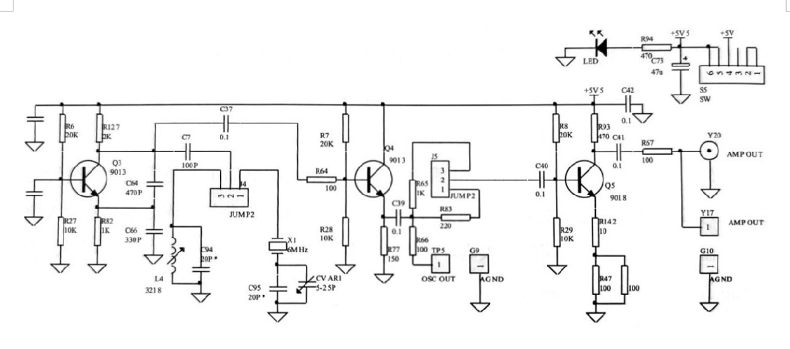

## 正弦波震荡器预习报告

### 实验原理
要使设计的LC振荡器能够起振，首先要满足振幅起振条件AF>1，其次要满足相位平衡条件——射同基（集）反。实验中使用的改进电容三点式振荡器共分为三级，第一级为共基极电容三点式主振电路；第二级为射级跟随器，它隔离了振荡器和输出负载；第三级为共射放大电路，它提高了振荡器输出电压幅度。
### 实验电路图

### 实验步骤
#### 1.测量静态工作点
**静态工作点的计算**
由实验电路图可知:
$$
\begin{cases}
V_{BQ} = \frac{10K}{20K+10K} \cdot VCC \\ V_{EQ} = V{BQ}-0.7 \\ V_{CQ} = VCC-\beta i_b \cdot 2K \Omega
\end{cases}
$$
将跳线J4取出（振荡器停振），用数字万用表直流电压档（10V档）测量三个晶体管基极、发射极和集电极的电压
**测量表格**
| 测量点 | VBQ3 | VEQ3 | VCQ3 | VBQ4 | VEQ4 | VCQ4 | VBQ5 | VEQ5 | VCQ5 |
|--------|------|------|------|------|------|------|------|------|------|
| 理论值/V |      |      |      |      |      |      |      |      |      |
| 测量值/V |      |      |      |      |      |      |      |      |      |
#### 2.观察晶体振荡器输出波形并调节频率
接通跳线J4的2-3脚，接通跳线J5的2-3脚，使用示波器在TP5处观察振荡器输出波形、使用频率计观察振荡频率，并使用调试工具对可调电容CVAR1进行微调，使振荡频率为6MHz
#### 3.观察输出放大器的输出波形
使用示波器在Y17（Y18）处观察输出波形，结果如图5所示，波形无明显失真。使用示波器的FFT功能观察记录输出波形的频谱
#### 4.观察LC振荡器输出波形并调节频率
通跳线J4的1-2脚，接通跳线J5的1-2脚，使用示波器在TP5处观察振荡器输出波形、使用频率计观察振荡频率，并使用调试工具慢慢旋动振荡回路电感L4的磁芯，使振荡频率为6MHz
#### 5.观察输出放大器的输出波形
使用示波器在Y17（Y18）处观察输出波形，结果如图8所示，波形无明显失真。使用示波器的FFT功能观察记录输出波形的频谱