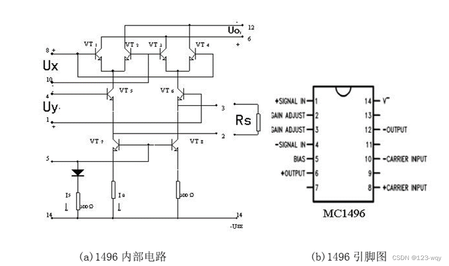
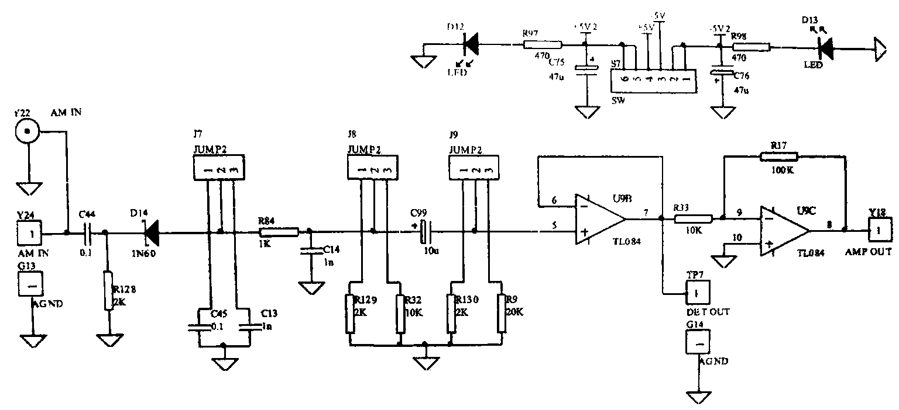
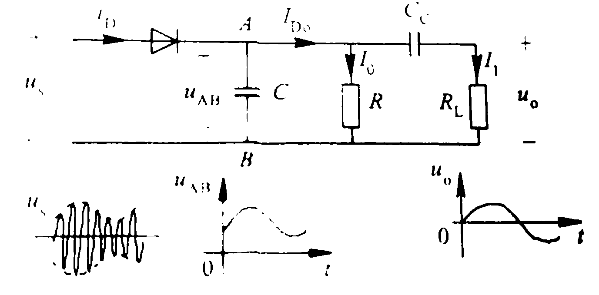

## 模拟调幅实验
### MC1496
* MC1496是双平衡四象限模拟乘法器，可完成两个模拟量（电压或电流）的相乘，用于振幅调制、同步检波、混频、倍频、鉴频、鉴相等调制与解调过程，其内部结构如下

由内部结构可知，由于 $I_0$ 是 $I_5$ 的镜像电流，所以改变电阻 $R_5$就可以改变 $I_0$的大小，即：
$$
I_0 \approx I_5 = \frac{|-u_{EE}-0.7V|}{R_5+500 \Omega}
$$
设输入信号 $u_x = U_{xm}cos \omega_x t,且为小信号,u_y = U_{ym} cos \omega_y t$,此时输出电压 $u_o$ 可以表示为
$$
u_o \approx \frac{R_L}{R_E U_T} u_x u_y
$$
#### 应用

##### AM调制
设载波信号的表达式为 $u_{cm}(1+m_a cos\Omega t)cos\omega_c t$,调制信号的表达式为 $u_{\Omega_m}cos \Omega t$,则AM调幅信号的表达式：
$$
u_{AM} = u_{cm}(1+m_a cos\Omega t)cos\omega_c t
$$
其中，$m_a$ 为调幅系数，$m_a = \frac {u_{\Omega m}}{u_{cm}}$

##### DSB调制
双边带调幅波的表达式为：
$$
u_o(t) = u_{cm}m_a cos\Omega t cos\omega_c t
$$

### 实验电路图

* 测试MC1496的静态工作点

| 测量点    | \( V_8 \) | \( V_{10} \) | \( V_1 \) | \( V_4 \) | \( V_6 \) | \( V_{12} \) | \( V_2 \) | \( V_3 \) | \( V_5 \) |
|-----------|-----------|-------------|-----------|-----------|-----------|-------------|-----------|-----------|-----------|
| 参考值/V  | 2.5       | 2.5         | 0         | 0         | 3         | 3           | -0.7      | -0.7      | -3.9    
|测量值      |           |            |            |          |            |
****
## 二极管包络检波
### 实验原理
 包络检波方法是将单极性信号通过电阻和电容组成的惰性网络，取出单极性信号的峰值信号。最常用的是二极管峰值包络检波器，其结构如下：

#### 主要技术参数
* 检波效率
检波效率是只检波后的低频信号与电压输入调幅信号包络电压之比，对于AM调波：
$$
\eta = \frac{U_{\Omega_m}}{m_a U_{cm}}
$$
* 惰性失真
为了提高检波效率从而增加检波器负载电阻，引起电容器的放电速率减小，导致电容器上的电压不能跟随包络的变化而出现的非线性失真
* 负峰切割失真
负载两端的输出电流可以表示为
$$
I_{D_0} = I_0 +I_1 cos \Omega t
$$
如果出现 $I_1 > I_0$ ,则可能出现二极管截止，负载网络两端的电压不跟随电压包络的变化而产生削底失真
### 实验电路图

