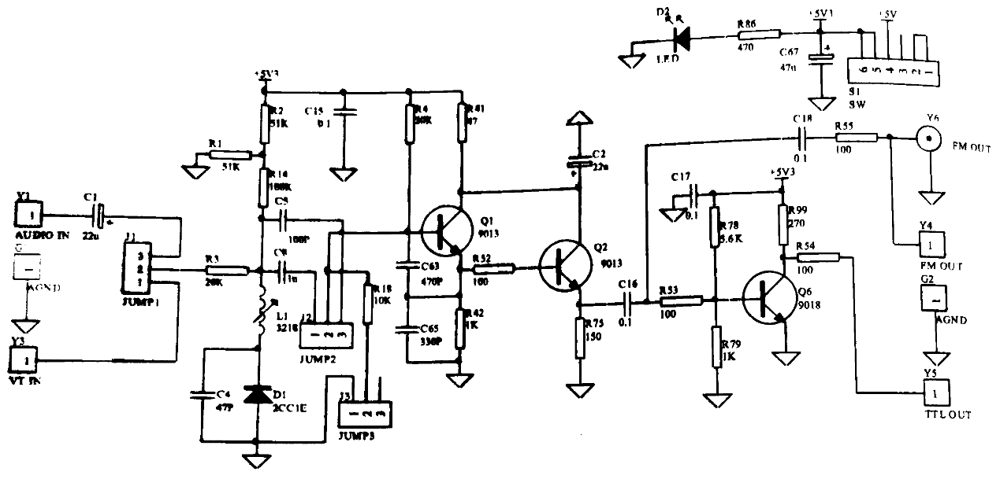
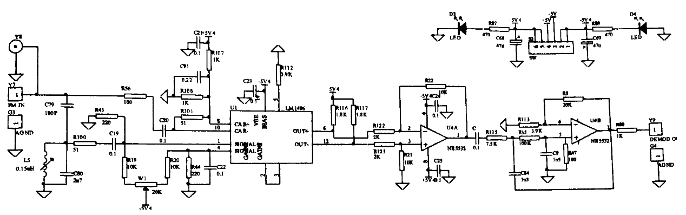

### 实验原理
#### 频率调制实验的实验原理
所谓调频，就是用调制信号去控制载波（高频振荡）的瞬时频率，使其按调制信息的规律变化。设调制信号 $v_{\Omega}(t) = V_{\Omega m}cos{\Omega t}$ ，载波 $v_C=V_{cm}cos(ω_ct+\phi)$。根据定义，调频时载波的瞬时频率随调制信号线性变化，载波频率的变化为
$$
\Delta \omega(t) = k_f v_{\Omega}(t) = k_f V_{\Omega m}cos \Omega t = \Delta cos \Omega t
$$
调频信号的表示可以写成
$$
v_{FM}(t) = V_{m0}cos(\omega_c t+m_f sin \Omega t+\phi_0)
$$
式中 $\Delta \omega = K_f V_{\Omega}$ 是调频波瞬时频率的最大偏移，简称频偏，它与调制信号的振幅成正比。比例常数 $K_f$亦称调制灵敏度，代表单位调制电压所产生的频偏。$m_f = \frac{K_f V_{\Omega}}{\Omega} = \frac{\Delta \omega}{\Omega} = \frac{\Delta f}{F}$ 称为调频指数，是调频瞬时相位的最大偏移，它的大小反映了调制深度。
产生调频信号最常用的方法是利用变容二极管的特性直接产生调频波。由于变容二极管 $C_j$ 的电容值随外加电压 $V_{\Omega} $的变化而变化，因此振荡器输出信号 $v_O$的频率也随着 $V_{\Omega}$的幅值变化，实现调频。
#### 调频解调实验的实验原理
鉴频是调频的逆过程，目前广泛采用的鉴频电路是相位鉴频器。其鉴频原理是：先将调频波经过一个线性移相网络变换成调频调相波，然后再与原调平波一起加到一个相位检波器进行鉴频。因此实现鉴频的核心部件是相位检波器。
相位检波又分为叠加型相位检波和乘积型相位检波，利用模拟乘法器的相乘原理可实现乘积型相位检波，其基本原理是：在乘法器的一个输入端输入调频波 $U_s(t)$，另一输入端输入经线性移相网络移相后的调频调相波 $U_s'(t)$。这两个信号相乘，并滤除其中的高频分量，即可实现调频解调。

### 实验电路图
#### 变容二极管调频振荡器实验电原理图

#### 模拟乘法器调频解调实验电原理图

### 实验数据测量
#### 频率调制
| 测量点 | \(V_{BQ1}\) | \(V_{EQ1}\) | \(V_{CQ1}\) | \(V_{BQ2}\) | \(V_{EQ2}\) | \(V_{CQ2}\) | \(V_{BQ6}\) | \(V_{EQ6}\) | \(V_{CQ6}\) |
|--------|------------|------------|------------|------------|------------|------------|------------|------------|------------|
| 测量值/V |            |            |            |            |            |            |            |            |            |

#### 调频解调实验
| 测量点 | \(V_{8}\) | \(V_{10}\) | \(V_1\) | \(V_4\) | \(V_6\) | \(V_{12}\) | \(V_2\) | \(V_3\) | \(V_5\) |
|--------|------------|------------|---------|---------|---------|------------|---------|---------|---------|
| 参考值/V | 2.5        | 2.5        | 0       | 0       | 3       | 3          | -0.7    | -0.7    | -3.9    |
| 测量值/V |     |     |  |  |   |     |  |  |  |